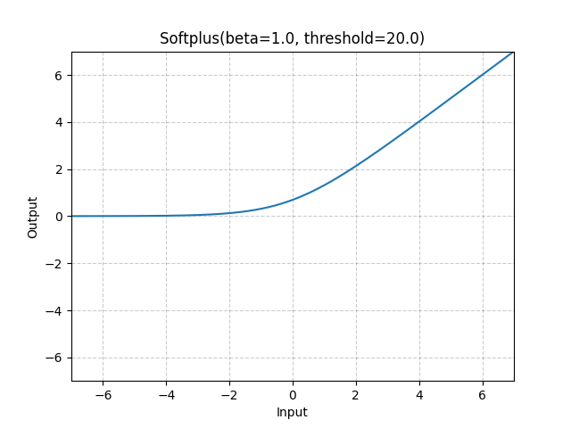
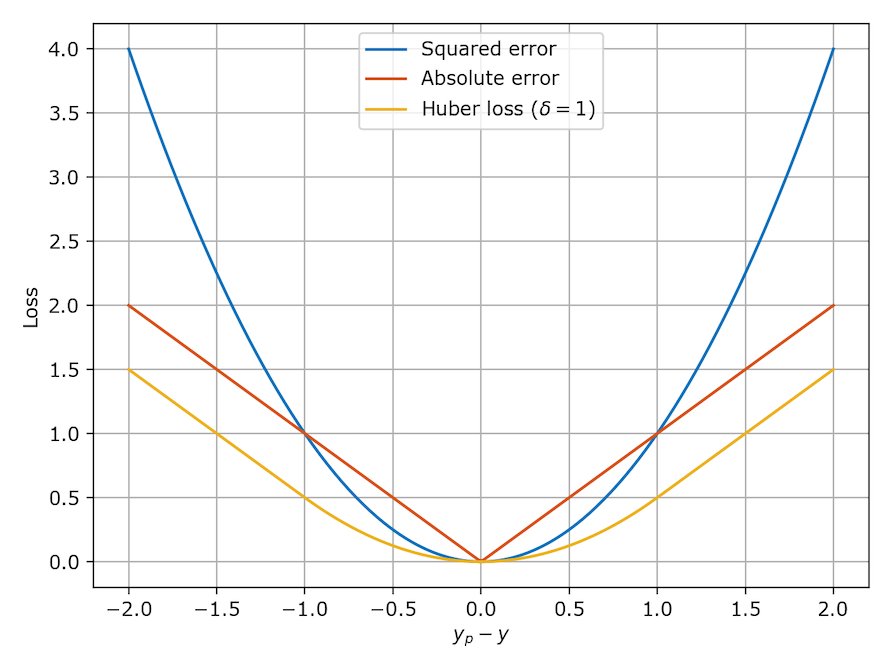

# <p align="center">Pytorch Notes</p>

---  

### <p align="center">Table of Contents</p>  
<div align="center">

|Item|<div align="center">Heading</div>|<div align="center">Subcontents</div>|
|:---:|:---|:---|
| **1.** | [Reference Links](#reference-links) ||
| **2.** | [Designing, Building & Problem Finding - Thought Process](#designing-building--problem-finding---thought-process) | Helpful information regarding initial thought processes & considerations for building a model, debugging and more |
| **3.** | [Tensors](#tensors) | [Initialising](#initialising-a-tensor),<br>[Attributes](#attributes-of-a-tensor),<br>[Operations](#operations-on-a-tensor) - indexing, joining, arithmetic etc., |
| **4.** | [Datasets & DataLoaders](#datasets--dataloaders) | [Loading datasets](#loading-datasets),<br>[Transforms](#transforms),<br>[Creating a Custom Dataset](#creating-a-custom-dataset),<br>[Iterating & Visualising the Dataset](#iterating--visualising-the-dataset),<br>[Preparing Data for Training with DataLoaders](#preparing-data-for-training-with-dataloaders) |
| **5.** | [Building a Neural Network<br>& Using Models](#building-a-neural-network--using-models) | [Get Device for Training](#get-device-for-training),<br>[Define the Class](#define-the-class),<br>[Using a Model](#using-a-model),<br>[Saving & Loading Models](#saving--loading-models) |
| **6.** | [`torch.nn` Module](#torchnn-module) | Basic building blocks for graphs including neural net:<br>**layers, activation functions & loss functions** |
| **7.** | [Activation Functions](#activation-functions) |[Information on Function Types & Problems](#activation-functions),<br>[Table of Activation Functions](#table-of-activation-functions)|
| **8.** | [Automatic Differentiation With Autograd](#automatic-differentiation-with-autograd) | [Compute Gradients](#compute-gradients),<br>[Operations & Tracking](#operations--tracking) |
| **9.** | [Optimising Model Parameters - Train/Test](#optimising-model-parameters---traintest) | [Hyperparameters](#hyperparameters),<br>[Initialise Loss Function](#initialise-loss-function),<br>[Initialise Optimizer](#initialise-optimizer),<br>[Optimisation Process](#optimisation-process),<br>[Define Train/Test Loops](#define-traintest-loops),<br>[Iterate Train/Test Loops in Epochs](#iterate-traintest-loops-in-epochs),<br>[Metrics](#metrics) |
| **10.** | [Loss Functions](#loss-functions)<br>- Includes Overview of Distributions & SVMs |[General Loss Function Information](#loss-functions),<br>[Overview of Losses](#overview-of-losses),<br>[Overview of Distributions](#overview-of-distributions),<br>[Overview of SVMs](#overview-of-support-vector-machines-svms),<br>[Table of Loss Functions](#table-of-loss-functions)|
| **11.** | [Optimizers](#optimizers) |[Key Concepts & Universal Methods](#optimizers),<br>[Table of Optimisers](#table-of-optimisers)|
| **12.** | [TensorBoard - Visualising Metrics](#tensorboard---visualising-metrics) ||

</div>

<br>

[⬆ Table of Contents ⬆](#pytorch-notes)    

---  

### <u>Reference Links</u>  

[Pytorch Documentation](https://pytorch.org/docs/stable/index.html)  
[Tutorials](https://pytorch.org/tutorials/beginner/basics/intro.html)  

<br>

[⬆ Table of Contents ⬆](#pytorch-notes)    

---  

### <u>Designing, Building & Problem Finding - Thought Process</u>  

|Item|<div align="center">Subheading</div>|<div align="center">Content</div>|
|:---:|:---|:---|
| **1.** | [Design & Build](#design--build) | [Understand the problem](#understand-the-problem),<br>[Gather & preprocess](#gather-and-preprocess-data),<br>[Model architecture](#model-architecture-design),<br>[Selecting loss](#selecting-loss-function),<br>[Selecting optimiser](#selecting-an-optimiser),<br>[Train & validate](#training-and-validation),<br>[Hyperparameter tuning](#hyperparameter-tuning),<br>[Regularisation techniques](#regularisation-techniques),<br>[Evaluate & iterate](#evaluate-and-iterate),<br>[Deploy & monitor](#deployment-and-monitoring) |
| **2.** | [Further Tips](#further-tips) | [Start with small batches & fewer epochs](#start-with-small-batches-and-fewer-epochs),<br>[Experiment with learning rate](#experiment-with-learning-rate),<br>[Understand overfitting and regularisation](#understand-overfitting-and-regularisation),<br>[Visualise with TensorBoard](#visualise-with-tensorboard),<br>[Use Captum to help interpret & understand the predictions of a PyTorch model](#use-captum-to-help-interpret--understand-the-predictions-of-a-pytorch-model),<br>[Always save the model](#always-save-the-model),<br>[Play with pretrained models](#play-with-pretrained-models),<br>[Join the community](#join-the-community) |
| **3.** | [Problem Finding (Common Issues)](#problem-finding-common-issues) | [Debugging tips](#debugging-tips),<br>[Understanding common pitfalls](#understanding-common-pitfalls) |

##### Design & build:  
Designing, building, and tuning a machine learning model is a complex process that involves both art and science. While there's no one-size-fits-all approach, below is a general thought process that many practitioners follow. The key is to iterate and experiment based on your understanding of the problem, your data, and the performance of your model. Here's how you might approach it:

###### Understand the problem:  
- *Type of Problem*: Is this a classification problem (e.g., image classification), regression (e.g., predicting house prices), or something else like segmentation or object detection? The nature of the problem will heavily influence your choices.  
- *Domain Knowledge*: Understanding the domain can guide your decisions. For example, in image processing, convolutional layers are often a good choice because they are effective at capturing spatial hierarchies.  
- *Performance Metric*: Decide on the evaluation metric that is most important (e.g., accuracy, F1 score, mean squared error). This will guide your choice of loss function and how you evaluate your model.  

###### Gather and preprocess data:  
- *Data Quality*: Ensure that your data is clean, balanced (or use techniques like oversampling/undersampling), and appropriately split into training, validation, and test sets.  
- *Data Augmentation*: If you have limited data, consider augmenting it, especially in tasks like image classification.  
- *Feature Engineering*: For structured data, think about creating new features or transforming existing ones to better capture the underlying patterns.  

###### Model architecture design:  
- *Baseline Model*:  
    - Start simple. Implement a baseline model with a basic architecture that can serve as a reference point. This could be a small feedforward neural network for structured data or a simple CNN for image data.  
- *Layer Selection*:  
    - *Convolutional Layers (CNNs)*: Use for image data or spatial data. Convolutions capture local patterns and are followed by pooling layers to reduce dimensionality.  
    - *Recurrent Layers (RNNs, LSTMs, GRUs)*: Use for sequential data like time series or text. They are good at capturing temporal dependencies.  
    - *Fully Connected Layers* (typically linear layers): Typically used at the end of a network to output a prediction. Start with a small number of fully connected layers and increase complexity as needed.  
    - *Transformer Layers*: Use for tasks involving sequences or text, where attention mechanisms can capture long-range dependencies.  
- *Determine Number of Input & Output Features*: This will depend on the architecture and the problem you’re solving (e.g., image classification, regression, etc.). For each type of layer:  
  - *Input Layer*:  
    - **Input Features**: This depends on the format of your data.  
      - *Image Data*: Size corresponds to the `height × width × number of channels` (e.g., for a 28×28 grayscale image, it would be 28×28=784 input features, or 28×28×1; for RGB images, it would be 28×28×3=2352).  
      - *Tabular Data*: The input size will be the `number of features (columns)` in your dataset.  
      - *Sequence Data (Text)*: The input size will be determined by the `sequence length and the embedding size`, depending on how you represent the input.  
  - *Convolutional Layers (CNN)*: Convolutional layers take an image-like input (typically in the shape `batchsize, channels, height, width`) and perform a series of filters.  
    - **Input Features**: The `number of channels from the previous layer` (depth of the input image or feature map).  
    - **Output Features (Filters)**: This is a hyperparameter you choose. It determines the number of filters (kernels) that the layer applies. The output shape will depend on:  
      - *Number of filters (output channels (depth))* you choose.  
      - *Filter size (kernel size)*.  
      - *Stride, padding, and dilation parameters*.<br><br>The output feature map size (`Output_height` x `Output_width`) is calculated as:<br><br><br>Where `Input_dim` is size of the dimension in the input (height, width, or depth),<br>`Kernal_dim` is the size of the pooling kernel (filter) in the dimension,<br>`Padding_dim` is the amount of padding added to the input in the dimension,<br>and `Stride_dim` is the step size or stride of the pooling operation in the dimension.  
  - *Fully Connected (Linear) Layers*.  
      - **Input Features**: The `output from the previous layer` (i.e., for an image going through convolutional layers, the feature map requires flattening before passing it to a fully connected layer. This means multiplying the dimensions of the feature map (number of channels x height × width)). E.g., If output of the convolutional layer is of shape [batch_size, 32, 7, 7] (32 filters and a 7x7 feature map), the input size to the fully connected layer will be 32 * 7 * 7 = 1568.  
      - **Output Features**: This is a hyperparameter you choose. It depends on `how many features you want to pass to the next layer` (commonly larger in earlier layers and smaller as you go deeper).  
  - *Recurrent Layers (RNN, LSTM, GRU)*: For sequence-based models (e.g., LSTMs or GRUs).  
    - **Input Features**: The `size of the feature vector at each time step`, which could be the embedding dimension (e.g., if you use word embeddings for text).  
    - **Output Features**: This is the `number of hidden units` (also a hyperparameter you choose), which determines the dimensionality of the output hidden state.  
  - *Pooling Layers*: (like MaxPooling or AveragePooling) reduce the spatial dimensions of the input.  
    - **Input Features**: The pooling layer `does not require a specific number of channels (planes) but needs at least one channel`. It will independently apply the pooling operation across all channels. No need to specify the number of input features explicitly. Instead, only require the kernel size, stride, and padding. If input tensor has shape (batch_size, channels, height, width), pooling will be applied across the height and width dimensions for each channel.  
    - **Output Features**: `Does not change the number of channels but reduces the height and width based on the pooling size and stride`.<br><br>The output feature map size (height × width) is calculated as:<br><br><br>Where `Input_dim` is size of the dimension in the input (height, width, or depth),<br>`Kernal_dim` is the size of the pooling kernel (filter) in the dimension,<br>`Padding_dim` is the amount of padding added to the input in the dimension,<br>and `Stride_dim` is the step size or stride of the pooling operation in the dimension.  
  - *Output Layer*:  
    - **Output Features**: The number of output features `depends on the task`.  
      - *Classification*: 
        - *Binary classification*, the output size is 1 (with a sigmoid activation).  
        - *Multi-class classification*, it is the number of classes (with softmax).  
      - *Regression*: For a regression task, it might be 1 (or more if predicting multiple values).  
      - *Sequence Output*: If working with a sequence prediction task, it will depend on the length of the sequence and the number of possible outputs at each time step.  
- *Activation Functions*:  
    - *ReLU (Rectified Linear Unit)*: Most common choice. It's computationally efficient and helps mitigate vanishing gradient problems.  
    - *Leaky ReLU, ELU*: Variants of ReLU that address the issue of neurons "dying" (i.e., outputting zero for all inputs).  
    - *Sigmoid/Tanh*: Use sparingly, typically in the output layer of binary classification problems (sigmoid) or in cases where outputs are between -1 and 1 (tanh). They can cause vanishing gradient problems in deep networks.  
- *Quantity of Layers*:  
    - Start with a few layers and increase complexity as needed. Too many layers can lead to overfitting, especially if you don't have enough data.  
    - Use deeper networks for more complex problems, but make sure to have sufficient data or use techniques like regularisation or dropout to avoid overfitting.  

###### Selecting loss function:  
- *Regression*:  
    - *Mean Squared Error (MSE)*: Standard loss function for regression problems.  
    - *Mean Absolute Error (MAE)*: Less sensitive to outliers compared to MSE.  
- *Classification*:  
    - *Cross-Entropy Loss*: Standard for multi-class classification.  
    - *Binary Cross-Entropy*: Use for binary classification problems.  
- *Custom Losses*:  
    - For more complex problems, consider custom loss functions that better capture the performance metric you care about (e.g., dice loss for segmentation tasks).  

###### Selecting an optimiser:  
- *SGD (Stochastic Gradient Descent)*:  
    - Simple and widely used, often with momentum.  
    - Can be slow to converge; adding a learning rate scheduler can help.  
- *Adam*:  
    - Popular choice due to its adaptive learning rate.  
    - Often works well out-of-the-box, especially for deep networks.  
- *AdamW*:  
    - Similar to Adam but with decoupled weight decay, often preferred for regularisation purposes.  
- *Learning Rate*:  
    - Start with a default (e.g., 1e-3 for Adam) and adjust based on validation performance. Consider using learning rate schedules or techniques like cyclic learning rates.  

###### Training and validation:  
- *Training Setup*:  
  - Start with a reasonable number of epochs (e.g., 10-50). Monitor the training and validation loss/metrics (Use [TensorBoard](#tensorboard---visualising-metrics)). These usually include:  
    - *Loss value* - which normally consists of several components like base loss and regularisation losses. You should monitor both the total loss and the individual components over time.  
    - *Results* of validation on training and test datasets.  
    - *Statistics* about gradients and weights.  
    - *Values produced by the network* - For example, if you are solving a classification problem, you definitely want to measure the entropy of predicted class probabilities. In the case of a regression problem, raw predicted values can give tons of data about the training.  
    - *Learning rates and other hyperparameters*, if they are adjusted over time.  
    - The list could be much longer and include domain-specific metrics, such as word embedding projections, audio samples, and images generated by GANs. You also may want to monitor values related to training speed, like how long an epoch takes, to see the effect of your optimisations or problems with hardware.  
  - Implement early stopping to prevent overfitting—stop training when validation performance stops improving.  
- *Validation*:  
  - Use a validation set to tune hyperparameters and monitor for overfitting.  
  - If possible, use k-fold cross-validation to get a more reliable estimate of model performance.  
   
###### Hyperparameter tuning:  
- *Manual Tuning*:  
  - Change one hyperparameter at a time (e.g., learning rate, number of layers) and observe the effect on performance.  
- *Grid Search/Random Search*:  
  - Explore combinations of hyperparameters by systematically (grid search) or randomly (random search) sampling them.  
- *Bayesian Optimisation*:  
  - More advanced technique that models the hyperparameter space and efficiently searches for optimal configurations.  
- *Learning Rate Scheduling*:  
  - Adjust the learning rate dynamically during training. Common techniques include step decay, exponential decay, and cosine annealing.  

###### Regularisation techniques:  
- *Dropout*: Randomly drops neurons during training to prevent overfitting. Typically used in fully connected layers.  
- *Weight Decay (L2 Regularisation)*: Adds a penalty to large weights, which can help prevent overfitting.  
- *Batch Normalisation*: Normalises the inputs to each layer, which can accelerate training and improve stability.  

###### Evaluate and iterate:  
- *Evaluate on Test Data*: After tuning, evaluate your final model on the test set to get an unbiased estimate of its performance.  
- *Model Interpretability*: Consider methods to understand your model’s decisions (e.g., SHAP values, Grad-CAM for images).  
- *Iterate*: Based on the results, you might go back and refine the model architecture, try different optimisers, or adjust the preprocessing steps.  

###### Deployment and monitoring:  
- *Deployment*: Once satisfied with your model, deploy it in your target environment (e.g., web service, mobile app).  
- *Monitoring*: Keep track of the model’s performance in production. Models can degrade over time as data distributions change (concept drift), so retraining might be necessary.  

###### Summary:
The key to designing, building, and tuning a model is to start simple, build up complexity incrementally, and rely on empirical evidence (i.e., experiments and validation performance) to guide your choices. Always keep the problem and data at the forefront of your decisions, and remember that no single architecture or hyperparameter setting is best for all problems. The process is iterative, with frequent revisiting of earlier steps based on the performance and insights gained.

##### Further tips:  
###### Start with small batches and fewer epochs:  
* Start with smaller batch sizes and fewer epochs to quickly iterate and see if your model is learning. Once you confirm that the model is working, you can scale up the batch size and number of epochs.  
* Remember that small batch sizes might lead to noisier gradient updates, while large batch sizes could require learning rate adjustments.  

###### Experiment with learning rate:  
* The learning rate is one of the most critical hyperparameters. If your model isn’t converging, or if it’s oscillating wildly, try adjusting the learning rate first. It’s common to start with a learning rate around 1e-3 for optimisers like Adam.  
* Consider using learning rate schedulers in PyTorch (e.g., torch.optim.lr_scheduler) to adjust the learning rate during training, which can help with convergence.  

###### Understand overfitting and regularisation:  
* Keep an eye on your model’s performance on both the training and validation datasets. If your model performs well on training but poorly on validation, it’s overfitting.  
* Use techniques like dropout, weight decay (L2 regularisation), and data augmentation to combat overfitting. Start with a simple model and gradually add these techniques as needed.  

###### Visualise with TensorBoard:   
* PyTorch has built-in support for [TensorBoard](#tensorboard---visualising-metrics). Use it to visualise metrics like loss and accuracy over time, inspect model graphs, and monitor other training statistics.  
* Seeing your model’s training progress visually can help identify problems like overfitting early on.  

###### Use Captum to help interpret & understand the predictions of a PyTorch model:  
* See [documentation](https://captum.ai/).  
* Provides tools to analyse which parts of the input are contributing most to the model's predictions, making model predictions more transparent.  
* Attribution methods provide a variety of methods to explain predictions, such as:  
  * *Integrated Gradients*: Measures the contributions of each input feature to the prediction by integrating gradients along a path from a baseline to the input.  
  * *Saliency Maps*: Highlights the most important parts of the input based on gradient information.  
  * *Gradient SHAP*: Combines SHAP (SHapley Additive exPlanations) values with gradient-based attributions.  
  * *Layer-wise Relevance Propagation (LRP)*: Assigns importance to each input feature by backpropagating the prediction through the network.  
* Another key feature of Captum is *visualisation*: to see how the different parts of an input (e.g., pixels in an image or tokens in a sentence) contribute to the model's predictions, allowing for better debugging and trust-building in models.  

###### Always save the model:  
* Always save the model after training, especially if you’re doing long training runs. It’s also a good practice to save the best-performing model on the validation set.  

###### Play with pretrained models:  
* Start by fine-tuning pre-trained models like ResNet or BERT on your dataset. This is often easier than training from scratch and can yield good results with less data.  
* Pretrained models in torchvision or huggingface libraries come with weights trained on large datasets. Fine-tuning these models on your dataset can help you achieve better performance with limited resources.  

###### Join the community:  
* The PyTorch community is large and active. If you encounter problems, it’s likely that others have faced the same issues. Participate in forums like the PyTorch Discuss or Stack Overflow.  
* GitHub repositories, especially for popular models and papers, are a great place to learn best practices and see how others structure their code.  

##### Problem finding (common issues):
###### Debugging tips:  
* *Print Shapes*: When you’re debugging, often the quickest way to identify an issue is by printing the shapes of tensors as they pass through your model. This will help catch mismatches between layers or mistakes in reshaping operations.  
* *Use `.to(device)` Wisely*: When moving tensors to a GPU, make sure to move both the model and data to the same device (cuda or cpu). A common error is having tensors on different devices, leading to runtime errors.  
* *Use the `torch.no_grad()` Context*: When you’re validating or testing your model, wrap the code in with `torch.no_grad()`: to disable gradient computation. This saves memory and computation time.  
* If model is **not learning, or training is giving strange results**, first thing to check is that `optimizer.zero_grad()` is being called. Also double check model parameters are on the correct device (`.to(device)`).  

###### Understanding common pitfalls:  
* *Gradient Issues*: Watch out for vanishing or exploding gradients, especially in deep networks. Use techniques like batch normalisation, appropriate weight initialisation, and gradient clipping if necessary.  
* *Batch Size Impact*: Too small a batch size can cause noisy updates, while too large can require reducing the learning rate. There’s often a sweet spot depending on the problem.  
* *Data Leakage*: Ensure that no information from the test set leaks into the training or validation processes. This could significantly overestimate your model’s performance.  

<br>

[⬆ Table of Contents ⬆](#pytorch-notes)    

---  

### <u>Tensors</u>

* Similar to **arrays** and **matrices**.  
* Can run on GPUs or other hardware accelerators.  

```python
import torch
import numpy as np
```  

##### <u>Initialising a Tensor</u>  

|Item|<div align="center">Subheading</div>|
|:---:|:---|
| **1.** | [Empty tensor](#empty-tensor) |
| **2.** | [Directly from data](#directly-from-data) |
| **3.** | [From a NumPy array](#from-a-numpy-array) |
| **4.** | [From another tensor](#from-another-tensor) |
| **5.** | [With random or constant values](#with-random-or-constant-values) |

* By **default**, PyTorch creates all tensors as **32-bit floating point**, but can override with parameter `dtype=torch.<type>`. Also note that NumPys default for arrays is **64-bit floating point**.  

###### Empty tensor:  
```py
# creates an tensor 3 rows by 4 columns but has not initialised the values
# values will be whatever was in memory when allocated
x = torch.empty(3, 4)
```

###### Directly from data:  
```py
# data type is automatically inferred
data = [[1, 2],[3, 4]]
x = torch.tensor(data)

# other ways to create a tensor from data - note mix of collections
x = torch.tensor((2, 3, 5, 7, 11, 13, 17, 19))
x = torch.tensor(((2, 4, 6), [3, 6, 9]))
```

###### From a NumPy array:  
> Tensors on the CPU and NumPy arrays can share their underlying memory locations, and changing one will change the other.  
```py
np_array = np.array(data)
t = torch.from_numpy(np_array)

# NumPy arrays can also be created from tensors
t2 = torch.ones(5)
np_array2 = t2.numpy()
```  

###### From another tensor:  
```py
# the new tensor retains the properties (shape, datatype) of the argument tensor, unless explicitly overridden
x_ones = torch.ones_like(x) # retains the properties of x
x_rand = torch.rand_like(x, dtype=torch.float) # overrides the datatype of x
# rand_like by default expects input to be floating-point tensor, but can override as shown here if input does not match


# creates a deep copy of a tensor, y will be independent of x
# cloned tensor retains the computation graph, which means it will still track operations for automatic differentiation if the original tensor does
y = x.clone()
y = x.detach().clone()  # clones with autograd turned off - autograd will remain on for x
```

###### With random or constant values:  
```py
# shape is a tuple of tensor dimensions
shape = (2,3,)

# can set manual seed
torch.manual_seed(<value>)

# useful function for setting seeds:
def enforce_reproducibility(seed=42):
    # Sets seed manually for both CPU and CUDA
    torch.manual_seed(seed)
    # For atomic operations there is currently
    # no simple way to enforce determinism, as
    # the order of parallel operations is not known.
    #
    # CUDNN
    torch.backends.cudnn.deterministic = True
    torch.backends.cudnn.benchmark = False
    # System based
    np.random.seed(seed)
enforce_reproducibility()

rand_tensor = torch.rand(shape)  # random floats 0-1 (inclusive 0, exclusive 1)
ones_tensor = torch.ones(shape)  # tensor of floats 1.
zeros_tensor = torch.zeros(shape)  # tensor of floats 0.
identity_tensor = torch.eye(shape)  # identity tensor (1s on diagonal, everything else is 0)

# sequence
torch.arange(start=0, end, step=1, dtype=None, device=None)
torch.arange(10)  # tensor with values from 0 to 9
```  

<br>  

##### <u>Attributes of a Tensor</u>  

```py
tensor = torch.rand(3,4)  # 3 rows by 4 columns

shape = tensor.shape
datatype = tensor.dtype
device = tensor.device  # device tensor is stored on (CPU, GPU)
```

<br>

##### <u>Operations on a Tensor</u>  

Available operations includes **arithmetic, linear algebra, matrix manipulation (transposing, indexing, slicing), sampling** (generating random values, seeding, sample from various distributions, random selection, noise addition, shuffling etc.) and more.  
See documentation:  
  * [torch (functional API)](https://pytorch.org/docs/stable/torch.html) (i.e. tensors are passed as arguments),  
  * [torch.Tensor (object-oriented API)](https://pytorch.org/docs/stable/tensors.html) (i.e. methods are called on tensor objects themselves).  

|Item|<div align="center">Subheading</div>|
|:---:|:---|
| **1.** | [CPU / GPU device](#cpu--gpu-device) |
| **2.** | [Indexing and slicing](#indexing-and-slicing) |
| **3.** | [Joining tensors](#joining-tensors) |
| **4.** | [Scalars](#scalars) |
| **5.** | [Matrix multiplication, cross product, & singular value decomposition](#matrix-multiplication-cross-product--singular-value-decomposition) |
| **6.** | [Element-wise product](#element-wise-product) |
| **7.** | [Major categories of maths with tensors](#major-categories-of-maths-with-tensors) |
| **8.** | [Convert single-element tensors to Python numerical value](#convert-single-element-tensors-to-python-numerical-value) |
| **9.** | [In-place operations](#in-place-operations) |
| **10.** | [Other common operations](#other-common-operations) |

###### CPU / GPU device:
* By default, operations are run on CPU. Can be run on GPU (typically faster) but need to **explicitly move tensors to the GPU** using `.to` method (after checking for GPU availability).  
* If using Colab, allocate a GPU by going to `Runtime > Change runtime type > GPU`.  
```py
# Move tensor to GPU if available
if torch.cuda.is_available():
    tensor = tensor.to("cuda")

# Alternatively define when creating tensor
X = torch.rand(1, 28, 28, device=device)  # see building-a-neural-network > get-device-for-training below
```  

###### Indexing and slicing:  
```py
tensor = torch.tensor([[1, 2, 3], 
                       [4, 5, 6]])

First row = tensor[0] 
First column = tensor[:, 0]  # careful how use, see below
Last column = tensor[..., -1] 

tensor[:,1] = 0  # set all 2nd column to zeros

# note difference between [..., ] and [:, ]
3d_tensor = torch.tensor([[[1, 2, 3],
                           [4, 5, 6]],

                          [[7, 8, 9],
                           [10, 11, 12]]])
last_col = 3d_tensor[..., -1]  # Slice last ele of last dimension across all dimensions: tensor([[ 3,  6], [ 9, 12]])
last_ele_2nd_dim = 3d_tensor[:, -1]  # Slice last ele of 2nd dimension for all rows: tensor([[ 4,  5,  6], [10, 11, 12]])
```

###### Joining tensors:  
```py
# torch.cat concatenates a sequence of tensors along a given dimension 
#   - tensors must have the same shape except along the dimension specified by dim
# torch.stack concatenates a sequence of tensors along a new dimension
#   - tensors must have exactly the same shape
tensor = torch.tensor([[1, 2, 3],
                       [4, 5, 6]])  # shape: [2, 3]


# torch.cat(dim=0) - vertical concatenation (row-wise)
joined_0 = torch.cat([tensor, tensor, tensor])  # default dim=0
""" tensor([[1, 2, 3],
            [4, 5, 6],
            [1, 2, 3],
            [4, 5, 6],
            [1, 2, 3],
            [4, 5, 6]])  shape: [6, 3] """

# torch.cat(dim=1) - horizontal concatenation (column-wise)
joined_1 = torch.cat([tensor, tensor, tensor], dim=1)  
""" tensor([[1, 2, 3, 1, 2, 3, 1, 2, 3],
            [4, 5, 6, 4, 5, 6, 4, 5, 6]])  shape: [2, 9] """

# torch.stack(dim=0) - creates a new dimension at the start (like adding layers)
stacked_0 = torch.stack([tensor, tensor, tensor])  # default dim=0
""" tensor([[[1, 2, 3],
             [4, 5, 6]],

            [[1, 2, 3],
             [4, 5, 6]],

            [[1, 2, 3],
             [4, 5, 6]]])  shape: [3, 2, 3] """  

# torch.stack(dim=1) - creates a new dimension in the middle
stacked_1 = torch.stack([tensor, tensor, tensor], dim=1)
""" tensor([[[1, 2, 3],
             [1, 2, 3],
             [1, 2, 3]],

            [[4, 5, 6],
             [4, 5, 6],
             [4, 5, 6]]])  shape: [2, 3, 3] """
```

###### Scalars:  
```py
addition = tensor + 1  # adds 1 to every element
subtraction = tensor - 1  # subtracts 1 from every element
multiplication = tensor * 2  # multiplies every element by 2
division = tensor / 2  # divides every element by 2
```

###### Matrix multiplication, cross product, & singular value decomposition:  
```py
# @ is matrix multiplication operator
y1 = tensor @ tensor.T  # matrix multiplication between tensor and its transpose
y2 = tensor.matmul(tensor.T)  # equivalent to previous operation
y3 = torch.linalg.matmul(tensor, tensor.T)  # also equivalent

# another way to perform matrix multiplication
y4 = torch.rand_like(y1)  # initialises y3 to same shape and data type as y1, but with random values
torch.matmul(tensor, tensor.T, out=y4)  # performs matrix multiplication (same as above), then stores result in y3


# cross product 
# - a vector operation that is defined only for three-dimensional vectors 
# When you take the cross product of two vectors, the result is a third vector that is perpendicular to both of the original vectors
# Important to note that cross product is defined for 3D vectors. If your tensor has more than three elements in any dimension, PyTorch will throw an error
v1 = torch.tensor([1., 0., 0.])  # x unit vector
v2 = torch.tensor([0., 1., 0.])  # y unit vector
torch.linalg.cross(v2, v1)  # computes the cross product of v2 and v1, results in the negative z unit vector (v1 x v2 == -v2 x v1)


# singular value decomposition
u, s, vh = torch.linalg.svd(y1)  # returning u, s, and v^T matrices - can also store all 3 in a single variable
```

###### Element-wise product:  
* Tensors must be identical shape.  
* The excption is broadcasting where:  
  * Each tensor must have at least one dimension - no empty tensors.  
  * Comparing the dimension sizes of the two tensors, going from last to first:  
    * Each dimension must be equal, or  
    * One of the dimensions must be of size 1, or  
    * The dimension does not exist in one of the tensors  
```py
z1 = tensor * tensor  # element-wise multiplication
z2 = tensor.mul(tensor)  # equivalent to previous operation

# another way to perform element-wise multiplication
z3 = torch.rand_like(tensor)  # initialises z3 to same shape and data type as 'tensor' but with random values
torch.mul(tensor, tensor, out=z3)  # performs element-wise multiplication (same as above), then stores result in z3

# broadcasting:
rand = torch.rand(2, 4)
doubled = rand * (torch.ones(1, 4) * 2)  # same as scaling rand by 2 - ones tensor is 1 row x 4 cols (matches dim 1 of rand) and then scaled by 2

# create tensor 4 layers, 3 rows, 2 columns
a = torch.ones(4, 3, 2)

# broadcast over every “layer” of a
b = a * torch.rand(   3, 2)  # 2nd & 3rd dims identical to a, dim 1 absent

# broadcast over every layer and row of a - every 3-element column is identical across the layers
c = a * torch.rand(   3, 1)  # 2nd dim identical to a, 3rd dim = 1

# switched it around - now every row is identical, across layers and columns across the layers
d = a * torch.rand(   1, 2)  # 2nd dim = 1, 3rd dim identical to a
```

###### Major categories of maths with tensors:  
* Most of the following functions **can be used in an object-oriented style** using `torch.Tensor` module. Use the format `<tensor>.<function>(<parameters>)`.  
```py
import torch
import math

# create randomly populated tensor 2 rows by 4 columns and scales to include values larger than 1 and negatives
a = torch.rand(2, 4) * 2 - 1

# common functions:
absolute = torch.abs(a)  # transforms all elements to positive values
ceil = torch.ceil(a)  # rounds up all elements to the nearest whole integer (though will still be original dtype)
floor = torch.floor(a)  # rounds down all elements to the nearest whole integer (though will still be original dtype)
clamped = torch.clamp(a, -0.5, 0.5)  # sets minimum and maximum values - changes to these if elements are outside them

# trigonometric functions and their inverses
angles = torch.tensor([0, math.pi / 4, math.pi / 2, 3 * math.pi / 4])  # angles for each quarter circle in radians
sines = torch.sin(angles)  # computes the sine of each element in the tensor
inverses = torch.asin(sines)  # computes the arcsine (inverse sine) of each element, returning values in radians

# bitwise operations
# If the corresponding bits of two numbers are different, the resulting bit is 1.
# If the corresponding bits of two numbers are the same, the resulting bit is 0.
b = torch.tensor([1, 5, 11])
c = torch.tensor([2, 7, 10])
xor = torch.bitwise_xor(b, c)  # computes the bitwise XOR of each pair of corresponding elements

# comparisons:
d = torch.tensor([[1., 2.], [3., 4.]])
e = torch.ones(1, 2)  # many comparison ops support broadcasting!
equal = torch.eq(d, e)  # compares each element of 'd' and 'e' for equality, returns a tensor of type bool

# reductions:
sum = torch.sum(d, dim=0)  # sums elements. dim is an optional argument, and specifies the dimension to reduce. Here, dim=0 reduces rows (i.e., sums columns)
max = torch.max(d)  # returns a single-element tensor containing the maximum value in tensor d
mean = torch.mean(d)  # average of all elements
stand_dev = torch.std(d)  # standard deviation of all elements
product = torch.prod(d)  # multiplies all elements together
torch.unique(d)  # returns unique elements in the tensor
```

###### Convert single-element tensors to Python numerical value:  
```py
agg = tensor.sum()  # example of aggregating all values of a tensor into one value
agg_item = agg.item()  # converts to float using .item()
```

###### In-place operations:  
> In-place operations save some memory, but can be problematic when computing derivatives because of an immediate loss of history. Hence, their use is discouraged.
* In-place operations are **suffixed with an underscore**.  
```py
# operations that store result in operand are denoted by a _ suffix
x.copy_(y)  # copies tensor y to tensor x - shapes must match
x.t_()  # transposes x and stores back to x
tensor.add_(5)  # adds 5 to every element in tensor and stores back to tensor
tensor.fill_(7)  # every element in tensor will be 7
```

###### Other common operations:  

|<div align="center">Function</div>|<div align="center">Description</div>|
|:---|:---|
|[torch.t](#torcht)| Transpose a tensor |
|[Flatten](#flatten)| Merge dimensions from a start to end dimension |
|[Numel](#numel)| Return total number of elements in tensor |
|[Nonzero]()| Returns a tensor containing the indices of all non-zero elements |
|[Reshape](#reshape)| Reshape tensor to custom shape (total elements must be of same number)<br>- tensor does not need to be contiguous |
|[View](#view)| Reshape tensor to custom shape (total elements must be of same number)<br>- tensor must be contiguous, and modifying returned affects original  |
|[Unsqueeze](#unsqueeze)| Add a dimension of extent 1 at dimension specified |
|[Squeeze](#squeeze)| Remove all or specified dimensions of size 1 |

Define tensor:  
```py
import torch

# tensor with shape (2, 3, 4, 4)
x = torch.rand(2, 3, 4, 4)
```

##### torch.t:  
* Transpose a tensor - swaps its dimensions, effectively flipping it over its diagonal, which turns rows into columns and vice versa.  
* Expects input to be a 2D tensor.  
```py
# use as function
transposed = torch.t(x)

# use tensor method
transposed = x.t()
```

##### Flatten:  
* (note there is also a layer that defines flatten in [torch.nn](#torchnn-module), also see [building a neural network](#building-a-neural-network--using-models) section.):  
* Allows you to merge dimensions from a start dimension to end dimension.  
```py
# flatten the tensor starting from dimension 1 to the end, passed as argument (part of torch API)
flattened = torch.flatten(x, start_dim=1)  # shape = (2, 3*4*4) = (2, 48)
print(flattened)

# flatten the tensor starting from dimension 1 to dimension 2, using the tensor's flatten method called on object (part of torch.Tensor API)
flattened = x.flatten(start_dim=1, end_dim=2)  # shape = (2, 3*4, 4) = (2, 12, 4)
```
##### Numel:  
* Returns the total number of elements in a tensor.  
```py
x.numel()  # returns 96 for the above tensor
```

##### Nonzero:  
* Returns a tensor containing the indices of all non-zero elements.  
```py
# use as function
indices = torch.nonzero(x)

# use tensor method
indices = x.nonzero()
```

##### Reshape:  
* return a view on the tensor - meaning **any change made to the source tensor will be reflected in the view on that tensor**, unless you `clone()` it.
* Returns a new tensor with the same data as the original tensor but of a different shape.  
* Total number of elements must match between the original and new shapes.  
* `-1` allows one dimension to be automatically inferred by PyTorch. The value of `-1` will be replaced by the appropriate size to ensure the total number of elements remains constant.  
* Does not require the tensor to be contiguous in memory (like [view](#view)). If the tensor is not contiguous, PyTorch will handle it internally, potentially by creating a copy (instead of a view).  
```py
# Create a tensor with 96 elements
x = torch.arange(96)  # Shape: (96,)

# Reshape the tensor to a 2D tensor with shape (4, 24)
reshaped = x.reshape(4, 24)  # Shape = (4, 24)
print(reshaped)

# Allow PyTorch to infer one dimension using -1
reshaped = x.reshape(6, -1, 2)  # Shape = (6, 8, 2)
print(reshaped)

# Reshape where -1 is used to infer dimension, and total elements divide evenly
reshaped = x.reshape(-1, 12)  # Shape = (8, 12) because 96 / 12 = 8
print(reshaped)

# Raises an error if the total number of elements do not match
# The following will raise an error because 96 does not divide evenly into 18 (6*3)
# reshaped = x.reshape(6, -1, 3)

```

##### View:  
* Returns a new tensor with the same data as the original tensor but of a different shape.  
* **Total number of elements** must match.  
* `-1` allows one dimension to be automatically inferred by PyTorch. Note an error will be raised if the total number of elements do not divide evenly.  
* **Requires the tensor to be contiguous in memory**. If the tensor is not contiguous, you must first use .contiguous() to make it contiguous.  
* Because torch.view() creates a view, **modifying the returned tensor will affect the original tensor**.  
```py
# original tensor above contains 96 elements - so new tensor must also
# reshape the tensor to a 2D tensor with shape (4, 24) (part of torch.Tensor API)
reshaped = x.view(4, 24)  # shape = (4, 24)

# allowing pytorch to infer one dimension using -1
reshaped = x.view(6, -1, 2)  # shape = (6, 8, 2)

# raises error as 96 does not divide evenly by 18 (6*3)
reshaped = x.view(6, -1, 3)
```

##### Unsqueeze:
* Adds a dimension of extent 1 at dimension specified.  
* Must specify dimension.  
```py
# shape = (2,3)
x = torch.rand(2,3)

# shape = (1,2,3)
x.unsqueeze(0)

# shape = (2,3,1)
x.unsqueeze(2)
```

##### Squeeze:  
* Removes all dimensions of size 1 unless specific dimension is specified.
* If dimension specified is not of size 1, will return same as orginal tensor.  
```py
# shape = (1,3,1)
a = torch.rand(1, 3, 1)

# removes all 1 dimensions of size 1
# shape = (3)
b = a.squeeze()

# remove specific dimension of size 1
b = a.squeeze(0)  # shape = (3,1)
b = a.squeeze(2)  # shape = (1,3)
b = a.squeeze(1)  # no change, shape = (1,3,1)
```

<br>

[⬆ Table of Contents ⬆](#pytorch-notes)    

---  

### <u>Datasets & DataLoaders</u>

* PyTorch provides two data primatives: `torch.utils.data.DataLoader` and `torch.utils.data.Dataset` to use pre-loaded datasets as well as your own.  
* `Dataset` stores the samples and corresponding labels.  
* `DataLoader` wraps an iterable around `Dataset` to enable easy access to samples.  
* PyTorch domain libraries provide a number of pre-loaded datasets (such as FashionMNIST) that subclass torch.utils.data.Dataset and implement functions specific to the particular data. See [Image datasets](https://pytorch.org/vision/stable/datasets.html), [Text datasets](https://pytorch.org/text/stable/datasets.html), and [Audio datasets](https://pytorch.org/audio/stable/datasets.html).  

##### <u>Loading Datasets</u>  
```py
"""
Example of how to load the Fashion-MNIST dataset from TorchVision.

Fashion-MNIST is a dataset of images consisting of 60,000 training examples and 10,000 test examples.
Each example comprises a 28×28 grayscale image and an associated label from one of 10 classes.
"""
import torch  # for tensor operations and transformations
from torchvision import datasets  # for loading datasets
from torchvision.transforms import ToTensor  # for converting images to tensors

# load training dataset
training_data = datasets.FashionMNIST(
    root="data",  # path where train/test data is stored
    train=True,  # specifies training or test dataset
    download=True,  # downloads dataset from internet if not available at root
    transform=ToTensor()  # specifies the feature transformation (see below)
)

# load test dataset
test_data = datasets.FashionMNIST(
    root="data",
    train=False,
    download=True,
    transform=ToTensor()
)
```

##### <u>Transforms</u>  
* Perform some manipulation of the data and make it suitable for training.  
* TorchVision datasets have two parameters (note these should be applied to both the training and test datasets if assigning as above) -  
  - `transform` to modify the **features**  
  - `target_transform` to modify the **labels**.  
* [torchvision.transforms](https://pytorch.org/vision/stable/transforms.html) module offers several commonly-used transforms. Below are examples of `ToTensor()` and one-hot encoding using `torchvision.transforms.Lambda` module.  
```py
import torch
from torchvision import datasets
from torchvision.transforms import ToTensor, Lambda

ds = datasets.FashionMNIST(
    root="data",
    train=True,
    download=True,

    # feature transformation
    transform=ToTensor(),

    # label transformation - not strictly necessary if wanting to keep original integer values
    target_transform=Lambda(lambda y: torch.zeros(10, dtype=torch.float).scatter_(0, torch.tensor(y), value=1))
)
```
* `ToTensor()` converts a PIL image or NumPy ndarray into a FloatTensor and scales the image pixel intensity values in range [0.,1.].  
* One-hot encoding is specified in the above example to the labels via `target_transform` by first createing a tensor of size 10 (number of labels in dataset), then calling `scatter_` which assigns a `value=1` on the index as given by the label `y`  

##### <u>Creating a Custom Dataset</u>  
* A custom dataset class **MUST** implement three functions: `__init__`, `__len__`, and `__getitem__`.  
* Labels are stored in a separate CSV file to the images and looks like this:  

    |Image_filename|Label|
    |:---:|:---:|
    |tshirt1.jpg|0|
    |tshirt2.jpg|0|
    |...|...|
    |ankleboot999.jpg|9|

```py
import os
import pandas as pd
from torchvision.io import read_image
from torch.utils.data import Dataset

class CustomImageDataset(Dataset):

    def __init__(self, annotations_file, img_dir, transform=None, target_transform=None):
        self.img_labels = pd.read_csv(annotations_file)  # labels stored in a CSV file
        self.img_dir = img_dir  # images stored in directory separate to labels
        self.transform = transform  # feature transformation
        self.target_transform = target_transform  # label transformation

    def __len__(self):
        """
        :return: int, Number of samples in the dataset
        """
        return len(self.img_labels)

    def __getitem__(self, idx):
        """
        Loads and returns a sample from the dataset at the given index.

        :param idx: int, Index of the sample to retrieve.
        :return: tuple (image: Tensor, label: int or Tensor)
             - `image`: The image data as a tensor.
             - `label`: The label for the image, which could be an integer or tensor depending on transformations.
        """
        img_path = os.path.join(self.img_dir, self.img_labels.iloc[idx, 0])  # sets path to directory and joins using image name from labels file
        image = read_image(img_path)  # reads image and converts to tensor
        label = self.img_labels.iloc[idx, 1]  # retrieves corresponding label from csv
        if self.transform:
            image = self.transform(image)
        if self.target_transform:
            label = self.target_transform(label)
        return image, label
```

###### Create instance of custom dataset:  
```py
from torchvision.transforms import ToTensor, Resize, Compose
from sklearn.preprocessing import LabelBinarizer

# define paths
labels_file = 'annotations.csv'
img_dir = 'images'

# define any required transformations for images and labels
image_transform = Compose([
    Resize((128, 128)),  # resize image to 128x128
    ToTensor()  # convert image to tensor
])

# define any required transformation for labels (e.g., one-hot encoding)
def label_transform(label):
    lb = LabelBinarizer()
    lb.fit(range(num_classes))  # `num_classes` should be defined based on your dataset
    return lb.transform([label])[0]

# create an instance of the dataset
dataset = CustomImageDataset(
    annotations_file=annotations_file,
    img_dir=img_dir,
    transform=image_transform,
    target_transform=label_transform
)

```

##### <u>Iterating & Visualising the Dataset</u>  
* Can index Datasets manually like a list.  
* Use matplotlib to visualise some samples.  
```py
import matplotlib

# Set the backend for interactive plots
matplotlib.use('TkAgg')  # noqa: E402 comment here suppresses formatting warning
# or
# Set the backend for non-interactive plots (e.g., when running on a server)
# matplotlib.use('Agg')  # noqa: E402

from matplotlib import pyplot as plt

# maps numerical labels (0-9) to corresponding class names
labels_map = {
    0: "T-Shirt",
    1: "Trouser",
    2: "Pullover",
    3: "Dress",
    4: "Coat",
    5: "Sandal",
    6: "Shirt",
    7: "Sneaker",
    8: "Bag",
    9: "Ankle Boot",
}
figure = plt.figure(figsize=(8, 8))  # create figure object where images will be plotted
cols, rows = 3, 3  # define layout of grid for displaying images
for i in range(1, cols * rows + 1):  # loop to create subplots for each image (range 1-10 = 9 loops)
    sample_idx = torch.randint(len(training_data), size=(1,)).item()  # creates a tensor of shape (1,), populates with random int between 0 and length of training_data, then extracts value
    img, img_label = training_data[sample_idx]  # can index datasets like a list to retrieve image and corresponding label
    figure.add_subplot(rows, cols, i)  # adds subplot to the figure to ith position of 3x3 grid
    plt.title(labels_map[img_label])  # sets title of current subplot
    plt.axis("off")  # removes axis lines and labels from subplot to show only the image
    plt.imshow(img.squeeze(),
               cmap="gray")  # displays image in subplot in grayscale. img.squeeze() removes any singleton dimensions (e.g., converting a shape of [1, 28, 28] to [28, 28]).
plt.show()  # renders entire figure with all subplots
```

##### <u>Preparing Data for Training with DataLoaders</u>  
* `Dataset` retrieves datasets features and labels one sample at a time.  
* While training a model, typically want to pass samples in "minibatches",reshuffle the data at every epoch to reduce model overfitting, and use Python's 'multiprocessing' to speed up data retrieval.  
* `DataLoader` is an iterable that abstracts this complexity in an API.  
* First load data to [datasets](#loading-datasets), or create instances of train/test [custom datasets](#creating-a-custom-dataset).  
```py
from torch.utils.data import DataLoader

# load dataset into dataloader
train_dataloader = DataLoader(training_data, batch_size=64, shuffle=True)
test_dataloader = DataLoader(test_data, batch_size=64, shuffle=True)

# Get next batch of features and labels
train_features, train_labels = next(iter(train_dataloader))  

img = train_features[0].squeeze()  # gets first image in batch and removes singleton dimension
img_label = train_labels[0]  # corresponding label as tensor

# Accessing label as either original value or using map to convert
label_value = img_label
label = labels_map[img_label.item()]

# Display image
plt.imshow(img, cmap="gray")
plt.show()
```
* Each iteration of `next(iter(train_dataloader))` returns a batch of `batch_size` (64) features and labels respectfully.  
* With `shuffle=True` specified when creating DataLoader object, after iterating **all** batches, the data is shuffled.  
* Alternatively, [samplers](https://pytorch.org/docs/stable/data.html#data-loading-order-and-sampler) can be used for fine-grained control over data loading order.  

<br>

[⬆ Table of Contents ⬆](#pytorch-notes)    

---  

### <u>Building a Neural Network & Using Models</u>

* Comprise of layers/modules that perform operations on data.  
* The [torch.nn](https://pytorch.org/docs/stable/nn.html) namespace contains everything required to build a neural network (building blocks, e.g. layers and utilities).  
* All neural net modules subclass the [nn.Module](https://pytorch.org/docs/stable/generated/torch.nn.Module.html). Your own modules (neural networks) should also subclass this class.  

```py
# typical imports required
import os  # handling file and directory paths
import torch  # tensor operations, basic operations (core PyTorch utilities), autograd functionality
from torch import nn  # classes and functions for building neural net layers and modules
from torch.utils.data import DataLoader  # load data in batches, shuffle, handle multiprocessing
from torchvision import (
    datasets,  # preloaded datasets (e.g., CIFAR-10, MNIST)
    transforms  # transforms data, usually image preprocessing and augmentation (e.g. images to tensors)
)
```

##### <u>Get Device for Training</u>  
```py
device = (
            # cuda is available on systems with NIVIDIA GPUs
            "cuda" if torch.cuda.is_available()  
            # mps is available on macOS systems that support Metal (Apple silicon e.g. M1/M2 chips)
            else "mps" if torch.backends.mps.is_available()  
            else "cpu"
        )

# Move instance of neural network model (see below) to available device (default is CPU - typically slower)
model = NeuralNetwork().to(device)

# Can also move tensors to available device 
tensor = tensor.to(device)
```

##### <u>Define the Class</u>  

|Item|<div align="center">Subheading</div>|
|:---:|:---|
| **1.** | [Define layers in a container](#define-layers-in-a-container) |
| **2.** | [Conditional activation functions and logical flow](#conditional-activation-functions-and-logical-flow) |
| **3.** | [Branching](#branching) |
| **4.** | [Multiple outputs](#multiple-outputs) |
| **5.** | [Tracking & model parameters](#tracking--model-parameters) |

* Subclass [nn.Module](https://pytorch.org/docs/stable/generated/torch.nn.Module.html).  
* Initialise [layers](#torchnn-module) in `__init__`.  
* Operations on input data are done in the `forward` method (same for all `nn.module` subclasses). **Do NOT** directly call `model.forward()`, it is automatically called (via `nn.Module`) when we pass the model input data.  
* Move instance of NeuralNetwork to available device ([see above](#get-device-for-training)).  
* [Non-linear activations](https://pytorch.org/docs/stable/nn.html#non-linear-activations-weighted-sum-nonlinearity) (e.g. ReLU) are what create the complex mappings between the model’s inputs and outputs. They are applied after linear transformations to introduce nonlinearity, helping neural networks learn a wide variety of phenomena.  
* See [`torch.nn` module](#torchnn-module) and [activation functions](#activation-functions) below for information on neural network **layers** and **activation functions**.  
###### Define layers in a container:  
```py
class NeuralNetwork(nn.Module):
        def __init__(self):
            super().__init__()
            self.flatten = nn.Flatten()  # converts each image to a 1D vector e.g. [1,28,28] -> [1, 784]
            self.linear_relu_stack = nn.Sequential(  # container module to stack layers in sequence. Each output becomes input to next
                nn.Linear(28 * 28, 512),  # each of the 784 (28*28) input features is connected to each of the 512 output features
                nn.ReLU(),  # element-wise activation function, introducing non-linearity into the model. Shape of tensor remains the same, but values are transformed
                nn.Linear(512, 512),  # transforms 512-dimensional input to another 512-dimensional output to learn new representation of the features
                nn.ReLU(),
                nn.Linear(512, 10),  # maps 512-dimensional input to 10-dimensional output corresponding to logits (in forward()) for each of the 10 classes in the classification task
            )

    # do not directly call model.forward()
    # it is automatically called (via nn.Module) when we pass the model input data
    def forward(self, x):
        x = self.flatten(x)
        logits = self.linear_relu_stack(x)
        return logits

# create instance and move to available device
# do this before training or using the model
model = NeuralNetwork().to(device)
```
###### Conditional activation functions and logical flow:  
* It may be more convenient to define layers individually in `__init__` so the logical flow and application of activation functions can be applied conditionally.  
```py
class FlexibleModel(nn.Module):
    def __init__(self):
        super().__init__()
        self.conv1 = nn.Conv2d(1, 16, 3, 1, 1)
        self.conv2 = nn.Conv2d(16, 32, 3, 1, 1)
        self.fc1 = nn.Linear(32 * 28 * 28, 128)
        self.fc2 = nn.Linear(128, 10)
    
    # define forward pass
    def forward(self, x):
        x = self.conv1(x)
        if torch.rand(1).item() > 0.5:  # randomly apply ReLU based on a condition
            x = torch.relu(x)
        else:
            x = torch.sigmoid(x)  # or use sigmoid instead
        
        x = self.conv2(x)
        x = x.view(-1, 32 * 28 * 28)  # reshapes tensor, pytorch infers dim=0
        x = self.fc1(x)
        x = torch.relu(x)
        x = self.fc2(x)
        return x
```
###### Branching:  
* It is also possible to define branches so network can split into multiple paths, each processing the data differently before merging back together or continuing to separate outputs.  
```py
class BranchingModel(nn.Module):
    def __init__(self):
        super().__init__()
        self.conv1 = nn.Conv2d(1, 16, 3, 1, 1)
        self.branch1 = nn.Conv2d(16, 32, 3, 1, 1)
        self.branch2 = nn.Conv2d(16, 32, 5, 1, 2)
        self.fc = nn.Linear(64 * 28 * 28, 10)
    
    def forward(self, x):
        x = self.conv1(x)
        
        # branching
        branch1_out = torch.relu(self.branch1(x))
        branch2_out = torch.relu(self.branch2(x))
        
        # concatenating the results from two branches
        x = torch.cat((branch1_out, branch2_out), dim=1)  # horizontal joining (dim=1 i.e. columns will increase with each tensor concatenated)
        
        x = x.view(-1, 64 * 28 * 28)  # reshapes tensor, pytorch infers dim=0
        x = self.fc(x)
        return x
```
###### Multiple outputs:  
* In some models, you might want to produce multiple outputs from different layers (e.g. in multi-task learning - one part responsible for classification, while another handles regression).  
```py
class MultiOutputModel(nn.Module):
    def __init__(self):
        super().__init__()
        self.conv1 = nn.Conv2d(1, 16, 3, 1, 1)
        self.fc_common = nn.Linear(16 * 28 * 28, 128)
        
        # two separate heads for different tasks
        self.fc_class = nn.Linear(128, 10)  # for classification
        self.fc_regress = nn.Linear(128, 1)  # for regression
    
    def forward(self, x):
        x = self.conv1(x)
        x = x.view(-1, 16 * 28 * 28)  # reshapes tensor, pytorch infers dim=0
        x = torch.relu(self.fc_common(x))
        
        # branching for different outputs
        class_output = self.fc_class(x)  # classification output
        regress_output = self.fc_regress(x)  # regression output
        
        return class_output, regress_output
```
###### Tracking & model parameters:  
* All fields inside your model object are automatically tracked by `nn.Module`, and makes all parameters accessible using your model’s `parameters()` or `named_parameters()` methods:
```py
# prints models structure
print(model)

# print just one layer
print(model.conv1)

# print model parameters (can also be done for layers) - model.<layer>.parameters()
for param in model.parameters():
    print(param)

# iterate over each parameter, and print its size and a preview of its values
for name, param in model.named_parameters():
    print(f"Layer: {name} | Size: {param.size()} | Values : {param[:2]} \n")
```

##### <u>Using a Model</u>  
* First create a model and move to desired device.  
* Model should be pre-trained (unless you are varifying the models architecture or benchmarking its performance prior to training etc.).  
* **Do NOT** directly call `forward()` - automatically called (via [nn.Module](https://pytorch.org/docs/stable/generated/torch.nn.Module.html) when passing the model input data).
```py
# create input data, typically will load in the data > see Datasets & DataLoaders above
X = torch.rand(1, 28, 28, device=device)  # [batch size, height, width], [1 image, 28 x 28]

# forward pass through the model
# Example input shape: [1,28,28] -> output shape: [batch_size, output_classes_defined_in_NeuralNetwork], [1,10]
# ensure the input dimensions match the expected input size for the pre-trained model (e.g., ResNet expects images of size [224, 224] with 3 color channels)
model.eval()  # set the model to evaluation mode (unless training, see train/test loops) so layers like Dropout and BatchNorm behave consistently to provide stable outputs
with torch.no_grad():  # disable gradient calculation for inference
    logits = model(X)  # calls model.forward() internally

""" 
Softmax normalises the logits to a probability distribution over the classes, 
applied across the class dimension (dim=1).

pred_probab is a tensor the same shape as logits [1,10], 
but now represents probabilities instead of raw values. 
Each value is between 0 and 1 and will sum to 1 along class dimension (as specified: dim=1)
"""
pred_probab = nn.Softmax(dim=1)(logits)

# get index of the highest probability in pred_probab dim=1
y_pred = pred_probab.argmax(1)  
```

##### <u>Saving & Loading Models</u>  
* PyTorch's flexibility allows you to save and load almost any object that can be serialised using Python's [pickle module](https://docs.python.org/3/library/pickle.html).  

|Item|<div align="center">Subheading</div>|
|:---:|:---|
| **1.** | [Saving models state](#saving-models-state) |
| **2.** | [Loading models state](#loading-models-state) |
| **3.** | [Storing optimizers state](#storing-optimizers-state) |
| **4.** | [Storing schedulers state](#storing-schedulers-state) |
| **5.** | [Using a checkpoint](#using-a-checkpoint) |
| **6.** | [Using pre-trained models](#using-pre-trained-models) |
  
###### Saving models state:  
* After creating a model and training its parameters, the models state can be saved (learned parameters such as weights and biases).  
* Note this **does NOT** save model architecture, hyperparameters, loss function, optimizer state or train/test loops.  
```py
import torch

# saving a models state (learned parameters)
torch.save(model.state_dict(), 'model_weights.pth')
```

###### Loading models state:  
* To load a models state, we must **first create an instance** (untrained) of the model because the class defines the structure of a network - this **MUST match the architecture** used when saving the state. Otherwise, `load_state_dict` will fail if there is a mismatch.  
* Loading a models state overwrites any previously learned values.  
* Models can be stored to include the structure by passing `model` instead of `model.state_dict()` when saving along with using `weights_only=False` when loading. However this is considered legacy and can make it harder to maintain or reproduce models across different environments, as the exact class definition is serialised. **Best practice** is to use `state_dict()` and `weights_only=True`.  
* It is **important** to **set the models mode** to `eval()` before inferencing to set the dropout and batch normalisation layers to evaluation mode. Failing to do this will yield inconsistent inference results.  
```py
# create instance of model (untrained)
model = NeuralNetwork().to(device)

# load models state (learned parameters - weights and biases)
model.load_state_dict(torch.load('model_weights.pth', weights_only=True))

# set model mode to evaluation mode so layers like Dropout and BatchNorm behave consistently to provide stable outputs
model.eval()

# can check models mode
print(model.training)  # True if in train() mode, False if eval() mode
```

###### Storing optimizers state:  
* It is **common practice to store both the models state and the optimizers state**, which includes things like learning rates, momentum, and any other optimizer-specific state.  
```py
# save optimizer state
torch.save(optimizer.state_dict(), 'optimizer.pth')

# load optimizer state
optimizer = torch.optim.SGD(model.parameters(), lr=0.01)  # optimizer must be redefined with same configuration as it was saved with
optimizer.load_state_dict(torch.load('optimizer.pth'))
```

###### Storing schedulers state:  
* If you're using a learning rate scheduler, it also has a state that can be saved. This is especially useful if you're planning to resume training and want to continue with the same learning rate schedule.  
```py
# save schedulers state
torch.save(scheduler.state_dict(), 'scheduler.pth')

# load schedulers state
scheduler = torch.optim.lr_scheduler.StepLR(optimizer, step_size=1, gamma=0.1)  # redefine scheduler with same configuration as it was saved with
scheduler.load_state_dict(torch.load('scheduler.pth'))
```

###### Using a checkpoint:  
* Checkpoints can be useful to save multiple states easily.  
* Below is example functions that can be used to save and load multiple states.  
```py
def save_checkpoint(model, epoch, loss, best_accuracy, filename='checkpoint.pth', optimizer=None, scheduler=None):
    # using a dictionary to store states prior to writting to file
    checkpoint = {
        'epoch': epoch,
        'model_state_dict': model.state_dict(),
        'loss': loss,
        'best_accuracy': best_accuracy,
    }
    
    if optimizer is not None:
        checkpoint['optimizer_state_dict'] = optimizer.state_dict()
    
    if scheduler is not None:
        checkpoint['scheduler_state_dict'] = scheduler.state_dict()
    
    # using torch.save to write dictionary object to file
    torch.save(checkpoint, filename)
    print(f"Checkpoint saved to {filename}")


def load_checkpoint(model, filename='checkpoint.pth', optimizer=None, scheduler=None):
    """
    Model, (and if using) optimizer and scheduler should be initialised first prior to calling function
    """
    # loading file to dictionary object
    checkpoint = torch.load(filename)
    
    model.load_state_dict(checkpoint['model_state_dict'])
    
    if optimizer is not None and 'optimizer_state_dict' in checkpoint:
        optimizer.load_state_dict(checkpoint['optimizer_state_dict'])
    
    if scheduler is not None and 'scheduler_state_dict' in checkpoint:
        scheduler.load_state_dict(checkpoint['scheduler_state_dict'])
    
    epoch = checkpoint.get('epoch', None)
    loss = checkpoint.get('loss', None)
    best_accuracy = checkpoint.get('best_accuracy', None)
    
    print(f"Checkpoint loaded from {filename}")
    print(f"Loaded Model at Epoch: {epoch}, Loss: {loss}, Best Accuracy: {best_accuracy}")
    
    return epoch, loss, best_accuracy
```

###### Using pre-trained models:  
* The [torchvision](https://pytorch.org/vision/stable/index.html) package consists of popular datasets, model architectures, and common image transformations for computer vision.  
* The [torchvision.models](https://pytorch.org/vision/stable/models.html) subpackage contains definitions of models for addressing different tasks.  
* Each model typically has a few predefined weight options, including:<br>specify: `weights=models.<model>_Weights.<option_from_below>`   
  * **Default weights**: `DEFAULT` uses best available weights - these may change across versions.  
  * **No weights**: `weights=None` initialises the model randomly without any pre-trained weights.  
  * **Weights for specific variants or tasks**: `<version>` Some models have multiple weight configurations depending on the version or the dataset they were trained on. See the various [classification models](https://pytorch.org/vision/stable/models.html#table-of-all-available-classification-weights) listing their weights and accuracies:  
    * Acc@1 (Top-1 Accuracy) - percentage of times the model's top prediction matches the true label.  
    * Acc@5 (Top-5 Accuracy) - percentage of times the true label is among the model's top 5 predictions.  
    * Params - the number of parameters in the model, typically measured in millions (M). Parameters are the weights and biases in the model that are learned during training.  
    * GFLOPS (Giga Floating Point Operations Per Second) - the computational complexity of the model, measured in GFLOPS. It represents the number of billion floating-point operations the model performs during inference for a single forward pass.  
    * Recipe - usually contains a link or reference to additional details, documentation, or the "recipe" for how the model was trained or evaluated. It might include details about the training setup, data augmentation techniques, hyperparameters, and other specifics relevant to reproducing or understanding the model's performance.  

Public functions to retrieve models and their corresponding weights:  
|<div align="center">Function</div>|<div align="center">Description</div>|
|:---|:---|
|[models.get_model(name, **config)](https://pytorch.org/vision/stable/generated/torchvision.models.get_model.html#torchvision.models.get_model)|Gets the model name and configuration and returns an instantiated model|
|[models.get_model_weights(name)](https://pytorch.org/vision/stable/generated/torchvision.models.get_model_weights.html#torchvision.models.get_model_weights)|Returns the weights enum class associated to the given model|
|[models.get_weight(name)<br>OR<br>model.<model_name>_Weights](https://pytorch.org/vision/stable/generated/torchvision.models.get_weight.html#torchvision.models.get_weight)|Gets the weights enum value by its full name|
|[models.list_models([module, include, exclude])](https://pytorch.org/vision/stable/generated/torchvision.models.list_models.html#torchvision.models.list_models)|Returns a list with the names of registered models|

```py
import torch
import torchvision.models as models

# load an untrained model ('vgg16' in this case) which weights can later be loaded into (as above, see Loading models state)
model = models.vgg16().to(device)

# load a pre-trained model ('resnet18' in this case)
model = models.get_model('resnet18', weights=models.ResNet18_Weights.DEFAULT).to(device)
# OR
model = models.resnet18(weights=models.ResNet18_Weights.DEFAULT).to(device)

# fine-tune a model by replacing the final layer(s) to match the number of classes in your specific task
num_features = model.fc.in_features
model.fc = torch.nn.Linear(num_features, num_classes) # replace final layer

# use the pre-trained model as a fixed feature extractor (i.e., freezing all layers except the final one)
# this freezes all layer parameters from being updated
for param in model.parameters():
    param.requires_grad = False
# following, the last layer can be replaced (as above) which can then be trained - updating just this last layer(s) parameters
```

<br>

[⬆ Table of Contents ⬆](#pytorch-notes)    

---  

### <u>`torch.nn` Module</u>

[Basic building blocks](https://pytorch.org/docs/stable/nn.html) for graphs including neural net layers and activation functions:  
* [Loss functions](https://pytorch.org/docs/stable/nn.html#loss-functions) quantify the difference between the predicted output and the actual target, guiding the optimisation process. See [Loss Function](#loss-functions) below for more information.  
* [Containers](https://pytorch.org/docs/stable/nn.html#containers) organize layers and operations in a modular, sequential manner.  
* [Convolution layers](https://pytorch.org/docs/stable/nn.html#convolution-layers) detect spatial hierarchies in data, commonly used in image processing for extracting features.  
* [Pooling layers](https://pytorch.org/docs/stable/nn.html#pooling-layers) reduce the spatial dimensions of the data while retaining important information, typically for down-sampling by selecting the maximum or average value in a region.  
* [Padding layers](https://pytorch.org/docs/stable/nn.html#padding-layers) adjust the spatial dimensions of data by adding extra values (typically zeros) around the edges, useful for maintaining dimensionality before and after convolutions.  
* [Non-linear activations](https://pytorch.org/docs/stable/nn.html#non-linear-activations-weighted-sum-nonlinearity) (e.g. ReLU) are what create the complex mappings between the model’s inputs and outputs. They are applied after linear transformations to introduce nonlinearity, helping neural networks learn a wide variety of phenomena. See [Activation Functions](#activation-functions) below for more information.  
* [Linear layers](https://pytorch.org/docs/stable/nn.html#linear-layers) perform affine transformations (linear transformations), used to map inputs to outputs, often as the final layer in a network (aka dense layer or fully connected layer).  
* [Dropout layers](https://pytorch.org/docs/stable/nn.html#dropout-layers) helps reduce overfitting by randomly setting a fraction of input units (or elements with a specifyied probability) to zero during training.  
* [Sparce layers](https://pytorch.org/docs/stable/nn.html#sparse-layers) efficiently handle operations with sparse tensors, commonly used in large-scale data with many zeroes.  
* [Normalisation layers](https://pytorch.org/docs/stable/nn.html#normalization-layers) stabilise and accelerate training by normalising activations (across the batch or across the layer).  
* [Recurrent layers](https://pytorch.org/docs/stable/nn.html#recurrent-layers) process sequential data by maintaining a hidden state that can capture temporal dependencies and patterns over time. Current input is influenced by previous inputs due to the use of a feedback loop. Includes long short-term memory and Elman RNN.  
* [Transformer layers](https://pytorch.org/docs/stable/nn.html#transformer-layers) handle sequence data by leveraging attention mechanisms for parallelisable processing - used in language models like GPT and BERT.  
* [Distance functions](https://pytorch.org/docs/stable/nn.html#distance-functions) measure similarity or dissimilarity between data points. `nn.PairwiseDistance` calculates Euclidean distance.  
* [Vision layers](https://pytorch.org/docs/stable/nn.html#vision-layers) contains specialised layers for image processing tasks.  
* [Shuffle layers](https://pytorch.org/docs/stable/nn.html#shuffle-layers) rearrange data order, often used to improve generalisation.  
* [DataParallel Layers](https://pytorch.org/docs/stable/nn.html#module-torch.nn.parallel) distribute computations across multiple GPUs or machines.  
* [Utilities](https://pytorch.org/docs/stable/nn.html#module-torch.nn.utils) helper functions and classes for managing and manipulating models and tensors - clip parameter gradients, flatten/unflatten Module parameters to/from a single vector, fuse Modules with BatchNorm modules, convert Module parameter memory formats, apply/remove weight normalisation from Module parameters, initialise Module parameters, pruning Module parameters, parametisation.  

<br>

[⬆ Table of Contents ⬆](#pytorch-notes)    

---  

### <u>Activation Functions</u>

[⬇ Jump to Functions ⬇](#table-of-activation-functions)    

* [Non-linear activations](https://pytorch.org/docs/stable/nn.html#non-linear-activations-weighted-sum-nonlinearity) (one that **cannot be represented as a straight line** in a graph) play a crucial role by introducing non-linearity into the network, which allows the model to learn complex patterns. The emphasis on transforming low values while maintaining high values in activation functions is a deliberate design choice aimed at ensuring effective learning, stability during training, efficient computation, and the ability to model complex, non-linear relationships.  
* A **piecewise linear** function is one **composed of straight-line segments**. Meaning the function is linear over certain intervals, but the overall function is not a single continous line - computationally efficient (due to their simplicity) and still introduce non-linearity.  
* **Smooth** functions are ones that are **continuously differentiable**, meaning there are no abrupt changes or sharp corners in the function’s graph.   
* A **non-monotonic** function is one that **does not consistently increase or decrease but instead can change direction**. In other words, it can have multiple local maxima and minima. Can capture more complex relationships between inputs and outputs, potentially leading to better performance in certain tasks.  
* **Thresholding** refers to setting a **cutoff value below or above which the function outputs a specific value**. This is a characteristic of functions that abruptly change their output at a certain input level. Useful for introducing sparsity in the activations, which can lead to more efficient models by reducing the number of active neurons.  
* **Normalising** functions **convert inputs into a probability distribution**.  
* **Self-normalising** functions **automatically scales its outputs** so that they have a **mean of zero and a fixed standard deviation**, typically close to 1. Useful because they help maintain stable activations throughout the network, which can lead to faster and more reliable training. Particularly beneficial in deep networks where maintaining the distribution of activations is challenging.  
* **Self-Regularising** functions **implicitly encourages the network to avoid overfitting by controlling the complexity** of the model. This is achieved without needing additional regularisation techniques like dropout or weight decay. Beneficial in scenarios where overfitting is a concern but explicit regularisation techniques might be computationally expensive or complex to implement.  
* **Saturation** occurs when the **output** of an activation function **becomes very close to its maximum or minimum value and remains relatively unchanged despite variations in input, which can lead to slow learning**. In saturated regions, the gradient (derivative) is very small, leading to the vanishing gradient problem. This typically happens in functions like Sigmoid and Tanh, where outputs asymptotically approach 1 or -1 (or 0 for Sigmoid).  
* The **vanishing gradient problem** occurs when the **gradients used to update the weights** during backpropagation **become very small**, particularly in deep networks. This **effectively halts learning** because the weight updates are insignificant. Common with activation functions like Sigmoid and Tanh, where the derivative can become very small for inputs that are far from zero (in the saturated regions). ReLU and its variants (Leaky ReLU, Parametric ReLU) are preferred in deep networks because they have gradients that do not vanish as easily.  
* **Exploding gradients** occur when the **gradients used to update the weights** during backpropagation **grow exponentially**, leading to extremely large updates. This can cause the model to become unstable, with weights taking on very large values, and **often leads to the model failing to converge** during training. More common in deep networks, especially in Recurrent Neural Networks (RNNs), where gradients are propagated back through many layers (or time steps).  
* **Bias shift** refers to the **gradual movement or shift in the bias term** of a neural network during training **due to the updates applied by the optimisation algorithm** (e.g., gradient descent). If this shift is significant, it **might affect** the model's **ability to learn effectively**. One of the symptoms of bias shift is when the network starts to consistently predict one class over others or when the loss does not reduce as expected.  
* The **dying ReLU problem** occurs when **neurons** in a neural network **consistently output zero for any input**. This typically happens when a ReLU neuron’s weights are updated in such a way that its input is always negative, causing it to output zero and stop contributing to the model ("dying"). ReLU variants allow a small, non-zero gradient when the input is negative to mitigate this.  
* **Attention Mechanisms** in neural networks are techniques designed to help models **focus on specific parts of the input data that are most relevant** to the current task. They **dynamically weigh the importance of different parts of the input**, allowing the model to handle complex, long-range dependencies and context-sensitive information effectively. Attention mechanisms are particularly useful in tasks like natural language processing (NLP), where understanding the relationships between words in a sentence is crucial.  
* **Self-Attention (or Scaled Dot-Product Attention)** is a type of attention mechanism where a model **computes the attention scores between all pairs of positions in a sequence** (e.g., words in a sentence). This allows the model **to consider the relationship between each word and every other word** in the sequence, making it effective in capturing dependencies regardless of their distance from each other.  
* **Attention Heads** are **components of self-attention mechanisms**. Multiple attention heads can be used in parallel, allowing the model **to focus on different parts of the input simultaneously**. Each head applies a separate attention mechanism, and their outputs are concatenated and transformed to create the final output of the attention layer.  
* **Transformation in Attention Mechanisms** refers to the **linear transformations applied to the inputs** in an attention mechanism. Typically, three linear transformations are applied to create three vectors: Query (Q), Key (K), and Value (V). The attention scores are computed as the dot product between the Query and Key vectors, and these scores are **used to weight the Value vectors**. This process enables the model to focus on the most relevant parts of the input for the current task.


###### Table of activation functions:  
|<div align="center">Grouped by type</div>|
|:---|
|[Piecewise linear and thresholding functions](#piecewise-linear-and-thresholding-functions)|
|[Smooth and non-linear functions](#smooth-and-non-linear-functions)|
|[Normalising functions](#normalising-functions)|
|[Attention Mechanisms](#attention-mechanisms)|

###### Piecewise linear and thresholding functions:  
|Function|<div align="center">Type and Differentiability</div>|Graph|
|:---:|:---|:---:|
|[ReLU (Rectified Linear Unit)](#relu-rectified-linear-unit)|<ul><li>Piecewise linear</li><li>Non-linear</li><li>Thresholding</li></ul><ul><li>Differentiable everywhere except at zero</li></ul>||
|[Leaky ReLU](#leaky-relu)|<ul><li>Piecewise linear</li><li>Non-linear</li><li>Thresholding</li></ul><ul><li>Differentiable everywhere, including at zero</li></ul>||
|[PReLU (Parametric ReLU)](#prelu-parametric-relu)|<ul><li>Piecewise linear</li><li>Non-linear</li><li>Thresholding</li></ul><ul><li>Differentiable everywhere</li></ul>||
|[Hardtanh](#hardtanh)|<ul><li>Piecewise linear</li><li>Non-linear</li><li>Saturating</li></ul><ul><li>Non-differentiable at the points where it transitions (min_val and max_val)</li></ul>||
|[Hardshrink](#hardshrink)|<ul><li>Piecewise linear</li><li>Non-linear</li><li>Thresholding</li></ul><ul><li>Non-differentiable at the thresholds</li></ul>||
|[Hardsigmoid](#hardsigmoid)|<ul><li>Piecewise linear</li><li>Non-linear</li><li>Thresholding</li><li>Saturating</li></ul><ul><li>Differentiable almost everywhere, except at the points where the function's slope changes abruptly</li></ul>||
|[Softshrink](#softshrink)|<ul><li>Piecewise linear</li><li>Non-linear</li><li>Thresholding</li></ul><ul><li>Differentiable everywhere</li></ul>||
|[Threshold](#threshold)|<ul><li>Piecewise linear</li><li>Non-linear</li><li>Thresholding</li></ul><ul><li>Non-differentiable at the threshold</li></ul>|Replaces values below a certain threshold with a fixed value|

###### Smooth and non-linear functions:  
|Function|<div align="center">Type and Differentiability</div>|Graph|
|:---:|:---|:---:|
|[ELU (Exponential Linear Unit)](#elu-exponential-linear-unit)|<ul><li>Non-linear</li><li>Smooth</li><li>Self-normalising</li></ul><ul><li>Differentiable everywhere</li></ul>||
|[SELU (Scaled Exponential Linear Unit)](#selu-scaled-exponential-linear-unit)|<ul><li>Non-linear</li><li>Smooth</li><li>Self-normalising</li><li>Saturating</li></ul><ul><li>Differentiable everywhere</li></ul>||
|[CELU (Continuously Differentiable Exponential Linear Unit)](#celu-continuously-differentiable-exponential-linear-unit)|<ul><li>Non-linear</li><li>Smooth</li><li>Self-normalising</li></ul><ul><li>Differentiable everywhere</li></ul>||
|[Sigmoid](#sigmoid)|<ul><li>Non-linear</li><li>Smooth</li><li>Saturating</li><li>Normalising</li></ul><ul><li>Differentiable everywhere</li></ul>||
|[Tanh (Hyperbolic Tangent)](#tanh-hyperbolic-tangent)|<ul><li>Non-linear</li><li>Smooth</li><li>Saturating</li></ul><ul><li>Differentiable everywhere</li></ul>||
|[Softplus](#softplus)|<ul><li>Non-linear</li><li>Smooth</li></ul><ul><li>Differentiable everywhere</li></ul>||
|[TanhShrink](#tanhshrink)|<ul><li>Non-linear</li><li>Smooth</li><li>Thresholding (implicitly, as it reduces the magnitude of input)</li></ul><ul><li>Differentiable everywhere</li></ul>||
|[HardSwish](#hardswish)|<ul><li>Piecewise linear</li><li>Non-linear</li><li>Smooth (but not continuously smooth)</li><li>Thresholding</li></ul><ul><li>Differentiable almost everywhere, except at the points where the function’s slope changes abruptly</li></ul>||
|[SiLU (Sigmoid Linear Unit, aka Swish)](#silu-sigmoid-linear-unit-aka-swish)|<ul><li>Non-linear</li><li>Smooth</li><li>Non-monotonic</li></ul><ul><li>Differentiable everywhere</li></ul>||
|[GELU (Gaussian Error Linear Unit)](#gelu-gaussian-error-linear-unit)|<ul><li>Non-linear</li><li>Smooth</li><li>Non-monotonic</li></ul><ul><li>Differentiable everywhere</li></ul>||
|[Mish](#mish)|<ul><li>Non-linear</li><li>Smooth</li><li>Self Regularised</li><li>Non-Monotonic</li></ul><ul><li>Differentiable everywhere</li></ul>||
|[Softsign](#softsign)|<ul><li>Non-linear</li><li>Smooth</li></ul><ul><li>Differentiable everywhere</li></ul>||
|[LogSigmoid](#logsigmoid)|<ul><li>Non-linear</li><li>Smooth</li><li>Saturating</li></ul><ul><li>Differentiable everywhere</li></ul>||

###### Normalising functions:  
|Function|<div align="center">Type and Differentiability</div>|<div align="center">Description</div>|
|:---:|:---|:---|
|[LogSoftmax](#logsoftmax)|<ul><li>Non-linear</li><li>Smooth</li><li>Normalising</li></ul><ul><li>Differentiable everywhere</li></ul>|Computes the logarithm of the Softmax function. The LogSoftmax function converts logits into log-probabilities, which are numerically more stable for tasks like classification.<br>While Softmax produces a probability distribution, LogSoftmax is often preferred when combining the output with a loss function like Negative Log-Likelihood (NLLLoss), as it can avoid numerical underflow and improve computational stability.<br>It is frequently used in conjunction with NLLLoss for tasks like multi-class classification.|
|[Softmax](#softmax)|<ul><li>Non-linear</li><li>Smooth</li><li>Normalising</li></ul><ul><li>Differentiable everywhere</li></ul>|Converts (normalises) logits (a Tensor) of K real numbers into a probability distribution of K possible outcomes.<br>After applying Softmax, each element will be in the interval $[0,1]$ and will sum to $1$.<br>Focus is on large values (i.e. the largest input value will have the highest probability value)|
|[Softmin](#softmin)|<ul><li>Non-linear</li><li>Smooth</li><li>Normalising</li></ul><ul><li>Differentiable everywhere</li></ul>|Converts (normalises) logits (a Tensor) of K real numbers into a probability distribution of K possible outcomes.<br>After applying Softmin, each element will be in the interval $[0,1]$ and will sum to $1$.<br>Focus is on small values (i.e. the smallest input value will have the highest probability value)|

###### Attention Mechanisms:  
|Function|<div align="center">Type and Differentiability</div>|<div align="center">Description</div>|
|:---:|:---|:---|
|[MultiheadAttention](#multiheadattention)|<ul><li>Non-linear (depending on activation)</li><li>Self-attention mechanism</li><li>Transformational</li></ul><ul><li>Differentiable everywhere (if components are differentiable, such as activations)</li></ul>|A core component of the Transformer architecture, MultiheadAttention allows the model to jointly attend to information from different representation subspaces at different positions. It extends the self-attention mechanism by splitting the input into multiple heads, each of which performs attention separately. The outputs of the heads are concatenated and transformed, enabling the model to capture a variety of dependencies from different perspectives.<br>Commonly used in models for NLP tasks like machine translation, summarisation, and language understanding.|


###### ReLU (Rectified Linear Unit):  

> `torch.nn.ReLU()`  
* See [documentation](https://pytorch.org/docs/stable/generated/torch.nn.ReLU.html#torch.nn.ReLU).  

$$
\text{ReLU}(x) = \text{max}(0, x)
$$

<p align="center">
 
</p>

|<div align="center">Pros</div>|<div align="center">Cons</div>|<div align="center">Use</div>|<div align="center">Computational Efficiency</div>|
|:---|:---|:---|:---|
|<ul><li>Computationally efficient (simple thresholding)</li><li>Helps mitigate the vanishing gradient problem</li><li>Introduces sparsity in the network (some neurons become inactive)</li><li>Less prone to exploding gradients but can still experience this problem in very deep networks</li></ul>|<ul><li>Can suffer from the "dying ReLU" problem, where neurons can become inactive and stuck at zero</li></ul>|<ul><li>Commonly used in hidden layers of deep neural networks, especially CNNs due to its simplicity and efficiency</li><li>Suitable for most general-purpose tasks like image recognition, text processing, etc</li></ul>|<ul><li>Very efficient since it only involves a simple comparison and has no complex operations</li></ul>|

[⬆ Table of Functions ⬆](#table-of-activation-functions)   

###### Leaky ReLU:  

> `torch.nn.LeakyReLU(negative_slope=0.01)`  
> 
> `negative_slope (float) – controls the angle of the negative slope (which is used for negative input values). Default: 1e-2`  
* See [documentation](https://pytorch.org/docs/stable/generated/torch.nn.LeakyReLU.html#torch.nn.LeakyReLU).  

$$
\text{Leaky ReLU}(x) = \begin{cases} 
x & \text{if } x \geq 0 \\ 
\alpha x & \text{otherwise}\end{cases}
$$
<div align="center">

Where $\alpha$ is a small constant representing negative slope.<br>
Default: $\alpha = 1e^{-2}$
</div>

<p align="center">
 
</p>

|<div align="center">Pros</div>|<div align="center">Cons</div>|<div align="center">Use</div>|<div align="center">Computational Efficiency</div>|
|:---|:---|:---|:---|
|<ul><li>Prevents the dying ReLU problem by allowing a small gradient when $x$ is negative</li><li>Less prone to exploding gradients but can still experience this problem in very deep networks</li></ul>|<ul><li>May introduce a slight bias towards negative values</li></ul>|<ul><li>When you encounter the dying ReLU problem</li><li>Often used in generative networks like GANs</li></ul>|<ul><li>Slightly more computationally expensive than ReLU, but still very efficient</li></ul>|

[⬆ Table of Functions ⬆](#table-of-activation-functions)  

###### PReLU (Parametric ReLU):  

> `torch.nn.PReLU(num_parameters=1, init=0.25, device=None, dtype=None)`  
> 
> `num_parameters (int) – number of alpha to learn. Only two values are legitimate: 1, or number of channels at input. Default: 1`  
> `init (float) -  initial value of alpha. Default: 0.25`  
* See [documentation](https://pytorch.org/docs/stable/generated/torch.nn.PReLU.html#torch.nn.PReLU).  

$$
\text{PReLU}(x) = \begin{cases} 
x & \text{if } x \geq 0 \\ 
\alpha x & \text{otherwise}\end{cases}
$$
<div align="center"> 

Where $\alpha$ is a learnable parameter for the negative slope.
</div>

<p align="center">
 
</p>

|<div align="center">Pros</div>|<div align="center">Cons</div>|<div align="center">Use</div>|<div align="center">Computational Efficiency</div>|
|:---|:---|:---|:---|
|<ul><li>Allows the network to learn the best slope for negative values</li><li>Provides more flexibility than Leaky ReLU</li><li>Less prone to exploding gradients but can still experience this problem in very deep networks</li></ul>|<ul><li>Slightly more complex to implement and may increase the risk of overfitting</li></ul>|<ul><li>When you encounter the dying ReLU problem</li><li>When you want the model to adaptively learn the slope of the negative part</li><li>Preferred to Leaky ReLU in very deep networks where a small trainable parameter can be beneficial</li></ul>|<ul><li>Slightly more computationally expensive than ReLU, but still very efficient</li></ul>|

[⬆ Table of Functions ⬆](#table-of-activation-functions)  

###### Hardtanh:  

> `torch.nn.Hardtanh(min_val=-1.0, max_val=1.0)`  
> 
> `min_val (float) - minimum value of the linear region range. Default: -1`  
> `max_val (float) - maximum value of the linear region range. Default: 1`  
* See [documentation](https://pytorch.org/docs/stable/generated/torch.nn.Hardtanh.html#torch.nn.Hardtanh).  

$$
\text{Hardtanh}(x) = \begin{cases} 
\text{min val} & \text{if } x \lt \text{min val} \\ 
\text{max val} & \text{if } x \gt \text{max val} \\
x & \text{otherwise}\end{cases}
$$

<p align="center">
 
</p>

|<div align="center">Pros</div>|<div align="center">Cons</div>|<div align="center">Use</div>|<div align="center">Computational Efficiency</div>|
|:---|:---|:---|:---|
|<ul><li>Computationally efficient</li><li>Bounded output, preventing exploding activations</li></ul>|<ul><li>Non-smooth, which may affect gradient-based optimisation</li></ul>|<ul><li>When you need a bounded activation function with a linear range, such as quantised neural networks</li></ul>|<ul><li>Very efficient, similar to ReLU</li></ul>|

[⬆ Table of Functions ⬆](#table-of-activation-functions)  

###### Hardshrink:  

> `torch.nn.Hardshrink(lambd=0.5)`  
> 
> `lambd (float) – the λ value for the Hardshrink formulation. Default: 0.5`    
* See [documentation](https://pytorch.org/docs/stable/generated/torch.nn.Hardshrink.html#torch.nn.Hardshrink).  

$$
\text{Hardshrink}(x) = \begin{cases}
x & \text{if }|x| \gt \lambda \\
0 & \text{otherwise}
\end{cases}
$$

<p align="center">
 
</p>

|<div align="center">Pros</div>|<div align="center">Cons</div>|<div align="center">Use</div>|<div align="center">Computational Efficiency</div>|
|:---|:---|:---|:---|
|<ul><li>Introduces sparsity by thresholding small values</li></ul>|<ul><li>Non-differentiable at ±𝜆</li></ul>|<ul><li>In tasks where sparsity is desired, like in certain signal processing tasks</li><li>Useful in sparse coding or noise reduction tasks where certain small activations are intentionally shrunk to zero</li></ul>|<ul><li>Very efficient, only involves simple thresholding</li></ul>|

[⬆ Table of Functions ⬆](#table-of-activation-functions)  

###### HardSigmoid:  

> `torch.nn.Hardsigmoid()`  
* See [documentation](https://pytorch.org/docs/stable/generated/torch.nn.Hardsigmoid.html#torch.nn.Hardsigmoid).  

$$
\text{Hardsigmoid}(x) = \begin{cases}
0 & \text{if }x \leq -3 \\
1 & \text{if }x \geq 3 \\
\frac{x}{6}+\frac{1}{2} & \text{otherwise}
\end{cases}
$$

<p align="center">
 
</p>

|<div align="center">Pros</div>|<div align="center">Cons</div>|<div align="center">Use</div>|<div align="center">Computational Efficiency</div>|
|:---|:---|:---|:---|
|<ul><li>Acts as an approximation of the Sigmoid function, but with reduced computational overhead</li><li>Helps mitigate the vanishing gradient problem, although less effectively than the true Sigmoid</li></ul>|<ul><li>Less smooth than the true Sigmoid function, which might slightly affect gradient-based optimization</li><li>Non-differentiable at the points where it transitions</li></ul>|<ul><li>Often used in resource-constrained environments where computational efficiency is crucial, such as mobile or embedded systems</li><li>Suitable for tasks that can tolerate the rough approximation of a smooth function</li></ul>|<ul><li>Very efficient, as it uses simple linear operations instead of exponential calculations</li></ul>|

[⬆ Table of Functions ⬆](#table-of-activation-functions)  

###### Softshrink:  

> `torch.nn.Softshrink(lambd=0.5)`  
> 
> `lambd (float) – the λ (must be no less than zero) value for the Softshrink formulation. Default: 0.5`    
* See [documentation](https://pytorch.org/docs/stable/generated/torch.nn.Softshrink.html#torch.nn.Softshrink).  

$$
\text{Softshrink}(x) = \begin{cases}
x - \lambda & \text{if }x \gt \lambda \\
x + \lambda & \text{if }x \lt - \lambda \\
0 & \text{otherwise}
\end{cases}
$$
<div align="center">

Where $\lambda$ is a threshold value
</div>

<p align="center">
 
</p>

|<div align="center">Pros</div>|<div align="center">Cons</div>|<div align="center">Use</div>|<div align="center">Computational Efficiency</div>|
|:---|:---|:---|:---|
|<ul><li>Introduces sparsity by thresholding small values</li><li>Smooth version of Hardshrink</li></ul>|<ul><li>Requires tuning of the 𝜆 parameter</li></ul>|<ul><li>In tasks requiring smooth thresholding and sparsity</li><li>Similar to Hardshrink but with a softer transition, useful in noise reduction tasks</li></ul>|<ul><li>Slightly more complex than Hardshrink but still efficient</li></ul>|

[⬆ Table of Functions ⬆](#table-of-activation-functions)  

###### Threshold:  

> `torch.nn.Threshold(threshold, value)`  
> 
> `threshold (float) – the value to threshold at.`    
> `value (float) – the value to replace with.`  
* See [documentation](https://pytorch.org/docs/stable/generated/torch.nn.Threshold.html#torch.nn.Threshold).  

$$
\text{Threshold}(x) = \begin{cases}
x & \text{if }x \gt \theta \\
\text{value} & \text{otherwise}
\end{cases}
$$
<div align="center">

where $\theta$ is the threshold.
</div>

|<div align="center">Pros</div>|<div align="center">Cons</div>|<div align="center">Use</div>|<div align="center">Computational Efficiency</div>|
|:---|:---|:---|:---|
|<ul><li>Simple thresholding function</li></ul>|<ul><li>Requires careful choice of threshold value</li></ul>|<ul><li>When a specific thresholding behavior is desired</li><li>Employed in models where activations need to be hard-limited, such as in certain sparsity-inducing architectures</li></ul>|<ul><li>Extremely efficient, only involves a simple comparison</li></ul>|

[⬆ Table of Functions ⬆](#table-of-activation-functions)  

###### ELU (Exponential Linear Unit):  

> `torch.nn.ELU(alpha=1.0)`  
> 
> `alpha (float) - the alpha value for the ELU formulation. Default: 1.0`  
* See [documentation](https://pytorch.org/docs/stable/generated/torch.nn.ELU.html#torch.nn.ELU).  

$$
\text{ELU}(x) = \begin{cases} 
x & \text{if } x \gt 0 \\ 
\alpha * (\text{exp}(x)-1) & \text{otherwise}\end{cases}
$$
<div align="center">

Where $\alpha$ is a positive constant for ELU formulation.<br>
Default: $\alpha = 1.0$
</div>

<p align="center">
 
</p>

|<div align="center">Pros</div>|<div align="center">Cons</div>|<div align="center">Use</div>|<div align="center">Computational Efficiency</div>|
|:---|:---|:---|:---|
|<ul><li>Helps mitigate the vanishing gradient problem</li><li>Smooth function, unlike ReLU, which can lead to better performance</li><li>Helps in reducing bias shifts by pushing mean activations closer to zero, though not as effectively as SELU</li><li>Designed to mitigate the risk of exploding gradients, especially in deep networks</li></ul>|<ul><li>More computationally expensive than ReLU</li><li>Can saturate for large negative inputs, which might slow down learning</li></ul>|<ul><li>When training deep networks where ReLU is not performing well</li><li>Preferred in deep networks where maintaining a mean activation close to zero is desired, which helps speed up learning</li></ul>|<ul><li>More computationally expensive than ReLU due to the exponential calculation</li></ul>|

[⬆ Table of Functions ⬆](#table-of-activation-functions)  

###### SELU (Scaled Exponential Linear Unit):  

> `torch.nn.SELU()`  
* See [documentation](https://pytorch.org/docs/stable/generated/torch.nn.SELU.html#torch.nn.SELU).  

$$
\text{SELU}(x) = \lambda \begin{cases} 
x & \text{if } x \gt 0 \\ 
\alpha * (\text{exp}(x)-1) & \text{otherwise}\end{cases}
$$
<div align="center">

Where $\lambda$ (scale) and $\alpha$ are fixed parameters.<br>
Default: $\lambda$ (scale) $= 1.0507..., \alpha = 1.67326...$
</div>

<p align="center">
 
</p>

|<div align="center">Pros</div>|<div align="center">Cons</div>|<div align="center">Use</div>|<div align="center">Computational Efficiency</div>|
|:---|:---|:---|:---|
|<ul><li>Self-normalising property helps maintain a stable mean and variance during training</li><li>Explicitly designed to avoid bias shifts by maintaining normalised activations</li><li>Designed to mitigate the risk of exploding gradients, especially in deep networks</li></ul>|<ul><li>Requires careful initialisation and architecture choices to work effectively</li></ul>|<ul><li>In deep networks where maintaining normalised activations is critical</li></ul>|<ul><li>Similar to ELU, it is more expensive than ReLU because of the exponential operation</li></ul>|

[⬆ Table of Functions ⬆](#table-of-activation-functions)  

###### CELU (Continuously Differentiable Exponential Linear Unit):  

> `torch.nn.CELU(alpha=1.0)`  
> 
> `alpha (float) – the α value for the CELU formulation. Default: 1.0`  
* See [documentation](https://pytorch.org/docs/stable/generated/torch.nn.CELU.html#torch.nn.CELU).  

$$
\text{CELU}(x) = \begin{cases} 
x & \text{if } x \gt 0 \\ 
\alpha * (\text{exp}(\frac{x}{\alpha})-1) & \text{otherwise}\end{cases}
$$
<div align="center">

Where $\alpha$ is a scaling parameter.<br>
Default: 1.0
</div>

<p align="center">
 
</p>

|<div align="center">Pros</div>|<div align="center">Cons</div>|<div align="center">Use</div>|<div align="center">Computational Efficiency</div>|
|:---|:---|:---|:---|
|<ul><li>Like ELU but with the added benefit of being continuously differentiable, which helps with gradient-based optimisation</li><li>Helps mitigate the vanishing gradient problem by allowing negative values</li></ul>|<ul><li>Slightly more computationally expensive than ReLU and Leaky ReLU</li></ul>|<ul><li>Used in deep networks where smooth gradients are important</li><li>Suitable for tasks that benefit from the properties of ELU but require continuous differentiability</li></ul>|<ul><li>Efficient, but not as much as simpler activations like ReLU</li></ul>|

[⬆ Table of Functions ⬆](#table-of-activation-functions)  

###### Sigmoid:  

> `torch.nn.Sigmoid()`  
* See [documentation](https://pytorch.org/docs/stable/generated/torch.nn.Sigmoid.html#torch.nn.Sigmoid).  

$$
\text{Sigmoid}(x) = \sigma(x) = \frac{1}{1 + \text{exp}(-x)}
$$

<p align="center">
 
</p>

|<div align="center">Pros</div>|<div align="center">Cons</div>|<div align="center">Use</div>|<div align="center">Computational Efficiency</div>|
|:---|:---|:---|:---|
|<ul><li>Output values are in the range [0,1], which is useful for binary classification</li></ul>|<ul><li>Suffers from the vanishing gradient problem</li><li>In certain conditions (e.g., very large weights), can contribute to exploding gradients</li><li>Saturates at both extremes, leading to slow learning</li><li>Does not avoid bias shifts effectively because its output is not zero-centered</li></ul>|<ul><li>Typically used in the output layer for binary classification problems</li></ul>|<ul><li>Computationally expensive due to the exponential function and division</li></ul>|

[⬆ Table of Functions ⬆](#table-of-activation-functions)  

###### Tanh (Hyperbolic Tangent):  

> `torch.nn.Tanh()`  
* See [documentation](https://pytorch.org/docs/stable/generated/torch.nn.Tanh.html#torch.nn.Tanh).  

$$
\text{Tanh}(x) = \frac{2}{1 + \text{exp}(-2x)} - 1 = \frac{\text{sinh}(x)}{\text{cosh}(x)} = \frac{\text{exp}(x)-\text{exp}(-x)}{\text{exp}(x)+\text{exp}(-x)}
$$

<p align="center">
 
</p>

|<div align="center">Pros</div>|<div align="center">Cons</div>|<div align="center">Use</div>|<div align="center">Computational Efficiency</div>|
|:---|:---|:---|:---|
|<ul><li>Output values are in the range [−1,1], which can help with centreing data</li><li>Naturally avoids bias shifts due to its zero-centered output</li></ul>|<ul><li>Suffers from the vanishing gradient problem</li><li>In certain conditions (e.g., very large weights), can contribute to exploding gradients</li><li>Can saturate and slow down learning, similar to the sigmoid function</li></ul>|<ul><li>Often used in hidden layers when the data needs to be centered around zero</li></ul>|<ul><li>Similar to Sigmoid, it is computationally expensive due to the need for exponentiation</li></ul>|

[⬆ Table of Functions ⬆](#table-of-activation-functions)  

###### Softplus:  

> `torch.nn.Softplus(beta=1.0, threshold=20.0)`  
> 
> `beta (float) – the beta value for the Softplus formulation. Default: 1`  
> `threshold (float) – values above this revert to a linear function. Default: 20`  
* See [documentation](https://pytorch.org/docs/stable/generated/torch.nn.Softplus.html#torch.nn.Softplus).  

$$
\text{Softplus}(x) = \frac{1}{\beta}*\text{log}(1 + \text{exp}(\beta * x))
$$
<div align="center">

Where $\beta$ is the value for Softplus formulation.<br>
Default: $1$
</div>

<p align="center">
 
</p>

|<div align="center">Pros</div>|<div align="center">Cons</div>|<div align="center">Use</div>|<div align="center">Computational Efficiency</div>|
|:---|:---|:---|:---|
|<ul><li>Smooth approximation to ReLU</li><li>Avoids the zero gradient problem in ReLU</li></ul>|<ul><li>Computationally more expensive than ReLU</li><li>May not introduce as much sparsity as ReLU</li></ul>|<ul><li>When a smooth version of ReLU is preferred (particularly in probabilistic models)</li><li>Constrains output to always be positive</li></ul>|<ul><li>More expensive than ReLU but less so than Sigmoid or Tanh</li></ul>|

[⬆ Table of Functions ⬆](#table-of-activation-functions)  

###### TanhShrink:  

> `torch.nn.Tanhshrink()`  
* See [documentation](https://pytorch.org/docs/stable/generated/torch.nn.Tanhshrink.html#torch.nn.Tanhshrink).  

$$
\text{TanhShrink}(x) = x-\text{Tanh}(x)
$$

<p align="center">
 
</p>

|<div align="center">Pros</div>|<div align="center">Cons</div>|<div align="center">Use</div>|<div align="center">Computational Efficiency</div>|
|:---|:---|:---|:---|
|<ul><li>Reduces the magnitude of input, potentially helping with stability during training</li><li>Smooth and differentiable, making it suitable for gradient-based methods</li></ul>|<ul><li>Might introduce a bias towards smaller values, which can affect learning</li><li>Less commonly used compared to more standard activation functions</li></ul>|<ul><li>Used in specialised scenarios where shrinkage of the input values is desired</li><li>Could be useful in certain types of noise reduction or regularisation tasks</li><ul>|<ul><li>Fairly efficient, similar to Tanh with an additional subtraction operation</li></ul>|

[⬆ Table of Functions ⬆](#table-of-activation-functions)  

###### HardSwish:  

> `torch.nn.Hardswish()`  
* See [documentation](https://pytorch.org/docs/stable/generated/torch.nn.Hardswish.html#torch.nn.Hardswish).  

$$
\text{HardSwish}(x) = x \cdot \text{HardSigmoid}(x)
$$

<p align="center">
 
</p>

|<div align="center">Pros</div>|<div align="center">Cons</div>|<div align="center">Use</div>|<div align="center">Computational Efficiency</div>|
|:---|:---|:---|:---|
|<ul><li>Provides a good balance between smooth and efficient activation</li><li>Retains the benefits of SiLU (e.g., non-monotonicity and smooth gradient flow) while being computationally cheaper</li><li>Helps mitigate the vanishing gradient problem</li></ul>|<ul><li>Like HardSigmoid, it is not as smooth as true SiLU, which might affect performance in some models</li></ul>|<ul><li>Often used in mobile networks like MobileNetV3 due to its efficiency and performance balance</li><li>Suitable for tasks requiring a balance between computational efficiency and smooth gradient flow</li></ul>|<ul><li>More efficient than SiLU due to the use of piecewise linear components</li></ul>|

[⬆ Table of Functions ⬆](#table-of-activation-functions)  

###### SiLU (Sigmoid Linear Unit, aka Swish):  

> `torch.nn.SiLU()`  
* See [documentation](https://pytorch.org/docs/stable/generated/torch.nn.SiLU.html#torch.nn.SiLU).  

$$
\text{SiLU}(x) = x * \text{Sigmoid}(x)
$$

<p align="center">
 
</p>

|<div align="center">Pros</div>|<div align="center">Cons</div>|<div align="center">Use</div>|<div align="center">Computational Efficiency</div>|
|:---|:---|:---|:---|
|<ul><li>Smooth non-linearity, often outperforms ReLU in deep networks</li></ul>|<ul><li>Computationally more expensive than ReLU</li></ul>|<ul><li>When you want better performance in deep networks, especially in NLP or image classification tasks</li></ul>|<ul><li>More computationally expensive than ReLU due to the sigmoid operation</li></ul>|

[⬆ Table of Functions ⬆](#table-of-activation-functions)  

###### GELU (Gaussian Error Linear Unit):  

> `torch.nn.GELU(approximate='none')`  
> 
> `approximate (str, optional) – the gelu approximation algorithm to use: 'none' | 'tanh'. Default: 'none'`
* See [documentation](https://pytorch.org/docs/stable/generated/torch.nn.GELU.html#torch.nn.GELU).  

$$
\text{GELU}(x) = x * \Phi(x)
$$
<div align="center">

Where $\Phi(x)$ is the Cumulative Distribution Function (CDF) of the Gaussian distribution (see notes in [loss functions](#loss-functions) for further information on Gaussian distribution).<br>
When the approximate argument is ‘tanh’, Gelu is estimated with:
</div>

$$
\text{GELU}(x) = 0.5 ∗ x ∗ (1 + \text{Tanh}(\sqrt{2/\pi} * (x + 0.044715 ∗ x^{3})))
$$

<p align="center">
 
</p>

|<div align="center">Pros</div>|<div align="center">Cons</div>|<div align="center">Use</div>|<div align="center">Computational Efficiency</div>|
|:---|:---|:---|:---|
|<ul><li>Smooth non-linearity that often leads to better performance in deep models</li><li>Natural approximation to the ReLU and Softplus functions</li></ul>|<ul><li>More complex and computationally expensive</li></ul>|<ul><li>Popular in NLP models like BERT and other transformer architectures</li></ul>|<ul><li>Computationally expensive, especially the exact formulation which involves an error function</li></ul>|

[⬆ Table of Functions ⬆](#table-of-activation-functions)  

###### Mish:  

> `torch.nn.Mish()`  
* See [documentation](https://pytorch.org/docs/stable/generated/torch.nn.Mish.html#torch.nn.Mish).  

$$
\text{Mish}(x) = x * \text{Tanh}(\text{Softplus}(x))
$$

<p align="center">
 
</p>

|<div align="center">Pros</div>|<div align="center">Cons</div>|<div align="center">Use</div>|<div align="center">Computational Efficiency</div>|
|:---|:---|:---|:---|
|<ul><li>Retains small negative values and smooth non-linearity</li><li>Can outperform ReLU and SiLU (Swish) in certain tasks</li><li>Less prone to exploding gradients compared to other non-linear functions due to its smooth and bounded nature</li></ul>|<ul><li>Computationally expensive</li><li>Relatively new, so less studied in various architectures</li></ul>|<ul><li>Experimental use in deep networks, often in vision tasks</li></ul>|<ul><li>More computationally intensive than ReLU or Swish due to the complex combination of logarithmic and hyperbolic tangent functions</li></ul>|

[⬆ Table of Functions ⬆](#table-of-activation-functions)  

###### Softsign:  

> `torch.nn.Softsign()`  
* See [documentation](https://pytorch.org/docs/stable/generated/torch.nn.Softsign.html#torch.nn.Softsign).  

$$
\text{Softsign}(x) = \frac{x}{1 + |x|}
$$

<p align="center">
 
</p>

|<div align="center">Pros</div>|<div align="center">Cons</div>|<div align="center">Use</div>|<div align="center">Computational Efficiency</div>|
|:---|:---|:---|:---|
|<ul><li>Smooth approximation to the identity function</li><li>Outputs are bounded between [-1, 1]</li></ul>|<ul><li>Similar saturation problems as sigmoid and tanh</li></ul>|<ul><li>When a smooth, bounded activation function is required</li><li>Occasionally used as an alternative to Tanh in situations where a more gradual activation curve is needed</li></ul>|<ul><li>Less efficient than ReLU, similar to Tanh but less complex</li></ul>|

[⬆ Table of Functions ⬆](#table-of-activation-functions)  

###### LogSigmoid:  

> `torch.nn.LogSigmoid()`  
* See [documentation](https://pytorch.org/docs/stable/generated/torch.nn.LogSigmoid.html#torch.nn.LogSigmoid).  

$$
\text{LogSigmoid}(x) = \text{log}(\frac{1}{1 + \text{exp}(-x)})
$$

<p align="center">
 
</p>

|<div align="center">Pros</div>|<div align="center">Cons</div>|<div align="center">Use</div>|<div align="center">Computational Efficiency</div>|
|:---|:---|:---|:---|
|<ul><li>Combines the benefits of the sigmoid function with log compression</li></ul>|<ul><li>Computationally expensive due to the logarithm and exponential operations</li></ul>|<ul><li>Useful in probabilistic models where log-probabilities are required</li></ul>|<ul><li>Similar computational cost to Sigmoid due to logarithm and exponential calculations</li></ul>|

[⬆ Table of Functions ⬆](#table-of-activation-functions)  

###### LogSoftmax:  

> `torch.nn.LogSoftmax(dim=None)`  
> 
> `dim (int) – a dimension along which LogSoftmax will be computed.`  
* See [documentation](https://pytorch.org/docs/stable/generated/torch.nn.LogSoftmax.html#torch.nn.LogSoftmax).  

Applies the $\text{log}(\text{Softmax}(x))$ function to an n-dimensional input Tensor.  

$$
\text{LogSoftmax}(x_i) = \text{log}(\frac{\text{exp}(x_i)}{\sum_j \text{exp}(x_j)})
$$
<div align="center">

Where $x_i$ is an element of the input vector.
</div>

|<div align="center">Pros</div>|<div align="center">Cons</div>|<div align="center">Use</div>|<div align="center">Computational Efficiency</div>|
|:---|:---|:---|:---|
|<ul><li>Combines the properties of softmax and logarithm, making it numerically stable for computing log-probabilities</li><li>Reduces the risk of overflow in the softmax calculation</li></ul>|<ul><li>Introduces a logarithmic operation, which can be more computationally intensive</li></ul>|<ul><li>Commonly used in classification tasks, especially in combination with the negative log-likelihood loss (cross-entropy)</li><li>Particularly useful in probabilistic models where log-probabilities are required</li></ul>|<ul><li>Efficient but slightly more complex than softmax due to the logarithmic operation</li></ul>|

[⬆ Table of Functions ⬆](#table-of-activation-functions)  

###### Softmax:  

> `torch.nn.Softmax(dim=None)`  
> 
> `dim (int) - a dimension along which Softmax will be computed (so every slice along dim will sum to 1).`  
* See [documentation](https://pytorch.org/docs/stable/generated/torch.nn.Softmax.html#torch.nn.Softmax).  

$$
\text{Softmax}(x_i) = \frac{\text{exp}(x_i)}{\sum_{j}\text{exp}(x_j)}
$$
<div align="center">

Elements of the n-dimensional output Tensor lie in the range $[0,1]$ and sum to $1$
</div>

|<div align="center">Pros</div>|<div align="center">Cons</div>|<div align="center">Use</div>|<div align="center">Computational Efficiency</div>|
|:---|:---|:---|:---|
|<ul><li>Converts logits to probabilities that sum to 1, useful for multi-class classification</li></ul>|<ul><li>Sensitive to outliers due to the exponential function</li><li>Can contribute to exploding gradients if not used with caution, particularly if the logits are large</li></ul>|<ul><li>Typically used in the output layer (last layer) of a network for multi-class classification problems</li></ul>|<ul><li>Computationally expensive because it involves exponentiation and normalisation</li></ul>|

[⬆ Table of Functions ⬆](#table-of-activation-functions)  

###### Softmin:  

> `torch.nn.Softmin(dim=None)`  
> 
> `dim (int) – A dimension along which Softmin will be computed (so every slice along dim will sum to 1).`    
* See [documentation](https://pytorch.org/docs/stable/generated/torch.nn.Softmin.html#torch.nn.Softmin).  

$$
\text{Softmin}(x_i) = \frac{\text{exp}(-x_i)}{\sum_{j}\text{exp}(-x_j)}
$$
<div align="center">

Elements of the n-dimensional output Tensor lie in the range $[0,1]$ and sum to $1$
</div>

|<div align="center">Pros</div>|<div align="center">Cons</div>|<div align="center">Use</div>|<div align="center">Computational Efficiency</div>|
|:---|:---|:---|:---|
|<ul><li>Similar to softmax but emphasises smaller values</li></ul>|<ul><li>May not be as intuitive or commonly used as softmax</li></ul>|<ul><li>When you need to emphasise smaller values in the output</li></ul>|<ul><li>Similar to Softmax, computationally expensive due to exponentiation and normalisation</li></ul>|

[⬆ Table of Functions ⬆](#table-of-activation-functions)  

###### MultiheadAttention:  

> `torch.nn.MultiheadAttention(embed_dim, num_heads, dropout=0.0, bias=True, add_bias_kv=False, add_zero_attn=False, kdim=None, vdim=None, batch_first=False, device=None, dtype=None)`  
> 
> `embed_dim – total dimension of the model.`  
> `num_heads – number of parallel attention heads. Note that embed_dim will be split across num_heads (i.e. each head will have dimension embed_dim // num_heads).`  
> `dropout – dropout probability on attn_output_weights. Default: 0.0 (no dropout)`  
> `bias – ff specified, adds bias to input / output projection layers. Default: True`  
> `add_bias_kv – if specified, adds bias to the key and value sequences at dim=0. Default: False`  
> `add_zero_attn – if specified, adds a new batch of zeros to the key and value sequences at dim=1. Default: False`  
> `kdim – total number of features for keys. Default: None (uses kdim=embed_dim)`  
> `vdim – total number of features for values. Default: None (uses vdim=embed_dim)`  
> `batch_first – if True, then the input and output tensors are provided as (batch, seq, feature). Default: False (seq, batch, feature)`  
* See [documentation](https://pytorch.org/docs/stable/generated/torch.nn.MultiheadAttention.html#torch.nn.MultiheadAttention).  

This function is complex, involving the calculation of multiple attention heads, which is typically described as:  

$$
\text{MultiHead}(\text{Q},\text{K},\text{V}) = \text{Concat}(\text{head}_1,\text{head}_2,...,\text{headₕ})\text{W}^\text{O}
$$
<div>
Where each head is defined as:  
</div>

$$
\text{head}_i = \text{Attention}(\text{QW}_i^\text{Q},\text{KW}_i^\text{K},\text{VW}_i^\text{V})
$$
<div>
And Attention is calculated using:  
</div>

$$
\text{Attention}(\text{Q,K,V}) = \text{Softmax}(\frac{\text{QK}^\text{T}}{\sqrt{\text{d}_k}})\text{V}
$$

|<div align="center">Pros</div>|<div align="center">Cons</div>|<div align="center">Use</div>|<div align="center">Computational Efficiency</div>|
|:---|:---|:---|:---|
|<ul><li>Enables the model to focus on different parts of the input simultaneously</li><li>Highly effective for tasks involving sequences, such as natural language processing</li><li>Facilitates the learning of contextual relationships in data</li></ul>|<ul><li>Computationally expensive due to matrix multiplications and softmax operations</li><li>Requires careful tuning of the number of heads and dimensionality</li></ul>|<ul><li>Primarily used in Transformer models for NLP tasks like translation, summarisation, and text generation</li><li>Also used in vision transformers and other domains where self-attention is beneficial</li></ul>|<ul><li>Less efficient than simple activations due to the complexity of matrix operations</li></ul>|

[⬆ Table of Functions ⬆](#table-of-activation-functions)  

[⬆ Table of Contents ⬆](#pytorch-notes)    

---  

### <u>Automatic Differentiation With Autograd</u>

* [Autograd](https://pytorch.org/docs/stable/autograd.html) keeps a record of data (tensors) and all executed operations (along with the resulting new tensors) in a directed acyclic graph (DAG) consisting of Function objects. In this DAG, leaf nodes are the input tensors, roots are the output tensors. By tracing this graph from roots to leaves, you can automatically compute the gradients using the chain rule.  
* In forward pass autograd:  
    * Runs requested operation to compute a resulting tensor.  
    * Maintains the operation’s gradient function in the DAG.  
* In backward pass (by calling `.backward()`) autograd:  
    * Computes the gradients by applying the chain rule to the operations stored in each `.grad_fn`.  
    * Accumulates them in the respective tensor’s `.grad` attribute.  
    * Propergates gradients all the way to the leaf tensors.  
* **Note** each graph is recreated from scratch after each `.backward()` call unless `retain_graph=True` is passed in call.  
* Custom [Function](https://pytorch.org/docs/stable/autograd.html#function) classes can be created to implement non-standard operations, customise gradients, optimise memory usage, customise backpropergation rules etc.  
```py
"""
A simple one-layer network with input x, parameters w, b and some loss function
We need to optimise params w and b. 
"""
import torch

x = torch.ones(5)  # input tensor (vector of 5 ones)
y = torch.zeros(3)  # expected output (vector of 3 zeros)
w = torch.randn(5, 3, requires_grad=True)  # weight matrix, initialised randomly
b = torch.randn(3, requires_grad=True)  # bias vector, initialised randomly

z = torch.matmul(x, w)+b  # linear output (logits) of the network before applying any activation function
loss = torch.nn.functional.binary_cross_entropy_with_logits(z, y)  # computes the loss (binary cross-entropy with logits)
```
##### <u>Compute Gradients</u>
* To compute gradients of a loss function with respect to its variables (e.g. weights and biases), need to set `requires_grad` property of those tensors. Gradients will not be available for other graph nodes.  
    * Either set `requires_grad` **when creating tensor**,  
    * or later with `x.requires_grad_(True)` method.  
*  Can only perform gradient calculations using `backward()` **once on a given graph** by default, for performance reasons. If we need to do several backward calls on the same graph, we need to pass `retain_graph=True` to the `backward()` call.  
*  **Zero gradients between training iterations** to prevent accumulation from multiple backward passes, see below.  
*  Need to call `optimizer.step()` to **actually update the weights**. See [optimisers](#optimizers) and [optimisation process](#optimisation-process).  
*  Avoid in-place operations on tensors that require gradients as can cause errors during backpropergation.  
```py
# first call backward() 
loss.backward()  # calculates gradient of the loss tensor wrt graph leaves (all tensors in graph with requires_grad=true)

# then retrieve gradients from the .grad attributes
gradient_wrt_w = w.grad  
gradient_wrt_b = b.grad 

# gradients are accumulated in '.grad' attribute
# beneficial for certain optimisation algorithms,
# but require manually zeroing between training iterations to prevent accumulations from multiple backward passes
w.grad.zero_()
b.grad.zero_()

# alternatively - best practice  
# zeroing all parameters that an optimizer is responsible for can be done by calling `.zero_grad()` on the optimizer
optimizer = torch.optim.SGD(model.parameters(), lr=0.01)
optimizer.zero_grad()  # zeroes the gradients of all model parameters
```

##### <u>Operations & Tracking</u>  

|Item|<div align="center">Subheading</div>|
|:---:|:---|
| **1.** | [Disable gradient tracking](#disable-gradient-tracking) |
| **2.** | [Access reference to backward propergation function](#access-reference-to-backward-propergation-function) |
| **3.** | [Check leaf node tensor](#check-leaf-node-tensor) |

###### Disable gradient tracking:  
* All tensors with `requires_grad=True` are tracking their computational history and support gradient computation.  
* If only want to do forward computations (e.g. when we have trained the model and just want to apply it to some input data), you can stop tracking to save memory and computation.  
```py
z = torch.matmul(x, w)+b
print(f"tracking on: {z.requires_grad}")  # True

# surround code to turn off gradient tracking
with torch.no_grad():  
    z = torch.matmul(x, w)+b
print(f"tracking on: {z.requires_grad}")  # False

z.requires_grad_(True)  # turns tracking back on
print(f"tracking on: {z.requires_grad}")  # True


# alternatively detach a tensor from its computational graph
z_det = z.detach()  # creates a new tensor that shares same data but with tracking off
print(f"tracking on: {z_det.requires_grad}")  # False


# using a decorator to turn off auto_grad
@torch.no_grad()
def add_tensors(x, y):
    return x + y

a = torch.ones(2, 3, requires_grad=True) * 2
b = add_tensors(a, a)
print(f"tracking on: {b.requires_grad}")  # False
```

###### Access reference to backward propergation function:
* A function applied to tensors to construct computational graph is an object of [Function](https://pytorch.org/docs/stable/autograd.html#function) class, which knows how to compute the function in the forwards direction, and how to compute derivative during back propergation step.  
* Reference to backward propergation function is stored in `grad_fn` - automatically created when a tensor is the result of an operation involving other tensors with `requires_grad=True`.  
```py
grad_fn_ref_z = z.grad_fn  # <AddBackward0 object at 0x00000125CBAFFE20>
grad_fn_ref_loss = loss.grad_fn  # <BinaryCrossEntropyWithLogitsBackward0 object at 0x00000125CBAFFE20> 
```

###### Check leaf node tensor:  
* Leaf tensors are tensors created by the user that have `requires_grad=True` and store their gradients in the `.grad` attribute.  
```py
print(f"w leaf tensor: {w.is_leaf}")  # True
print(f"z leaf tensor: {z.is_leaf} \n")  # False
```

<br>

[⬆ Table of Contents ⬆](#pytorch-notes)    

---  

### <u>Optimising Model Parameters - Train/Test</u>

* Training is an iterative process. Each iteration, model makes a guess about output, calculates error (loss), collects the derivatives of the error wrt its parameters, and optimises these parameters using gradient decent (or other optimiser).  
* Each iteration is called an epoch which consists of two main parts:
  * The **train loop** - iterate over the training dataset and try to converge to optimal parameters.  
  * The **validation/test loop** - iterate over the test dataset to check if model performance is improving.  
* If `shuffle=True` specified when creating DataLoader objects, after each epoch, the data is shuffled which helps reduce overfitting.  
* First load the [datasets and DataLoader](#datasets--dataloaders) objects - you may wish to set `batch_size` hyperparameter prior to this (to pass to the DataLoaders).  
* [Build the model](#building-a-neural-network), alternatively [load pretrained models and/or learned parameters](#saving--loading-models).  
* Set the [hyperparameters](#hyperparameters).  
* Initialise a [loss function](#initialise-loss-function).  
* Define and initialise an [optimizer](#initialise-optimizer).  
* Define [train/test](#define-traintest-loops) loops.  
* Iterate train/test loops in [Epochs](#iterate-traintest-loops-in-epochs).  
* [Save models learned parameters](#saving--loading-models).  
* Decide if you want to add other [metrics](#metrics) to test loop - typically `average loss` and `accuracy` will suffice.  
* [Use the model](#using-a-model) ensuring `eval()` mode is set so layers like Dropout and BatchNorm behave consistently to provide stable outputs. To get the current mode of a model: `model.training` will return a boolean (train mode: `True`, eval mode: `False`).  
* If model is **not learning, or training is giving strange results**, first thing to check is that `optimizer.zero_grad()` is being called. Also double check model parameters are on the correct device (`.to(device)`).  

##### <u>Hyperparameters</u>  
* Adjustable parameters that let you control the model optimisation process. Different hyperparameter values can impact model training and convergence rates.  
* Can use tools such as [Ray Tune](https://pytorch.org/tutorials/beginner/hyperparameter_tuning_tutorial.html) to help find best combination of parameters.  
* Define the following hyperparameters for training:  
```py
epochs = 5  # the number times to iterate over the dataset 
batch_size = 64  # the number of data samples propagated through the network before the parameters are updated  
learning_rate = 1e-3  # how much to update models parameters at each batch/epoch. Smaller values yield slow learning speed, while large values may result in unpredictable behavior during training  
```

##### <u>Initialise Loss Function</u>  
* See [Loss Functions](#loss-functions) below for more information.  
```py
# example loss function class
loss_fn = torch.nn.CrossEntropyLoss()  # initialise the loss function
loss = loss_fn(predictions, targets)  # calculating loss

# example stateless loss function usage
loss = torch.nn.functional.cross_entropy(predictions, targets)  # calculating loss
```

##### <u>Initialise Optimizer</u>  
* See [Optimizers](#optimizers) below for more information.  
* Initialise the `optimizer` by registering the **model’s parameters** (`model.parameters()`) that need to be trained, and passing in the learning rate.  
* Note **American spelling** is required.  
* All optimisation logic is encapsulated in `optimizer` object.  
```py
# must be american spelling
optimizer = torch.optim.SGD(model.parameters(), lr=learning_rate)
```

##### <u>Optimisation Process</u>  
* Optimisation is the process of adjusting model parameters to reduce model error in each training step.  
* Inside the training loop, optimisation happens in three steps:  
```py
# reset gradients of model parameters. By default, gradients add up; resetting prevents double-counting
# this MUST be placed either before the forward pass (model(X)) OR after the optimizer.step() call
optimizer.zero_grad()

# backpropagate the prediction loss - PyTorch deposits gradients of the loss wrt each parameter
loss.backward()

# adjust parameters by the gradient collected in the backward pass
optimizer.step()
```

##### <u>Define Train/Test Loops</u>  
* [Training loop](#training-loop) makes a prediction, calculates loss and optimises the parameters.  
* [Test loop](#test-loop) evaluates the models performance  

###### Training loop:  
```py
def train_loop(train_loader, model, loss_fn, optimizer):
    ds_size = len(train_loader.dataset)  # total number of samples in training dataset

    # Set the model to training mode - important for batch_idx normalization and dropout layers
    # Unnecessary in this situation but added for best practices
    model.train()

    # iterates training data in batches
    # for each batch loop, makes a prediction, calculates loss, optimises the parameters
    for batch_idx, (inputs, labels) in enumerate(train_loader):
        # Compute prediction and loss
        pred = model(inputs)  # forward pass
        loss = loss_fn(pred, labels)

        # Backpropagation
        loss.backward()  # compute gradients of loss wrt model parameters
        optimizer.step()  # update model parameters based on computed gradients
        optimizer.zero_grad()  # reset gradients to prevent accumulating across batches

        # every 100 batches, log current loss and progress
        if batch_idx % 100 == 0:
            loss, samples_processed = loss.item(), (batch_idx + 1) * batch_size
            print(f"loss: {loss:>7f}  [{samples_processed:>5d}/{ds_size:>5d}]")
```
###### Test loop:  
* Typically `average loss` and `accuracy` will suffice, but see [Metrics](#metrics) below for others.  
```py
def test_loop(test_loader, model, loss_fn):
    # Set the model to evaluation mode - important for batch normalization and dropout layers
    # Unnecessary in this situation but added for best practices
    model.eval()

    ds_size = len(test_loader.dataset)  # total number of samples in test dataset
    num_batches = len(test_loader)

    # initialise cumulative total test loss and number of correct predictions
    total_test_loss, correct = 0, 0

    # Evaluating the model with torch.no_grad() ensures that no gradients are computed during test mode
    # also serves to reduce unnecessary gradient computations and memory usage for tensors with requires_grad=True
    with torch.no_grad():
        # iterates test data in batches
        for inputs, labels in test_loader:
            pred = model(inputs)  # forward pass, pred.shape = [64, 10] = [samples_in_batch, class_scores-logits_for_each_sample]
            total_test_loss += loss_fn(pred, labels).item()  # calculates loss for batch and accumulates it in total_test_loss

            # pred.argmax(1) gives the index of the maximum logit (class prediction) for each sample
            # pred.argmax(1).shape = [64] = number of samples in the batch
            # (pred.argmax(1) == labels) compares predicted class indices with true label indices -> boolean tensor
            # (pred.argmax(1) == labels).type(torch.float) converts boolean tensor to float (1.0 for correct, 0.0 for incorrect)
            # .sum() adds up all the 1.0 values, counting the total number of correct predictions
            # .item() converts the result to a Python float
            correct += (pred.argmax(1) == labels).type(torch.float).sum().item()  # number of correct predictions

    total_test_loss /= num_batches  # average loss across all batches
    correct /= ds_size  # accuracy = number_of_correct_predictions / total_number_of_samples
    print(f"Test Error: \n Accuracy: {(100*correct):>0.1f}%, Avg loss: {total_test_loss:>8f} \n")  # accuracy displayed as percentage
```

##### <u>Iterate Train/Test Loops in Epochs</u>  
* After each epoch, DataLoader will shuffle the samples if `shuffle=True` was defined when creating DataLoader objects, which helps reduce overfitting.  
```py
for t in range(epochs):
    print(f"Epoch {t+1}\n-------------------------------")
    train_loop(train_dataloader, nn_model, ce_loss, sgd_optimizer)
    test_loop(test_dataloader, nn_model, ce_loss)
print("Done!")
```

##### <u>Metrics</u>  

|Item|<div align="center">Subheading</div>|
|:---:|:---|
| **1.** | [Confusion matrix](#confusion-matrix) |
| **2.** | [Accuracy](#accuracy) |
| **3.** | [Precision](#precision) |
| **4.** | [Recall (TPR)](#recall-aka-recall-sensitivity-aka-true-positive-rate-tpr) |
| **5.** | [False Negative Rate (FNR)](#false-negative-rate-fnr) |
| **5.** | [Specificity (TNR)](#specificity-aka-true-negative-rate-tnr) |
| **6.** | [False Positive Rate (FPR)](#false-positive-rate-fpr) |
| **7.** | [F1-Score](#f1-score) |
| **8.** | [Weighted metrics](#weighted-metrics) |
| **9.** | [Test loop showing metric calculations](#test-loop-showing-metric-calculations)

###### Confusion matrix:  
<p align="center">
  
</p>

* Positive = in class
* Negative = not in class
* Actual = labeled as such
* Predicted = model prediction

###### Accuracy:  
> Ratio of the number of correct predictions to the total number of samples.  

$$
\text{Accuracy} = \frac{\text{True Positives} + \text{True Negatives}}{\text{Total Number of Samples}}
$$
* How many predictions were accurate - **overall performance**.  
* Simple to understand and compute.  
* Useful when classes are balanced and every prediction is equally important and want a general sense of models performance.  
* Not informative if the dataset is imbalanced, as can give misleading sense of performance by overestimating the importance of the majority class.  

###### Precision:  
> Ratio of true positive predictions to the sum of true and false positive predictions (or negative to sum of negatives).  

$$
\text{Precision} = \frac{\text{True Positives}}{\text{True Positives} + \text{False Positives}}
$$
* **For those predicted class x, how many are actually class x**.  
* Useful for understanding how many of the positive (or negative) predictions were correct.  
* Important when the cost of false positives is high, such as in spam detection or medical diagnosis (false positives could mean misdiagnosis).  
* Can be misleading if not considered alongside recall.  

###### Recall (aka Recall Sensitivity, aka True Positive Rate (TPR)):  
> Ratio of true positive predictions to the sum of true positive and false negative predictions - coverage of actual positive samples.  


$$
\text{Recall} = \frac{\text{True Positives}}{\text{True Positives} + \text{False Negatives}}
$$
* **For all in class x, how many were predicted class x**.  
* Performance with respect to positive class.  
* Useful for understanding how many of the actual positives were correctly predicted.  
* Crucial when the cost of false negatives is high, such as in detecting fraudulent transactions (missing a fraud is costly).  
* Can be misleading if not considered alongside precision, as it doesn't account for the number of false positives.  

###### False Negative Rate (FNR):  
> Ratio of actual positives that are incorrectly classified as negatives.  

$$
\text{False Negative Rate} = \frac{\text{False Negatives}}{\text{True Positives} + \text{False Negatives}} = 1 - \text{Recall (Sensitivity)}
$$
* **For all in class x, how many were incorrectly identified as *NOT* in class x**.  
* Flip side of recall (sensitivity).  
* Provides insight into how often the model fails to identify the positive class and misses positive cases.  
* Crucial when the cost of missing a positive case (false negative) is high (e.g. in medical diagnosis could mean a significant number of patients with a disease are not being identified).  

###### Specificity (aka True Negative Rate (TNR)):  
> Ratio of true negative predictions to the sum of true negative and false positive predictions - coverage of actual negative samples.  

$$
\text{Specificity} = \frac{\text{True Negatives}}{\text{True Negatives} + \text{False Positives}}
$$
* **For all *NOT* in class x, how many were predicted *NOT* in class x**.  
* Performance with respect to negative class.  
* Useful in scenarios where it is important to correctly identify the negative class. Particularly when negative class is much more common than positive class (e.g. the absence of a disease, non-fraudulent transactions).  
* High specificity indicates model is effectively reducing the number of false alarms (false positives).  

###### False Positive Rate (FPR):  
> Ratio of false positive predictions to the sum of true negative and false positive predictions.  

$$
\text{False Positive Rate} = \frac{\text{False Positives}}{\text{False Positives} + \text{True Negatives}} = 1 - \text{Specificity}
$$
* **For all *NOT* in class x, how many were incorrectly identified as being in class x**.  
* Flip side of specificity.  
* Provides insight into how often the model makes mistakes by labeling negative cases as positive.  

###### F1-Score:  
> The harmonic mean of precision and recall, providing a balance between them.  

$$
\text{F1-Score} = 2 \times \frac{\mathrm{Precision} \times \mathrm{Recall}}{\mathrm{Precision} + \mathrm{Recall}}
$$
* Useful when you need to balance precision and recall, especially in cases of imbalanced datasets.  
* It might not give a clear picture if the precision and recall vary significantly.  

###### Weighted metrics:  
* Takes into account the number of samples (support) for each class when averaging.  
* Classes with more samples have a larger influence on the final metric.  
* Provides a more accurate representation of the model's performance on imbalanced datasets because it considers the distribution of classes.  
* However it can mask poor performance on minority classes.  

###### Test loop showing metric calculations:  
* Typically `average loss` and `accuracy` will suffice.  
* See [Define Train/Test Loops](#define-traintest-loops) for more information on rest of loop.  
```py
def test_loop(test_loader, model, loss_fn):
    model.eval()

    ds_size = len(test_loader.dataset)  # total number of samples in test dataset
    num_batches = len(test_loader)

    total_test_loss = 0

    # initialise tensors to store predictions and labels
    all_preds = torch.tensor([], dtype=torch.long, device=device)  # ensure it's on the correct device
    all_labels = torch.tensor([], dtype=torch.long, device=device)  # ensure it's on the correct device

    with torch.no_grad():
        for inputs, labels in test_loader:
            pred = model(inputs)  
            total_test_loss += loss_fn(pred, labels).item()  

            # concatenate predictions (index of highest raw logit) and labels (index of correct class)
            all_preds = torch.cat((all_preds, pred.argmax(1)))
            all_labels = torch.cat((all_labels, labels))

    # average loss across all batches
    total_test_loss /= num_batches

    # calculate accuracy
    # if just calculating accuracy, 'correct' can be moved into for loop initialised as an int = 0;
    # then use: correct += (pred.argmax(1) == labels).type(torch.float).sum().item()
    correct = (all_preds == all_labels).type(torch.float).sum().item()  # compares predicted class to true class (indices), converts to float tensor, sums correct predictions and extracts to float
    accuracy = correct / ds_size

    # total number of classes
    num_classes = torch.numel(torch.unique(all_labels))

    # initialize tensors for metrics
    precision_per_class = torch.zeros(num_classes)
    recall_per_class = torch.zeros(num_classes)
    f1_per_class = torch.zeros(num_classes)
    fnr_per_class = torch.zeros(num_classes)
    specificity_per_class = torch.zeros(num_classes)
    fpr_per_class = torch.zeros(num_classes)

    # calculate metrics for each class
    for cla in range(num_classes):
        true_positive = ((all_preds == cla) & (all_labels == cla)).sum().item()
        false_positive = ((all_preds == cla) & (all_labels != cla)).sum().item()
        false_negative = ((all_preds != cla) & (all_labels == cla)).sum().item()
        true_negative = ((all_preds != cla) & (all_labels != cla)).sum().item()

        precision = true_positive / (true_positive + false_positive) if (true_positive + false_positive) > 0 else 0
        recall = true_positive / (true_positive + false_negative) if (true_positive + false_negative) > 0 else 0
        fnr = false_negative / (false_negative + true_positive) if (false_negative + true_positive) > 0 else 0
        specificity = true_negative / (true_negative + false_positive) if (true_negative + false_positive) > 0 else 0
        fpr = false_positive / (false_positive + true_negative) if (false_positive + true_negative) > 0 else 0

        # unweighted metrics per-class
        precision_per_class[cla] = precision
        recall_per_class[cla] = recall
        fnr_per_class[cla] = fnr
        specificity_per_class[cla] = specificity
        fpr_per_class[cla] = fpr
        f1_per_class[cla] = 2 * precision * recall / (precision + recall) if (precision + recall) > 0 else 0

    # number of samples per class (support) for use in weighted calculations
    support_per_class = torch.tensor([(all_labels == i).sum().item() for i in range(num_classes)])

    # calculate weighted average metrics
    weighted_precision = (precision_per_class * support_per_class).sum().item() / ds_size
    weighted_recall = (recall_per_class * support_per_class).sum().item() / ds_size
    weighted_f1 = (f1_per_class * support_per_class).sum().item() / ds_size
    weighted_fnr = (fnr_per_class * support_per_class).sum().item() / ds_size
    weighted_specificity = (specificity_per_class * support_per_class).sum().item() / ds_size
    weighted_fpr = (fpr_per_class * support_per_class).sum().item() / ds_size

    print(f"Test Error: \n Accuracy: {(100*accuracy):>0.1f}%, Avg loss: {total_test_loss:>8f}")  # accuracy displayed as percentage
    print(f" Precision: {weighted_precision:.4f}, Recall: {weighted_recall:.4f}, F1-Score: {weighted_f1:.4f}")
    print(f" FNR: {weighted_fnr:.4f}, Specificity: {weighted_specificity:.4f}, FPR: {weighted_fpr:.4f}\n")
```

<br>

[⬆ Table of Contents ⬆](#pytorch-notes)    

---  

### <u>Loss Functions</u>

[⬇ Jump to Functions ⬇](#table-of-loss-functions)   

* Measures the degree of dissimilarity between the model's prediction and the target value, the goal during training is to  **minimise** this loss.  
* **Loss function classes** - [torch.nn.<loss_function>](https://pytorch.org/docs/stable/nn.html#loss-functions) requires instantiation and is used as an object. They can maintain internal states or configurations that persist across calls to the instance - use when you need to maintain or reuse specific configurations across multiple invocations - **usual choice**.  
* **Stateless Loss Functions** - [torch.nn.functional.<loss_function>](https://pytorch.org/docs/stable/nn.functional.html#loss-functions) are called directly without needing to create an instance. All necessary arguments/options need to be provided in each function call - use for a more concise and straightforward implementation where state management is not required.  
* See [Initialise Loss Function](#initialise-loss-function) above for more information on initialising and use.  
<br>

###### Overview of losses:  
* **Regression losses** - used in tasks where the goal is to predict **continuous** values. The loss measures the difference between the predicted values and the actual continuous targets.  
Common losses:  
  * [Mean squared error (MSE)](#mean-square-error-mse): Measures the average squared difference between predicted and actual values.  
  * [Mean absolute error (MAE)](#l1-loss-mean-absolute-error): Measures the average absolute difference between predicted and actual values.  
  * [Huber loss](#huber-loss): Combines MSE and MAE to be less sensitive to outliers.  
<p align="center">
 
  
</p>
<p align="center">
  
</p>

* **Classification losses** - used in tasks where the goal is to **assign input data to predefined categories**. These losses measure how well the predicted probabilities or logits match the true class labels.  
Common losses:  
  * [Cross-entropy loss](#cross-entropy-ce): Measures the difference between the predicted probability distribution and the actual distribution (one-hot encoded class labels).  
  * [Binary cross-entropy loss](#binary-cross-entropy-bce): A special case of cross-entropy loss for binary classification tasks.  
<p align="center">
  
</p>

* **Metric learning losses** - designed to **learn a distance metric that brings similar data points closer and pushes dissimilar points apart in the feature space**. These losses are often used in tasks like face recognition or image retrieval.  
Common losses:  
  * [Triplet loss](#triplet-margin-loss): Ensures that the distance between an anchor and a positive example is less than the distance between the anchor and a negative example by a margin.  
<p align="center">
  
</p>
<p align="center">
  
</p>

* **Sequence modeling losses** - used in tasks involving sequences, such as language modeling, machine translation, or time series prediction. These losses are **designed to handle the sequential nature of the data**.  
Common losses:  
    * [CTC loss (connectionist temporal classification)](#ctc-loss-connectionist-temporal-classification): Used for sequence alignment tasks where the length of input and output sequences can differ, such as in speech recognition.  
<p align="center">
  
</p>

* **Ranking losses** - used when the goal is to **predict an ordering or ranking of items**, such as in search engines or recommendation systems. These losses measure how well the predicted ranking matches the desired ranking.  
Common losses:  
  * [Margin ranking loss](#margin-ranking-loss): Encourages the correct ranking of pairs of items by enforcing a margin between the scores of the correctly and incorrectly ranked pairs.  
<br>

* **Distribution-based losses** - used in **probabilistic modeling**, where the goal is to **predict a distribution over the possible outcomes**. These losses measure the difference between the predicted and true probability distributions.  
Common losses:  
    * [Poisson negative log likelihood loss](#poisson-negative-log-likelihood-loss-poisson-nll-loss): Used when the target variable follows a poisson distribution, often in count-based prediction tasks.  
    * [Gaussian negative log likelihood loss](#gaussian-negative-log-likelihood-loss-gaussian-nll-loss): Used when the target variable is assumed to follow a gaussian (normal) distribution.  
<br>

###### Overview of distributions:  
* **Poisson distribution** - is a **discrete probability distribution that models the number of times an event occurs within a fixed interval of time or space**. It is often used in scenarios where events occur independently, and the average rate of occurrence is known.  
<div align="center">

The probability of observing $𝑘$ events in a fixed interval is given by:  
</div>

$$
P(X = k) = \frac{\lambda^k e^{-\lambda}}{k!}
$$
<div align="center">

Where $\lambda$ is the average rate of occurrence.
</div>
<p align="center">
  
</p>

* **Gaussian distribution** - aka the **normal distribution**, is a **continuous probability distribution characterised by its bell-shaped curve**. It is defined by two parameters: the mean ($\mu$) and the standard deviation ($\sigma$).  
<div align="center">

The probability density function is given by:
</div>

$$
f(x) = \frac{1}{\sigma \sqrt{2\pi}}e^{-\frac{(x-\mu)^2}{2\sigma^2}} = \frac{1}{\sqrt{2\pi\sigma^2}}\text{exp}(-\frac{(x-\mu)^2}{2\sigma^2})
$$
<div align="center">

Where $\mu$ is the mean ($\mu = \frac{1}{2} \sum_{i=1}^n x_i$),<br>
$\sigma$ is the standard deviation ($\sigma = \sqrt{\frac{1}{n}\sum_{i=1}^n (x_i - \mu)^2} \text{ }$ ),<br>
and $e$ is Euler's number ($\approx2.71828$)
</div>
<p align="center">
  
<div align="center">
Red curve is the standard normal distribution
</div>
</p>
<br>


###### Overview of support vector machines (SVMs):  
* **[Support Vector Machines](https://ankitnitjsr13.medium.com/math-behind-support-vector-machine-svm-5e7376d0ee4d)** - are a set of supervised learning methods used for classification and regression. They **work by finding the hyperplane that best separates different classes in the feature space**. The key idea is to maximise the margin, which is the distance between the hyperplane and the nearest data points (support vectors) from each class.  
Key Concepts:  
    * **Linear SVM**: Finds a linear hyperplane in the feature space that separates the classes with the maximum margin.  
    * **Kernel Trick**: SVM can be extended to handle non-linear data by mapping the data into a higher-dimensional space using a kernel function.  
    * **[Hinge Loss](#hinge-loss)**: The loss function used in SVMs to ensure that misclassified points are penalised and correct classifications are separated by a margin.  
<table align="center">
  <tr>
    <td align="center">
      
      <br>
      <div align="center">Hyper-plane is blue line (Fig.3)</div>
    </td>
    <td align="center">
      
      <br>
      <div align="center">Add dimension to make linearly separable</div>
    </td>
  </tr>
  <tr>
    <td align="center">
      
      <br>
      <div align="center">Many hyperplanes can separate the data points</div>
    </td>
    <td align="center">
      
      <br>
      <div align="center">Optimal hyperplane divides the data points very well</div>
    </td>
  </tr>
  <tr>
    <td colspan="2" align="center">
      
      <br>
      <div align="center">Hard and soft margin classification</div>
    </td>
  </tr>
</table>
<br>


###### Table of loss functions:  
|<div align="center">Grouped by type</div>|
|:---|
|[Regression losses](#regression-losses)|
|[Classification losses](#classification-losses)|
|[Metric learning losses](#metric-learning-losses)|
|[Sequence modelling losses](#sequence-modelling-losses)|
|[Ranking losses](#ranking-losses)|
|[Distribution-based losses](#distribution-based-losses)|

###### Regression losses:  
|Function<br>(click for formula and parameters)|Function class<br>(click for documentation)|For task|<div align="center">Notes</div>|
|:---:|:---:|:---:|:---|
|[Mean Square Error (MSE - Squared L2 Norm)](#mean-square-error-mse)|[nn.MSELoss](https://pytorch.org/docs/stable/generated/torch.nn.MSELoss.html#torch.nn.MSELoss)|Regression|**Pros:**<ul><li>Simple and effective for regression tasks</li><li>Convex function - single global minimum, so easier to optimise and more predictable</li></ul>**Cons:**<ul><li>Sensitive to outliers as it squares the error, amplifying large differences</li><li>Gradient saturation - in cases of large errors, the gradients can become large, leading to large updates in the model parameters, potentially destabilising training</li></ul>**Computational Efficiency:**<ul><li>Efficient and easy to compute</li><li>Suitable for large datasets with continuous output variables</li></ul>**Best Use:**<ul><li>Predicting continuous variables (e.g., house prices)</li></ul>**Additional Notes:**<ul><li>Variance and bias trade-off - MSE tends to provide a balance between variance and bias, but in cases where outliers dominate, alternative loss functions like huber loss might be preferred</li><li>Feature scaling - MSE assumes that the input features are appropriately scaled. Unscaled features with vastly different ranges can lead to skewed loss values, making it harder to train the model</li></ul>|
|[L1 Loss (Mean Absolute Error (MAE))](#l1-loss-mean-absolute-error)|[nn.L1Loss](https://pytorch.org/docs/stable/generated/torch.nn.L1Loss.html#torch.nn.L1Loss)|Regression|**Pros:**<ul><li>Less sensitive to outliers compared to MSE</li></ul>**Cons:**<ul><li>May converge slower compared to MSE</li></ul>**Computational Efficiency:**<ul><li>Efficient, similar to MSE</li></ul>**Best Use:**<ul><li>Regression tasks with many outliers</li></ul>**Additional Notes:**<ul><li>L1 loss encourages sparsity in the model's predictions</li></ul>|
|[Huber Loss](#huber-loss)|[nn.HuberLoss](https://pytorch.org/docs/stable/generated/torch.nn.HuberLoss.html#torch.nn.HuberLoss)|Regression tasks that are robust to outliers|**Pros:**<ul><li>Robust to outliers - less sensitive to outliers compared to MSE</li><li>Smooth transition - the smooth transition between L1 and L2 loss makes it a good compromise between the two</li></ul>**Cons:**<ul><li>Hyperparameter tuning - requires careful tuning of the δ parameter</li><li>Not always the best fit - while robust, it may not always outperform either L1 or L2 in specific contexts</li></ul>**Computational Efficiency:**<ul><li>Slightly more complex than MSE but generally efficient, especially in large-scale applications</li></ul>**Best Use:**<ul><li>Ideal for regression tasks where you want robustness to outliers, such as in financial modeling or any real-world noisy data scenario</li></ul>**Additional Notes:**<ul><li>Delta selection - the choice of δ is important; smaller values make it closer to L1 loss, and larger values make it closer to MSE</li><li>Outlier sensitivity - particularly useful when outliers are present but not overly dominant</li></ul>|
|[Smooth L1 Loss (aka Huber Loss in some contexts)](#smooth-l1-loss)|[nn.SmoothL1Loss](https://pytorch.org/docs/stable/generated/torch.nn.SmoothL1Loss.html#torch.nn.SmoothL1Loss)|Regression|**Pros:**<ul><li>Less sensitive to outliers compared to MSE, combining the best of L1 and L2 losses</li></ul>**Cons:**<ul><li>Can be slower to converge if the problem is not noisy</li></ul>**Computational Efficiency:**<ul><li>Slightly less efficient than MSE due to conditional computation</li></ul>**Best Use:**<ul><li>Regression tasks where outliers are present but should not dominate the loss</li></ul>**Additional Notes:**<ul><li>Often used in reinforcement learning and object detection</li></ul>|
|[Poisson Negative Log Likelihood Loss (PoissonNLLLoss)](#poisson-negative-log-likelihood-loss-poisson-nll-loss)|[nn.PoissonNLLLoss](https://pytorch.org/docs/stable/generated/torch.nn.PoissonNLLLoss.html#torch.nn.PoissonNLLLoss)|Regression tasks where the target is modeled as a poisson distribution (e.g., count data)|**Pros:**<ul><li>Natural fit for count data - works well for data that represents counts or rates</li><li>Incorporates variance - the loss function naturally models the variance of the data based on the mean, which is a characteristic of poisson distributions</li></ul>**Cons:**<ul><li>Requires non-negative predictions - predictions must be non-negative, which can be limiting</li><li>Sensitivity to outliers - like other likelihood-based losses, it can be sensitive to outliers in the data</li></ul>**Computational Efficiency:**<ul><li>Generally efficient but may require careful implementation to avoid numerical issues, especially when dealing with large or small values</li></ul>**Best Use:**<ul><li>Suitable for count data regression tasks, such as predicting the number of occurrences of an event over a given period</li></ul>**Additional Notes:**<ul><li>Log input option - the log_input option can be used to input the log of predictions, which can help with numerical stability</li><li>Regularisation - consider using a regularisation term to handle overdispersion in data that does not strictly follow a poisson distribution</li></ul>|
|[Gaussian Negative Log Likelihood Loss (GaussianNLLLoss)](#gaussian-negative-log-likelihood-loss-gaussian-nll-loss)|[nn.GaussianNLLLoss](https://pytorch.org/docs/stable/generated/torch.nn.GaussianNLLLoss.html#torch.nn.GaussianNLLLoss)|Regression tasks where the target is modeled as a gaussian distribution with predicted mean and variance|**Pros:**<ul><li>Handles uncertainty - incorporates the prediction of variance, allowing the model to express uncertainty in its predictions</li><li>Natural fit for gaussian data - best suited for data that naturally follows a gaussian distribution</li></ul>**Cons:**<ul><li>Complexity - requires the model to predict both the mean and variance, adding complexity</li><li>Stability issues - poor prediction of variance can lead to instability and large losses</li></ul>**Computational Efficiency:**<ul><li>Slightly more complex than standard regression losses like MSE due to the additional variance prediction</li></ul>**Best Use:**<ul><li>Ideal for regression tasks with heteroscedastic data (where variance changes across data points), such as predicting prices with associated uncertainties</li></ul>**Additional Notes:**<ul><li>This loss requires the model to predict both mean and variance. It’s essential for tasks where uncertainty estimation is crucial</li><li>Variance regularisation - regularising the variance prediction can prevent the model from predicting extremely small variances, which can lead to large losses</li><li>Scale of inputs - ensure that inputs are appropriately scaled, as large input values can lead to unstable variance predictions</li></ul>|

###### Classification losses:  
|<div align="center">Grouped by type</div>|
|:---|
|[Binary](#binary-classification)|
|[Multi-class](#multi-class-classification)|
|[Multi-Label](#multi-label-classification)|

###### Binary classification:  
|Function<br>(click for formula and parameters)|Function class<br>(click for documentation)|For task|<div align="center">Notes</div>|
|:---:|:---:|:---:|:---|
|[Binary Cross Entropy (BCE)](#binary-cross-entropy-bce)|[nn.BCELoss](https://pytorch.org/docs/stable/generated/torch.nn.BCELoss.html#torch.nn.BCELoss)|Binary classification|**Pros:**<ul><li>Directly calculates binary cross-entropy loss for binary classification</li></ul>**Cons:**<ul><li>May suffer from numerical instability when predictions are very close to 0 or 1</li></ul>**Computational Efficiency:**<ul><li>Efficient for binary tasks</li></ul>**Best Use:**<ul><li>Binary classification tasks (e.g., spam detection)</li></ul>**Additional Notes:**<ul><li>Often paired with a sigmoid activation function before calculating the loss</li></ul>|
|[Binary Cross Entropy with Logits (BCE with Sigmoid layer)](#binary-cross-entropy-with-logits-bcewithlogitsloss)|[nn.BCEWithLogitsLoss](https://pytorch.org/docs/stable/generated/torch.nn.BCEWithLogitsLoss.html#torch.nn.BCEWithLogitsLoss)|Binary classification|**Pros:**<ul><li>Combines sigmoid layer and binary cross-entropy loss in one for numerical stability</li></ul>**Cons:**<ul><li>More complex to understand due to combination but safer to use</li></ul>**Computational Efficiency:**<ul><li>Efficient as it combines two operations</li></ul>**Best Use:**<ul><li>Binary classification with logits as model output</li></ul>**Additional Notes:**<ul><li>Preferred over BCELoss when the model output is raw logits</li></ul>|
|[Hinge Loss](#hinge-loss)|[nn.HingeEmbeddingLoss](https://pytorch.org/docs/stable/generated/torch.nn.HingeEmbeddingLoss.html#torch.nn.HingeEmbeddingLoss)|Binary classification (especially [Support Vector Machine (SVM)](#overview-of-support-vector-machines-svms))|**Pros:**<ul><li>Useful for binary classification and works well with SVM-like objectives</li></ul>**Cons:**<ul><li>Not directly applicable to multi-class classification</li></ul>**Computational Efficiency:**<ul><li>Efficient for binary tasks</li></ul>**Best Use:**<ul><li>SVM-like binary classification tasks</li></ul>**Additional Notes:**<ul><li>Rarely used in modern deep learning compared to BCE or CrossEntropy</li></ul>|
|[Soft Margin Loss](#soft-margin-loss)|[nn.SoftMarginLoss](https://pytorch.org/docs/stable/generated/torch.nn.SoftMarginLoss.html#torch.nn.SoftMarginLoss)|Binary classification tasks and multi-class problems|**Pros:**<ul><li>Smooth optimisation - provides a smooth gradient for optimisation, unlike the hard hinge loss</li><li>Margin maximisation - encourages the model to maximise the decision margin, which can lead to better generalisation</li></ul>**Cons:**<ul><li>Limited to binary - primarily for binary classification; not directly applicable to multi-class tasks without modifications</li><li>Sensitivity to misclassified points - like hinge loss, it can focus too much on misclassified points, which might not always be desirable</li></ul>**Computational Efficiency:**<ul><li>Generally efficient and well-suited for gradient-based optimisation</li></ul>**Best Use:**<ul><li>Best suited for binary classification tasks where the decision boundary's margin is important, such as binary support vector machines ([SVMs](#overview-of-support-vector-machines-svms)) like hinge loss, however soft margin loss is a more general form used for multi-class problems</li></ul>**Additional Notes:**<ul><li>Binary labels - ensure that labels are in the form of ±1 for correct application of the loss</li><li>Comparison with BCE - often compared with binary cross entropy Loss (BCE), where soft margin loss can offer smoother gradients</li><li>Soft margin loss is an extension of hinge loss for multi-class classification</li></ul>|

###### Multi-class classification:  
|Function<br>(click for formula and parameters)|Function class<br>(click for documentation)|For task|<div align="center">Notes</div>|
|:---:|:---:|:---:|:---|
|[Negative Log Likelihood (NLL)](#negative-log-likelihood-nllloss)|[nn.NLLLoss](https://pytorch.org/docs/stable/generated/torch.nn.NLLLoss.html#torch.nn.NLLLoss)|Classification|**Pros:**<ul><li>Works well with probabilistic outputs (softmax or log-softmax)</li><li>Provides a direct measure of how "unlikely" the model considers the correct class given the prediction</li></ul>**Cons:**<ul><li>Requires a log-softmax to be applied beforehand</li></ul>**Computational Efficiency:**<ul><li>Slightly less efficient than cross entropy due to separate softmax</li></ul>**Best Use:**<ul><li>When using a model that already applies log-softmax or where more control over the application of softmax is needed</li></ul>**Additional Notes:**<ul><li>Class imbalance - NLLLoss allows for weighting classes differently using the weight parameter, which is useful in cases of class imbalance</li><li>Logits vs. probabilities - ensure that the inputs are log-probabilities, not raw logits. If working with raw logits, consider using cross entropy loss for convenience</li><li>Smoothing techniques - label smoothing can be applied before NLL to make the model less confident and help generalise better</li></ul>|
|[Cross Entropy (CE)](#cross-entropy-ce)|[nn.CrossEntropyLoss](https://pytorch.org/docs/stable/generated/torch.nn.CrossEntropyLoss.html#torch.nn.CrossEntropyLoss)|Classification|**Pros:**<ul><li>Combines softmax and NLL in one operation, making it easier to implement</li></ul>**Cons:**<ul><li>Only works with logits (raw model outputs)</li></ul>**Computational Efficiency:**<ul><li>Efficient as it handles softmax and NLL together</li></ul>**Best Use:**<ul><li>Multi-class classification problems (e.g., image recognition)</li></ul>**Additional Notes:**<ul><li>Class weighting - use the weight parameter to address class imbalance, ensuring that minority classes are not overshadowed during training</li><li>Label encoding - target labels should be provided as class indices, not as one-hot encoded vectors, to work correctly</li><li>Softmax temperature - in certain advanced applications, modifying the temperature of the softmax (making it "sharper" or "softer") before applying CE can help control the confidence levels of the model’s predictions</li></ul>|
|[Multi-Margin Loss](#multi-margin-loss)|[nn.MultiMarginLoss](https://pytorch.org/docs/stable/generated/torch.nn.MultiMarginLoss.html#torch.nn.MultiMarginLoss)|Multi-class classification|**Pros:**<ul><li>Margin maximisation - like hinge loss, it encourages the model to maintain a margin between the correct and incorrect classes</li><li>Flexible margin - the margin can be adjusted for different classes, making it adaptable to different classification tasks</li></ul>**Cons:**<ul><li>Not commonly used - less commonly used than cross entropy loss, which is generally more effective for multi-class tasks</li><li>Sensitive to scaling - the performance can be sensitive to the scaling of input features</li></ul>**Computational Efficiency:**<ul><li>Slightly more computationally intensive than cross entropy loss due to the multiple margin calculations but still practical for most applications</li></ul>**Best Use:**<ul><li>Suitable for multi-class classification tasks, particularly when margin maximisation is desired</li></ul>**Additional Notes:**<ul><li>Comparison with cross entropy - multi-margin loss can be seen as an alternative to cross entropy loss, though cross entropy is typically preferred for its probabilistic interpretation</li><li>Input scaling - careful input scaling can improve the performance and stability of the loss function</li></ul>|

###### Multi-label classification:  
|Function<br>(click for formula and parameters)|Function class<br>(click for documentation)|For task|<div align="center">Notes</div>|
|:---:|:---:|:---:|:---|
|[Multi-Label Soft Margin Loss](#multi-label-soft-margin-loss)|[nn.MultiLabelSoftMarginLoss](https://pytorch.org/docs/stable/generated/torch.nn.MultiLabelSoftMarginLoss.html#torch.nn.MultiLabelSoftMarginLoss)|Multi-label classification|**Pros:**<ul><li>Suitable for multi-label classification where each class is independent</li></ul>**Cons:**<ul><li>Requires proper thresholding to determine the presence of a label</li></ul>**Computational Efficiency:**<ul><li>Efficient, similar to binary cross-entropy</li></ul>**Best Use:**<ul><li>Multi-label classification tasks (e.g., tag prediction)</li></ul>**Additional Notes:**<ul><li>Combines sigmoid activation and binary cross-entropy</li><li>Uses a log-sum-exp trick for numerical stability</li></ul>|
|[Multi-Label Margin Loss](#multi-label-margin-loss)|[nn.MultiLabelMarginLoss](https://pytorch.org/docs/stable/generated/torch.nn.MultiLabelMarginLoss.html#torch.nn.MultiLabelMarginLoss)|Multi-label classification tasks|**Pros:**<ul><li>Handles multiple labels - designed for scenarios where each input can be associated with multiple labels</li><li>Margin enforcement - enforces a margin between correct and incorrect labels, encouraging better ranking</li></ul>**Cons:**<ul><li>Complexity - more complex than standard multi-label classification losses like BCE with logits loss</li><li>Sensitive to margin - like margin ranking loss, the choice of margin can affect performance</li></ul>**Computational Efficiency:**<ul><li>Relatively efficient but can be slower than simpler losses like BCE with logits loss, especially with many labels</li></ul>**Best Use:**<ul><li>Suitable for multi-label classification tasks where the correct ranking of labels is important, such as text categorisation with multiple tags</li></ul>**Additional Notes:**<ul><li>Label encoding - ensure correct label encoding, where the target is represented as indices of the positive labels</li><li>Margin tuning - as with other margin-based losses, tuning the margin parameter is crucial for optimal performance</li><li>Multi-label soft margin loss can be a more stable alternative</li></ul>|

###### Metric learning losses:  
|Function<br>(click for formula and parameters)|Function class<br>(click for documentation)|For task|<div align="center">Notes</div>|
|:---:|:---:|:---:|:---|
|[Cosine Embedding Loss](#cosine-embedding-loss)|[nn.CosineEmbeddingLoss](https://pytorch.org/docs/stable/generated/torch.nn.CosineEmbeddingLoss.html#torch.nn.CosineEmbeddingLoss)|Similarity learning|**Pros:**<ul><li>Measures the cosine similarity between two embeddings</li></ul>**Cons:**<ul><li>Sensitive to the magnitude of the vectors</li></ul>**Computational Efficiency:**<ul><li>Efficient for embedding tasks</li></ul>**Best Use:**<ul><li>Tasks like face verification, where similarity between vectors is crucial</li></ul>**Additional Notes:**<ul><li>Often used in metric learning scenarios</li></ul>|
|[Triplet Margin Loss](#triplet-margin-loss)|[nn.TripletMarginLoss](https://pytorch.org/docs/stable/generated/torch.nn.TripletMarginLoss.html#torch.nn.TripletMarginLoss)|Metric learning tasks, such as face verification or image retrieval|**Pros:**<ul><li>Effective for metric learning - encourages the model to learn a metric space where similar items are closer together</li><li>Simple yet powerful - the triplet loss is simple to implement but powerful in learning embeddings</li></ul>**Cons:**<ul><li>Requires careful sampling - the effectiveness of the loss is heavily dependent on the choice of triplets (anchor, positive, negative)</li><li>Sensitive to margin - the margin parameter can be tricky to tune for optimal performance</li></ul>**Computational Efficiency:**<ul><li>Moderately intensive due to the need to compute distances between multiple pairs</li><li>Careful selection of triplets can reduce computation and improve learning efficiency</li></ul>**Best Use:**<ul><li>Best suited for metric learning tasks like face verification, where learning a discriminative embedding space is crucial</li><li>Commonly used for learning embeddings with triplet samples</li></ul>**Additional Notes:**<ul><li>Cosine embedding loss can be an alternative when comparing pairs rather than triplets</li><li>Hard negative mining - often used in conjunction with hard negative mining, where the hardest (most similar) negative examples are selected during training</li><li>Margin tuning - the margin parameter is critical and often needs to be tuned based on the specific dataset and task</li></ul>|
|[Triplet Margin Loss with Distance](#triplet-margin-loss-with-distance)|[nn.TripletMarginWithDistanceLoss](https://pytorch.org/docs/stable/generated/torch.nn.TripletMarginWithDistanceLoss.html#torch.nn.TripletMarginWithDistanceLoss)|Metric learning tasks similar to triplet margin loss, with added flexibility|**Pros:**<ul><li>Customisable - allows the use of custom distance metrics, which can be tailored to specific tasks or data characteristics</li><li>Flexible - extends the triplet margin loss to more complex scenarios where standard distance functions may not suffice</li></ul>**Cons:**<ul><li>Complexity - choosing and implementing a custom distance function can add complexity</li><li>Sensitive to distance function - the performance is highly dependent on the appropriateness of the chosen distance function</li></ul>**Computational Efficiency:**<ul><li>Similar to triplet margin loss, though the complexity can increase depending on the custom distance function used</li></ul>**Best Use:**<ul><li>Best for metric learning tasks where a specific notion of distance is crucial, such as in specialised retrieval systems or customised embedding spaces</li></ul>**Additional Notes:**<ul><li>This is a variant of triplet margin loss with customisable distance metrics</li><li>Distance function choice - carefully consider and test different distance functions to find the one that best suits your task</li><li>Use cases - particularly useful in tasks where traditional euclidean distance may not capture the true similarity between data points, such as in high-dimensional spaces or with non-euclidean data</li></ul>|

###### Sequence modelling losses:  
|Function<br>(click for formula and parameters)|Function class<br>(click for documentation)|For task|<div align="center">Notes</div>|
|:---:|:---:|:---:|:---|
|[CTC Loss (Connectionist Temporal Classification Loss)](#ctc-loss-connectionist-temporal-classification)|[nn.CTCLoss](https://pytorch.org/docs/stable/generated/torch.nn.CTCLoss.html#torch.nn.CTCLoss)|Sequence-to-sequence tasks with variable-length outputs (e.g., speech recognition, handwriting recognition)|**Pros:**<ul><li>Handles variable length - suitable for tasks where the input and output sequences are of different lengths</li><li>No alignment required - works well when the alignment between input and output is unknown or difficult to establish</li></ul>**Cons:**<ul><li>Complexity - can be more difficult to implement and tune compared to simpler loss functions due to the nature of sequence modeling</li><li>Requires blank label - the model must learn to predict a "blank" label effectively, which can be challenging</li></ul>**Computational Efficiency:**<ul><li>Computationally intensive, especially for long sequences, as it requires dynamic programming techniques to compute the loss</li></ul>**Best Use:**<ul><li>Ideal for speech recognition, handwriting recognition, and other sequence-to-sequence tasks where the length of the output sequence can vary and alignment is unknown</li><li>Use in sequence-to-sequence tasks where alignment between inputs and outputs is unknown, as opposed to [CE](#multi-class-classification), which is used when the alignment is known</li></ul>**Additional Notes:**<ul><li>Beam search decoding - often used in conjunction with beam search decoding to find the most likely output sequence</li><li>Blank label prediction - ensuring the model learns to predict the "blank" label properly is crucial for good performance</li></ul>|

###### Ranking losses:  
|Function<br>(click for formula and parameters)|Function class<br>(click for documentation)|For task|<div align="center">Notes</div>|
|:---:|:---:|:---:|:---|
|[Margin Ranking Loss](#margin-ranking-loss)|[nn.MarginRankingLoss](https://pytorch.org/docs/stable/generated/torch.nn.MarginRankingLoss.html#torch.nn.MarginRankingLoss)|Learning to rank tasks, such as ranking search results or recommendation systems|**Pros:**<ul><li>Simplicity - simple to implement and understand, directly encouraging correct ranking</li><li>Flexibility - can be used with various types of models and scoring functions</li></ul>**Cons:**<ul><li>Requires pairs - training data must be prepared as pairs, which can be time-consuming and complex for large datasets</li><li>Sensitive to margin - the choice of margin can significantly affect performance and needs careful tuning</li></ul>**Computational Efficiency:**<ul><li>Efficient to compute, though constructing pairs can be resource-intensive</li></ul>**Best Use:**<ul><li>Best suited for ranking tasks such as information retrieval, recommendation systems, or any application where relative ordering is more important than absolute predictions</li></ul>**Additional Notes:**<ul><li>Pair sampling - effective pair sampling strategies can significantly improve performance by focusing on the most informative pairs</li><li>Margin tuning - experiment with different margins to find the optimal balance between precision and generalisation</li></ul>|

###### Distribution-based losses:  
|Function<br>(click for formula and parameters)|Function class<br>(click for documentation)|For task|<div align="center">Notes</div>|
|:---:|:---:|:---:|:---|
|[Kullback-Leibler Divergence (KL Divergence)](#kullback-leibler-divergence-kl-divergence)|[nn.KLDivLoss](https://pytorch.org/docs/stable/generated/torch.nn.KLDivLoss.html#torch.nn.KLDivLoss)|Distribution-based tasks|**Pros:**<ul><li>Measures how one probability distribution diverges from a second, expected distribution</li></ul>**Cons:**<ul><li>Requires careful numerical handling; only works with log-probabilities</li></ul>**Computational Efficiency:**<ul><li>More computationally intense due to log and division operations</li></ul>**Best Use:**<ul><li>When comparing probability distributions (e.g., in variational autoencoders) - to measure the divergence between them</li></ul>**Additional Notes:**<ul><li>Usually used alongside a softmax or log-softmax output</li></ul>|


###### Mean square error (MSE):  

> `torch.nn.MSELoss(size_average=None, reduce=None, reduction='mean')`  
> 
> `size_average (bool, optional) – Deprecated (see reduction).`  
> `reduce (bool, optional) – Deprecated (see reduction).`  
> `reduction (str, optional) – Specifies the reduction to apply to the output: 'none' | 'mean' | 'sum'. Default: 'mean'`  
* See [documentation](https://pytorch.org/docs/stable/generated/torch.nn.MSELoss.html#torch.nn.MSELoss).  
<br>

* MSE measures the average of the squares of the errors between the predicted and actual values, emphasising larger errors.  

$$
\text{MSE}(y, \hat y) = \frac{1}{n}\sum_{i=1}^n(y_i-\hat y_i)^2
$$

[⬆ Table of Functions ⬆](#table-of-loss-functions)  

###### L1 loss (mean absolute error):  

> `torch.nn.L1Loss(size_average=None, reduce=None, reduction='mean')`  
> 
> `size_average (bool, optional) – Deprecated (see reduction).`  
> `reduce (bool, optional) – Deprecated (see reduction).`  
> `reduction (str, optional) – Specifies the reduction to apply to the output: 'none' | 'mean' | 'sum'. Default: 'mean'`  
* See [documentation](https://pytorch.org/docs/stable/generated/torch.nn.L1Loss.html#torch.nn.L1Loss).  
<br>

* L1 Loss, also known as mean absolute error, computes the average of the absolute differences between predicted and actual values, giving equal weight to all errors.  

$$
\text{L1 Loss}(y, \hat y) = \frac{1}{n}\sum_{i=1}^n|y_i-\hat y_i|
$$

[⬆ Table of Functions ⬆](#table-of-loss-functions)  

###### Huber loss:  

> `torch.nn.HuberLoss(reduction='mean', delta=1.0)`  
> 
> `reduction (str, optional) – Specifies the reduction to apply to the output: 'none' | 'mean' | 'sum'. Default: 'mean'`  
> `delta (float, optional) – Specifies the threshold at which to change between delta-scaled L1 and L2 loss. The value must be positive. Default: 1.0`  
* See [documentation](https://pytorch.org/docs/stable/generated/torch.nn.HuberLoss.html#torch.nn.HuberLoss).  
<br>

* Huber loss combines the advantages of [MSE](#mean-square-error-mse) and [L1 loss](#l1-loss-mean-absolute-error), being quadratic for small errors and linear for large errors, reducing sensitivity to outliers.  

$$
\text{Huber Loss}(y, \hat y) = \begin{cases}
\frac{1}{2}(y_i - \hat y_i)^2 & \text{for }|y_i - \hat y_i| \leq \delta \\
\delta \cdot |y_i - \hat y_i| - \frac{1}{2}\delta^2 & \text{otherwise}
\end{cases}
$$
<div align="center">

Where $\delta$ is the threshold at which to change between delta-scaled L1 and L2 loss.
</div>

[⬆ Table of Functions ⬆](#table-of-loss-functions)  

###### Smooth L1 loss:  

> `torch.nn.SmoothL1Loss(size_average=None, reduce=None, reduction='mean', beta=1.0)`  
> 
> `size_average (bool, optional) – Deprecated (see reduction).`  
> `reduce (bool, optional) – Deprecated (see reduction).`  
> `reduction (str, optional) – Specifies the reduction to apply to the output: 'none' | 'mean' | 'sum'. Default: 'mean'`  
> `beta (float, optional) – Specifies the threshold at which to change between L1 and L2 loss. The value must be non-negative. Default: 1.0`  
* See [documentation](https://pytorch.org/docs/stable/generated/torch.nn.SmoothL1Loss.html#torch.nn.SmoothL1Loss).  
<br>

* Similar to [huber loss](#huber-loss), smooth L1 loss is less sensitive to outliers and is commonly used in object detection tasks for bounding box regression.  

$$
\text{Smooth L1 Loss}(y, \hat y) = \begin{cases}
\frac{1}{2}(y_i - \hat y_i)^2 & \text{for }|y_i - \hat y_i| \lt 1 \\
|y_i - \hat y_i| - \frac{1}{2} & \text{otherwise}
\end{cases}
$$

[⬆ Table of Functions ⬆](#table-of-loss-functions)  

###### Poisson negative log likelihood loss (poisson NLL loss):  

> `torch.nn.PoissonNLLLoss(log_input=True, full=False, size_average=None, eps=1e-08, reduce=None, reduction='mean')`  
> 
> `log_input (bool, optional) – if True the loss is computed as: exp(input) − target ∗ input, if False the loss is: input − target ∗ log(input + eps).`  
> `full (bool, optional) – whether to compute full loss, i. e. to add the Stirling approximation term: target ∗ log(target) − target + 0.5 ∗ log(2πtarget).`  
> `size_average (bool, optional) – Deprecated (see reduction).`  
> `eps (float, optional) – Small value to avoid evaluation of: log(0) when log_input = False. Default: 1e-8`  
> `reduce (bool, optional) – Deprecated (see reduction).`  
> `reduction (str, optional) – Specifies the reduction to apply to the output: 'none' | 'mean' | 'sum'. Default: 'mean'`  
* See [documentation](https://pytorch.org/docs/stable/generated/torch.nn.PoissonNLLLoss.html#torch.nn.PoissonNLLLoss).  
<br>

* Poisson NLL loss is used for modeling count data, where the target values are assumed to follow a poisson distribution. It calculates the negative log-likelihood of the predicted values under a poisson distribution.  

$$
\text{PoissonNLLLoss}(y, \hat y) = \frac{1}{n} \sum_{i=1}^n (\hat y_i - y_i \text{log}(\hat y_i) + \text{log}(y_i!))
$$
<div align="center">

Where $y_i!$ is the factorial of the target value $y_i$.
</div>

[⬆ Table of Functions ⬆](#table-of-loss-functions)  

###### Gaussian negative log likelihood loss (gaussian NLL loss):  

> `torch.nn.GaussianNLLLoss(*, full=False, eps=1e-06, reduction='mean')`  
> 
> `full (bool, optional) – include the constant term in the loss calculation. Default: False.`  
> `eps (float, optional) – value used to clamp var for stability. Clamping of var is ignored with respect to autograd, and so the gradients are unaffected by it. Default: 1e-6.`  
> `reduction (str, optional) – specifies the reduction to apply to the output:'none' | 'mean' | 'sum'. Default: 'mean'.`  
* See [documentation](https://pytorch.org/docs/stable/generated/torch.nn.GaussianNLLLoss.html#torch.nn.GaussianNLLLoss).  
<br>

* Gaussian NLL loss is used for regression tasks where the target values are assumed to follow a gaussian distribution. It computes the negative log-likelihood of the targets under a gaussian distribution parameterised by the predicted mean and variance.  

$$
\text{GaussianNLLLoss}(y, \mu, \sigma^2) = \frac{1}{2n} \sum_{i=1}^n (\text{log}(\sigma_i^2) + \frac{(y_i - \mu_i)^2}{\sigma_i^2})
$$
<div align="center">

Where $\mu_i$ and $\sigma_i^2$ are the predicted mean and variance, respectively.
</div>

[⬆ Table of Functions ⬆](#table-of-loss-functions)  

###### Binary cross entropy (BCE):  

> `torch.nn.BCELoss(weight=None, size_average=None, reduce=None, reduction='mean')`  
> 
> `weight (Tensor, optional) – a manual rescaling weight given to the loss of each batch element. If given, has to be a Tensor of size nbatch.`  
> `size_average (bool, optional) – Deprecated (see reduction).`  
> `reduce (bool, optional) – Deprecated (see reduction).`  
> `reduction (str, optional) – Specifies the reduction to apply to the output: 'none' | 'mean' | 'sum'. Default: 'mean'`  
* See [documentation](https://pytorch.org/docs/stable/generated/torch.nn.BCELoss.html#torch.nn.BCELoss).  
<br>

* BCE is used for binary classification tasks, measuring the loss between two classes, penalising incorrect classifications.  

$$
\text{BCE}(y, \hat y) = \frac{1}{n}\sum_{i=1}^n (y_i \text{ log}(\hat y_i) + (1 - y_i) \text{ log}(1 - \hat y_i))
$$

[⬆ Table of Functions ⬆](#table-of-loss-functions)  

###### Binary cross entropy with logits (BCEWithLogitsLoss):  

> `torch.nn.BCEWithLogitsLoss(weight=None, size_average=None, reduce=None, reduction='mean', pos_weight=None)`  
> 
> `weight (Tensor, optional) – a manual rescaling weight given to the loss of each batch element. If given, has to be a Tensor of size nbatch.`  
> `size_average (bool, optional) – Deprecated (see reduction).`  
> `reduce (bool, optional) – Deprecated (see reduction).`  
> `reduction (str, optional) – Specifies the reduction to apply to the output: 'none' | 'mean' | 'sum'. Default: 'mean'`  
> `pos_weight (Tensor, optional) – a weight of positive examples to be broadcasted with target. Must be a tensor with equal size along the class dimension to the number of classes. Pay close attention to PyTorch’s broadcasting semantics in order to achieve the desired operations. Default: None`  
* See [documentation](https://pytorch.org/docs/stable/generated/torch.nn.BCEWithLogitsLoss.html#torch.nn.BCEWithLogitsLoss).  
<br>

* This loss combines a [sigmoid](#sigmoid) layer and [BCE](#binary-cross-entropy-bce) in one step, providing numerical stability for classification tasks.  

$$
\text{BCEWithLogitsLoss}(y, z) = \frac{1}{n}\sum_{i=1}^n (y_i \text{ log}(\sigma(z_i)) + (1 - y_i) \text{ log}(1 - \sigma(z_i)))
$$
<div align="center">

Where $\sigma(z_i)$ is the sigmoid function applied to the logits $z_i$.
</div>

[⬆ Table of Functions ⬆](#table-of-loss-functions)  

###### Hinge loss:  

> `torch.nn.HingeEmbeddingLoss(margin=1.0, size_average=None, reduce=None, reduction='mean')`  
> 
> `margin (float, optional) – Default: 1.`  
> `size_average (bool, optional) – Deprecated (see reduction).`  
> `reduce (bool, optional) – Deprecated (see reduction).`  
> `reduction (str, optional) – Specifies the reduction to apply to the output: 'none' | 'mean' | 'sum'. Default: 'mean'`  
* See [documentation](https://pytorch.org/docs/stable/generated/torch.nn.HingeEmbeddingLoss.html#torch.nn.HingeEmbeddingLoss).  
<br>

* Hinge loss is primarily used for training support vector machines ([SVMs](#overview-of-support-vector-machines-svms)), penalising incorrect classifications and margin violations.  

$$
\text{Hinge Loss}(y, \hat y) = \text{max}(0, 1 - y \cdot \hat y)
$$

[⬆ Table of Functions ⬆](#table-of-loss-functions)  

###### Soft margin loss:  

> `torch.nn.SoftMarginLoss(size_average=None, reduce=None, reduction='mean')`  
> 
> `size_average (bool, optional) – Deprecated (see reduction).`  
> `reduce (bool, optional) – Deprecated (see reduction).`  
> `reduction (str, optional) – Specifies the reduction to apply to the output: 'none' | 'mean' | 'sum'. Default: 'mean'`  
* See [documentation](https://pytorch.org/docs/stable/generated/torch.nn.SoftMarginLoss.html#torch.nn.SoftMarginLoss).  
<br>

* Soft margin loss generalises [hinge loss](#hinge-loss) for multi-class problems, allowing for better handling of non-linearly separable data.  

$$
\text{Soft Margin Loss}(y, \hat y) = \sum_{i=1}^n \text{ log}(1 + \text{exp}(- y_i \cdot \hat y_i))
$$

[⬆ Table of Functions ⬆](#table-of-loss-functions)  

###### Negative log likelihood (NLLLoss):  

> `torch.nn.NLLLoss(weight=None, size_average=None, ignore_index=-100, reduce=None, reduction='mean')`  
> 
> `weight (Tensor, optional) – a manual rescaling weight given to each class. If given, it has to be a Tensor of size C. Otherwise, it is treated as if having all ones.`  
> `size_average (bool, optional) – Deprecated (see reduction).`  
> `ignore_index (int, optional) – Specifies a target value that is ignored and does not contribute to the input gradient. When size_average is True, the loss is averaged over non-ignored targets.`  
> `reduce (bool, optional) – Deprecated (see reduction).`  
> `reduction (str, optional) – Specifies the reduction to apply to the output: 'none' | 'mean' | 'sum'. Default: 'mean'`  
* See [documentation](https://pytorch.org/docs/stable/generated/torch.nn.NLLLoss.html#torch.nn.NLLLoss).  
<br>

* NLLLoss is used in conjunction with a [log-softmax](#logsoftmax) output layer for classification tasks, penalising incorrect class predictions.  

$$
\text{NLLLoss}(y, \text{log}(\hat y)) = \sum_{i=1}^n \text{ log}(\hat y_{i,y_i})
$$
<div align="center">

Where $\hat y_{i,y_i}$ is the log-probability of the true class.
</div>

[⬆ Table of Functions ⬆](#table-of-loss-functions)  

###### Cross entropy (CE):  

> `torch.nn.CrossEntropyLoss(weight=None, size_average=None, ignore_index=-100, reduce=None, reduction='mean', label_smoothing=0.0)`  
> 
> `weight (Tensor, optional) – a manual rescaling weight given to each class. If given, has to be a Tensor of size C and floating point dtype`  
> `size_average (bool, optional) – Deprecated (see reduction).`  
> `ignore_index (int, optional) – Specifies a target value that is ignored and does not contribute to the input gradient. When size_average is True, the loss is averaged over non-ignored targets. Note that ignore_index is only applicable when the target contains class indices.`  
> `reduce (bool, optional) – Deprecated (see reduction).`  
> `reduction (str, optional) – Specifies the reduction to apply to the output: 'none' | 'mean' | 'sum'. Default: 'mean'`  
> `label_smoothing (float, optional) – A float in [0.0, 1.0]. Specifies the amount of smoothing when computing the loss, where 0.0 means no smoothing. The targets become a mixture of the original ground truth and a uniform distribution. Default: 0.0.`  
* See [documentation](https://pytorch.org/docs/stable/generated/torch.nn.CrossEntropyLoss.html#torch.nn.CrossEntropyLoss).  
<br>

* Cross entropy loss is used for multi-class classification tasks, calculating the difference between the true class distribution and the predicted probability distribution.  

$$
\text{CE}(y, \hat y) = \sum_{i=1}^n \sum_{j=1}^C y_{ij} \text{ log}(\hat y_{ij})
$$
<div align="center">

Where $C$ is the number of classes.
</div>

[⬆ Table of Functions ⬆](#table-of-loss-functions)  

###### Multi-margin loss:  

> `torch.nn.MultiMarginLoss(p=1, margin=1.0, weight=None, size_average=None, reduce=None, reduction='mean')`  
> 
> `p (int, optional) – 1 and 2 are the only supported values. Default: 1`  
> `margin (float, optional) – Default: 1`  
> `weight (Tensor, optional) – a manual rescaling weight given to each class. If given, it has to be a Tensor of size C. Otherwise, it is treated as if having all ones.`  
> `size_average (bool, optional) – Deprecated (see reduction).`  
> `reduce (bool, optional) – Deprecated (see reduction).`  
> `reduction (str, optional) – Specifies the reduction to apply to the output: 'none' | 'mean' | 'sum'. Default: 'mean'`  
* See [documentation](https://pytorch.org/docs/stable/generated/torch.nn.MultiMarginLoss.html#torch.nn.MultiMarginLoss).  
<br>

* Multi-margin loss is used for multi-class classification tasks, where the margin between the correct class and other classes is maximised. It is a generalisation of [hinge loss](#hinge-loss) for multi-class settings.  

$$
\text{Multi-Margin Loss}(y, \hat y) = \frac{1}{n} \sum_{i=1}^n \sum_{j\neq y_i} \text{max}(0, 1 + \hat y_j - \hat y_{y_i})
$$
<div align="center">

Where $\hat y_j$ is the predicted score for class $j$, <br>and $\hat y_{y_i}$ is the predicted score for the correct class $y_i$.
</div>

[⬆ Table of Functions ⬆](#table-of-loss-functions)  

###### Multi-label soft margin loss:  

> `torch.nn.MultiLabelSoftMarginLoss(weight=None, size_average=None, reduce=None, reduction='mean')`  
> 
> `weight (Tensor, optional) – a manual rescaling weight given to each class. If given, it has to be a Tensor of size C. Otherwise, it is treated as if having all ones.`  
> `size_average (bool, optional) – Deprecated (see reduction).`  
> `reduce (bool, optional) – Deprecated (see reduction).`  
> `reduction (str, optional) – Specifies the reduction to apply to the output: 'none' | 'mean' | 'sum'. Default: 'mean'`  
* See [documentation](https://pytorch.org/docs/stable/generated/torch.nn.MultiLabelSoftMarginLoss.html#torch.nn.MultiLabelSoftMarginLoss).  
<br>

* This loss is used for multi-label classification tasks, where each label is treated independently, applying a log-sum-exp trick for numerical stability.  

$$
\text{Multi-Label Soft Margin Loss}(y, \hat y) = -\frac{1}{n}\sum_{i=1}^n [y_i \cdot \text{ log}(\sigma (\hat y_i)) + (1 - y_i) \cdot \text{log}(1 - \sigma (\hat y_i))]
$$
<div align="center">

Where $\sigma(\hat y_i)$ denotes the [sigmoid activation function](#sigmoid) which transforms raw logits ($\hat y_i$) into a probability value between $0$ and $1$. This enables the calculation of the [binary cross-entropy loss](#binary-cross-entropy-bce) for each label before finally being averaged.
</div>

[⬆ Table of Functions ⬆](#table-of-loss-functions)  

###### Multi-label margin loss:  

> `torch.nn.MultiLabelMarginLoss(size_average=None, reduce=None, reduction='mean')`  
> 
> `size_average (bool, optional) – Deprecated (see reduction).`  
> `reduce (bool, optional) – Deprecated (see reduction).`  
> `reduction (str, optional) – Specifies the reduction to apply to the output: 'none' | 'mean' | 'sum'. Default: 'mean'`  
* See [documentation](https://pytorch.org/docs/stable/generated/torch.nn.MultiLabelMarginLoss.html#torch.nn.MultiLabelMarginLoss).  
<br>

* Multi-label margin loss is also used for multi-label classification, computing the average of margin violations across all labels.  

$$
\text{Multi-Label Margin Loss}(y, \hat y) = \frac{1}{n}\sum_{i=1}^n \sum_{j=1}^{C-1} \text{max}(0, 1 - (y_{ij} - y_{ik}) \cdot (\hat y_{ij} - \hat y_{ik}))
$$
<div align="center">

Where $j$ and $k$ are indices over the number of classes $C$.
</div>

[⬆ Table of Functions ⬆](#table-of-loss-functions)  

###### Cosine embedding loss:  

> `torch.nn.CosineEmbeddingLoss(margin=0.0, size_average=None, reduce=None, reduction='mean')`  
> 
> `margin (float, optional) – Should be a number from −1 to 1, 0 to 0.5 is suggested. If missing, default: 0.`  
> `size_average (bool, optional) – Deprecated (see reduction).`  
> `reduce (bool, optional) – Deprecated (see reduction).`  
> `reduction (str, optional) – Specifies the reduction to apply to the output: 'none' | 'mean' | 'sum'. Default: 'mean'`  
* See [documentation](https://pytorch.org/docs/stable/generated/torch.nn.CosineEmbeddingLoss.html#torch.nn.CosineEmbeddingLoss).  
<br>

* Cosine embedding loss is used in tasks requiring similarity learning, measuring the cosine similarity between input vectors and penalising dissimilar pairs.  

$$
\text{Cosine Embedding Loss}(x_1, x_2, y) = \begin{cases}
1 - \text{cos}(x_1, x_2) & \text{if } y = 1 \\
\text{max}(0, \text{cos}(x_1, x_2) - m) & \text{if } y = -1
\end{cases}
$$
<div align="center">

Where $m$ is the margin parameter, and $y$ is a label with values $1$ or $-1$.
</div>

[⬆ Table of Functions ⬆](#table-of-loss-functions)  

###### Triplet margin loss:  

> `torch.nn.TripletMarginLoss(margin=1.0, p=2.0, eps=1e-06, swap=False, size_average=None, reduce=None, reduction='mean')`  
> 
> `margin (float, optional) – Default: 1.`  
> `p (int, optional) – The norm degree for pairwise distance. Default: 2.`  
> `eps (float, optional) – Small constant for numerical stability. Default: 1e−6.`  
> `swap (bool, optional) – The distance swap. Default: False.`  
> `size_average (bool, optional) – Deprecated (see reduction).`  
> `reduce (bool, optional) – Deprecated (see reduction).`  
> `reduction (str, optional) – Specifies the reduction to apply to the output: 'none' | 'mean' | 'sum'. Default: 'mean'`  
* See [documentation](https://pytorch.org/docs/stable/generated/torch.nn.TripletMarginLoss.html#torch.nn.TripletMarginLoss).  
<br>

* Triplet margin loss is used for embedding learning, ensuring that the distance between an anchor and a positive example is smaller than the distance between the anchor and a negative example by a specified margin.  

$$
\text{Triplet Margin Loss}(a, p, n) = \text{max}(0, d(a, p) - d(a, n) + \text{margin})
$$
<div align="center">

Where $d(a, p)$ and $d(a, n)$ are the distances between the anchor-positive and anchor-negative pairs, respectively.<br>$\text{margin}$ has a value greater than $0$.
</div>

[⬆ Table of Functions ⬆](#table-of-loss-functions)  

###### Triplet margin loss with distance:  

> `torch.nn.TripletMarginWithDistanceLoss(*, distance_function=None, margin=1.0, swap=False, reduction='mean')`  
> 
> `distance_function (Callable, optional) – A nonnegative, real-valued function that quantifies the closeness of two tensors. If not specified, nn.PairwiseDistance will be used. Default: None`  
> `margin (float, optional) – A nonnegative margin representing the minimum difference between the positive and negative distances required for the loss to be 0. Larger margins penalise cases where the negative examples are not distant enough from the anchors, relative to the positives. Default: 1.`  
> `swap (bool, optional) – Whether to use distance swap. If True, and if the positive example is closer to the negative example than the anchor is, swaps the positive example and the anchor in the loss computation. Default: False.`  
> `reduction (str, optional) – Specifies the (optional) reduction to apply to the output: 'none' | 'mean' | 'sum'. Default: 'mean'`  
* See [documentation](https://pytorch.org/docs/stable/generated/torch.nn.TripletMarginWithDistanceLoss.html#torch.nn.TripletMarginWithDistanceLoss).  
<br>

* This is a variant of [triplet margin loss](#triplet-margin-loss) where a custom distance metric can be used to compare the anchor, positive, and negative examples.  

$$
\text{Triplet Margin Loss with Distance}(a, p, n) = \text{max}(0, D(a, p) - D(a, n) + \text{margin})
$$
<div align="center">

Where $D$ is a custom distance function.<br>$\text{margin}$ is non-negative.
</div>

[⬆ Table of Functions ⬆](#table-of-loss-functions)  

###### CTC loss (connectionist temporal classification):  

> `torch.nn.CTCLoss(blank=0, reduction='mean', zero_infinity=False)`  
> 
> `blank (int, optional) – blank label. Default: 0.`  
> `reduction (str, optional) – Specifies the reduction to apply to the output: 'none' | 'mean' | 'sum'. Default: 'mean'`  
> `zero_infinity (bool, optional) – Whether to zero infinite losses and the associated gradients. Infinite losses mainly occur when the inputs are too short to be aligned to the targets. Default: False`  
* See [documentation](https://pytorch.org/docs/stable/generated/torch.nn.CTCLoss.html#torch.nn.CTCLoss).  
<br>

* CTC loss is used in sequence-to-sequence tasks where alignment between input and output sequences is unknown, such as in speech recognition or handwriting recognition.  

$$
\text{CTC Loss}(y, \hat y) = - \text{log}(p(y | \hat y))
$$
<div align="center">

Where $p(y | \hat y)$ is the probability of the output sequence $y$ given the input sequence $\hat y$.
</div>

[⬆ Table of Functions ⬆](#table-of-loss-functions)  

###### Margin ranking loss:  

> `torch.nn.MarginRankingLoss(margin=0.0, size_average=None, reduce=None, reduction='mean')`  
> 
> `margin (float, optional) – Default: 0.`  
> `size_average (bool, optional) – Deprecated (see reduction).`  
> `reduce (bool, optional) – Deprecated (see reduction).`  
> `reduction (str, optional) – Specifies the reduction to apply to the output: 'none' | 'mean' | 'sum'. Default: 'mean'`  
* See [documentation](https://pytorch.org/docs/stable/generated/torch.nn.MarginRankingLoss.html#torch.nn.MarginRankingLoss).  
<br>

* Margin ranking loss is used to learn the relative ranking between pairs of samples. It encourages the score of a positive sample to be higher than a negative sample by at least a certain margin.  

$$
\text{Margin Ranking Loss}(x_1, x_2, y) = \text{max}(0, -y \cdot (x_1 - x_2) + \text{margin})
$$
<div align="center">

Where $x_1$ and $x_2$ are the scores for the two samples,<br>
$y$ is the label indicating the desired order ($1$ for $x_1 \gt x_2, -1$ for $x_1 \lt x_2$),<br>
and $\text{margin}$ is the threshold that should be maintained between the scores.
</div>

[⬆ Table of Functions ⬆](#table-of-loss-functions)  

###### Kullback-leibler divergence (KL divergence):  

> `torch.nn.KLDivLoss(size_average=None, reduce=None, reduction='mean', log_target=False)`  
> 
> `size_average (bool, optional) – Deprecated (see reduction).`  
> `reduce (bool, optional) – Deprecated (see reduction).`  
> `reduction (str, optional) – Specifies the reduction to apply to the output. Default: 'mean'`  
> `log_target (bool, optional) – Specifies whether target is the log space. Default: False`  
* See [documentation](https://pytorch.org/docs/stable/generated/torch.nn.KLDivLoss.html#torch.nn.KLDivLoss).  
<br>

* KL divergence measures how one probability distribution diverges from a second, expected probability distribution, often used in variational autoencoders and distribution comparisons.  

$$
\text{KL Divergence}(P || Q) = \sum_{i=1}^n P(i) \text{log}(\frac{P(i)}{Q(i)})
$$
<div align="center">

Where $P$ is the true distribution and $Q$ is the approximating distribution.
</div>

[⬆ Table of Functions ⬆](#table-of-loss-functions)  

[⬆ Table of Contents ⬆](#pytorch-notes)    

---  

### <u>Optimizers</u>

[⬇ Jump to Optimisers ⬇](#table-of-optimisers)   

* [torch.optim](https://pytorch.org/docs/stable/optim.html) package is for implementing various optimisation algorithms.  
* Use `torch.optim` to construct an `optimizer` object for updating model parameters (adjust weights based on gradients) with goal of minimising the loss function.  
Key concepts:  
  * **Learning Rate**: hyperparameter that controls **how much to adjust the weights** with respect to the gradient (size of steps optimizer takes).  
  * **Momentum**: helps **accelerate gradients vectors in the right directions**, thus leading to faster converging (take slightly larger steps in the direction of improvement over the last few time steps).  
  * **Weight Decay**: encourages regularisation and help avoid overfitting.  
  * **Adaptive Learning Rates**: methods like Adam, RMSprop, and Adagrad **adjust learning rates based on parameter updates**, which can help in dealing with sparse gradients or varying parameter scales.  
* The **optimizer is responsible for updating model weights** (with `optimizer.step()`) based on the computed gradients of the loss function (with `loss.backward()`).  
* Ensure to call `optimizer.zero_grad()` after calling `optimizer.step()`, or else every time `loss.backward()` is called, the gradients on the learning weights will accumulate.  
* If model is **not learning, or training is giving strange results**, first thing to check is that `optimizer.zero_grad()` is being called.  
* **Parameters** refer to the values that the model learns from the data during training. These are typically the weights and biases in neural networks, which are adjusted iteratively during training to minimise the loss function.
* See [Initialise Optimizer](#initialise-optimizer) above for more information on initialising and use.  
* Note **American spelling** is required.  

Most optimizers have the following methods available to them:  
|<div align="center">Method</div>|<div align="center">Description</div>|
|:---|:---|
|[optimizer.zero_grad()](https://pytorch.org/docs/stable/generated/torch.optim.Optimizer.zero_grad.html#torch.optim.Optimizer.zero_grad)|Reset gradients of all optimised models parameters|
|loss.backward()|Computes gradients of the loss wrt each parameter|
|[optimizer.step()](https://pytorch.org/docs/stable/generated/torch.optim.Optimizer.step.html#torch.optim.Optimizer.step)|Performs a single optimisation step (parameter update)|
|[Optimizer.add_param_group(param_group)](https://pytorch.org/docs/stable/generated/torch.optim.Optimizer.add_param_group.html#torch.optim.Optimizer.add_param_group)|Add a param group to the Optimizers `param_groups`|
|[Optimizer.state_dict()](https://pytorch.org/docs/stable/generated/torch.optim.Optimizer.state_dict.html#torch.optim.Optimizer.state_dict)|Returns the state of the optimizer as a `dict`|
|[Optimizer.load_state_dict(state_dict)](https://pytorch.org/docs/stable/generated/torch.optim.Optimizer.load_state_dict.html#torch.optim.Optimizer.load_state_dict)|Loads the optimizer state|

<br>


###### Table of optimisers:  
|<div align="center">Grouped by type</div>|<div align="center">Description</div>|
|:---|:---|
|[Basic gradient descent-based optimisers](#basic-gradient-descent-based-optimisers)|Fundamental methods - simple and widely applicable but may require careful tuning and can be slower to converge|
|[Adaptive learning rate optimisers](#adaptive-learning-rate-optimisers)|Methods that adjust learning rates dynamically based on past gradients, often improving performance on sparse data but may be complex to tune|
|[Adaptive moment estimation optimisers](#adaptive-moment-estimation-optimisers)|Methods that use moving averages of gradients and squared gradients - they combine advantages of different optimisation techniques for better performance in deep learning but can be computationally intensive|
|[Quasi-newton methods](#quasi-newton-methods)|Methods that approximate second-order optimisation techniques to improve convergence but are computationally expensive|
|[Regularisation-based optimisers](#regularisation-based-optimisers)|Methods incorporating regularisation techniques to handle issues like noisy gradients, with varying effectiveness depending on the problem|
|[Sparse and specialised optimisers](#sparse-and-specialised-optimisers)|Tailored for specific scenarios such as sparse gradients, providing efficiency improvements for those cases|

###### Basic gradient descent-based optimisers:  
|Optimiser|<div align="center">Description</div>|<div align="center">Use Cases</div>|
|:---:|:---|:---|
|[Stochastic gradient descent (SGD)](#stochastic-gradient-descent-sgd)|Updates parameters based on the gradient of the loss function with respect to each mini-batch of data|Suitable for a wide range of problems, particularly where training data is too large to fit into memory at once|
|[SGD with momentum](#sgd-with-momentum)|Enhances [SGD](#stochastic-gradient-descent-sgd) by adding a momentum term to accumulate past gradients|Commonly used in training deep neural networks to speed up convergence|
|[Nesterov accelerated gradient (NAG)](#nesterov-accelerated-gradient-nag)|A variant of [SGD](#stochastic-gradient-descent-sgd) with momentum that incorporates nesterov’s accelerated gradient to anticipate the future gradient|Used in scenarios where faster convergence is needed, especially in deep learning|

###### Adaptive learning rate optimisers:  
|Optimiser|<div align="center">Description</div>|<div align="center">Use Cases</div>|
|:---:|:---|:---|
|[Adagrad](#adagrad)|Adjusts the learning rate for each parameter based on the past squared gradients|Useful for models with sparse features, such as text classification|
|[RMSprop](#rmsprop)|Adjusts the learning rate based on a moving average of squared gradients to avoid diminishing learning rates|Commonly used in training recurrent neural networks and other deep architectures|
|[Adadelta](#adadelta)|An extension of [adagrad](#adagrad) that maintains a moving average of squared gradients and updates parameters based on that|Useful in scenarios where learning rates need to be controlled dynamically|
|[RAdam](#radam)|Rectified adam, a variant of [adam](#adam) that corrects the variance of adaptive learning rates|Effective for various neural network architectures, especially in cases where adam may struggle|

###### Adaptive moment estimation optimisers:  
|Optimiser|<div align="center">Description</div>|<div align="center">Use Cases</div>|
|:---:|:---|:---|
|[Adam](#adam)|Combines the benefits of [adagrad](#adagrad) and [RMSprop](#rmsprop) using moving averages of gradients and squared gradients|Suitable for most deep learning problems|
|[AdamW](#adamw)|A variant of [adam](#adam) with decoupled weight decay for better regularisation|Effective for training deep neural networks with better generalisation|
|[Adamax](#adamax)|A variant of [adam](#adam) that uses the infinity norm for the adaptive learning rate|Useful when dealing with very noisy gradients|
|[Nadam](#nadam)|[Adam](#adam) with [nesterov accelerated gradient](#nesterov-accelerated-gradient-nag) incorporated|Often used in deep learning where both adaptive learning rates and momentum are beneficial|

###### Quasi-newton methods:  
|Optimiser|<div align="center">Description</div>|<div align="center">Use Cases</div>|
|:---:|:---|:---|
|[LBFGS](#lbfgs)|Approximates the [BFGS](https://towardsdatascience.com/bfgs-in-a-nutshell-an-introduction-to-quasi-newton-methods-21b0e13ee504) algorithm (not implemented in PyTorch), which uses an estimate of the inverse [hessian matrix](https://machinelearningmastery.com/a-gentle-introduction-to-hessian-matrices/) to guide optimisation|Often used for smaller, high-dimensional problems where second-order information can be beneficial|

###### Regularisation-based optimisers:  
|Optimiser|<div align="center">Description</div>|<div align="center">Use Cases</div>|
|:---:|:---|:---|
|[Rprop (Resilient Propagation)](#rprop-resilient-propagation)|Relies on the sign of the gradient to update parameters, which helps in avoiding the problem of [vanishing or exploding gradients](#activation-functions)|Effective for training neural networks where gradient magnitudes can vary significantly|

###### Sparse and specialised optimisers:  
|Optimiser|<div align="center">Description</div>|<div align="center">Use Cases</div>|
|:---:|:---|:---|
|[SparseAdam](#sparseadam)|An [adam](#adam) variant designed for sparse gradients, such as those in embeddings|Commonly used for models with sparse input data, such as embedding layers|


###### Stochastic gradient descent (SGD):  

> `To use basic SGD, generally only require params and lr:`  
> `torch.optim.SGD(params, lr=0.01) - example arguments`  
> 
> `torch.optim.SGD(params, lr=0.001, momentum=0, dampening=0, weight_decay=0, nesterov=False, *, maximize=False, foreach=None, differentiable=False, fused=None)`  
> 
> `params (iterable) – iterable of parameters to optimise or dicts defining parameter groups`  
> `lr (float, optional) – learning rate. Default: 1e-3`  
> `momentum (float, optional) – momentum factor. Default: 0`  
> `dampening (float, optional) – dampening for momentum. Default: 0`  
> `weight_decay (float, optional) – weight decay (L2 penalty). Default: 0`  
> `nesterov (bool, optional) – enables Nesterov momentum. Default: False`  
> `maximize (bool, optional) – maximise the objective with respect to the params, instead of minimising. Default: False`  
> `foreach (bool, optional) – whether foreach implementation of optimiser is used. Default: None`  
> `differentiable (bool, optional) – whether autograd should occur through the optimizer step in training. Otherwise, the step() function runs in a torch.no_grad() context. Default: False`  
> `fused (bool, optional) – whether the fused implementation is used. Default: None`  
* See [documentation](https://pytorch.org/docs/stable/generated/torch.optim.SGD.html#torch.optim.SGD).  

$$
\theta_{t+1} = \theta_t - \eta \nabla_\theta L(\theta_t)
$$
<div align="center">

Where $\theta$ represents the parameters,<br>
$\eta$ is the learning rate,<br>
and $\nabla_\theta L(\theta_t)$ is the gradient of the loss function wrt $\theta$ at time step $t$.
</div>

|<div align="center">Pros</div>|<div align="center">Cons</div>|<div align="center">Computational Efficiency</div>|
|:---|:---|:---|
|Simple to implement, widely used, and easy to understand|Convergence can be slow and may get stuck in local minima|Generally efficient for large-scale problems as it updates parameters with each mini-batch|

[⬆ Table of Optimisers ⬆](#table-of-optimisers)  

###### SGD with momentum:  

> `torch.optim.SGD(params, lr=0.01, momentum=0.9) - example arguments`  
>
> `params (iterable) – iterable of parameters to optimise or dicts defining parameter groups`  
> `lr (float, optional) – learning rate. Default: 1e-3`  
> `momentum (float, optional) – momentum factor. Default: 0`  
* See [SGD](#stochastic-gradient-descent-sgd) for full parameter list.  
* See [documentation](https://pytorch.org/docs/stable/generated/torch.optim.SGD.html#torch.optim.SGD).  

$$
v_{t+1} = \beta v_t + (1 - \beta) \nabla_\theta L(\theta_t)
$$

$$
\theta_{t+1} = \theta_t - \eta v_{t+1}
$$
<div align="center">

Where $\theta$ represents the parameters,<br>
$\eta$ is the learning rate,<br>
$\nabla_\theta L(\theta_t)$ is the gradient of the loss function wrt $\theta$ at time step $t$,<br>
$v_t$ is the velocity term,<br>
and $\beta$ is the momentum coefficient.
</div>

|<div align="center">Pros</div>|<div align="center">Cons</div>|<div align="center">Computational Efficiency</div>|
|:---|:---|:---|
|Helps accelerate convergence and reduces oscillations|Requires tuning of the momentum term; might still get stuck in local minima|Slightly more complex than plain [SGD](#stochastic-gradient-descent-sgd) due to additional computation of the momentum term|

[⬆ Table of Optimisers ⬆](#table-of-optimisers)  

###### Nesterov accelerated gradient (NAG):  

> `torch.optim.SGD(params, lr=0.01, momentum=0.9, nesterov=True) - example arguments`  
>
> `params (iterable) – iterable of parameters to optimise or dicts defining parameter groups`  
> `lr (float, optional) – learning rate. Default: 1e-3`  
> `momentum (float, optional) – momentum factor. Default: 0`  
> `nesterov (bool, optional) – enables Nesterov momentum. Default: False`  
* See [SGD](#stochastic-gradient-descent-sgd) for full parameter list.  
* See [documentation](https://pytorch.org/docs/stable/generated/torch.optim.SGD.html#torch.optim.SGD).  

$$
v_{t+1} = \beta v_t + \eta \nabla_\theta L(\theta_t - \beta v_t)
$$

$$
\theta_{t+1} = \theta_t - v_{t+1}
$$
<div align="center">

Where $\theta$ represents the parameters,<br>
$\eta$ is the learning rate,<br>
$\nabla_\theta L(\theta_t - \beta v_t)$ is the gradient of the loss function wrt $\theta$ at time step $t$ evaluated at the lookahead point $\theta_t - \beta v_t$,<br>
$v_t$ is the velocity term,<br>
and $\beta$ is the momentum coefficient.
</div>

|<div align="center">Pros</div>|<div align="center">Cons</div>|<div align="center">Computational Efficiency</div>|
|:---|:---|:---|
|More responsive to the curvature of the cost function, often leading to faster convergence|More computationally intensive due to additional gradient computation|Efficient but involves an additional step for computing the anticipated gradient|

[⬆ Table of Optimisers ⬆](#table-of-optimisers)  

###### Adagrad:  

> `torch.optim.Adagrad(params, lr=0.01) - example arguments`
> 
> `torch.optim.Adagrad(params, lr=0.01, lr_decay=0, weight_decay=0, initial_accumulator_value=0, eps=1e-10, foreach=None, *, maximize=False, differentiable=False, fused=None)`  
>
> `params (iterable) – iterable of parameters to optimise or dicts defining parameter groups`  
> `lr (float, optional) – learning rate. Default: 1e-2`  
> `lr_decay (float, optional) – learning rate decay. Default: 0`  
> `weight_decay (float, optional) – weight decay (L2 penalty). Default: 0`  
> `initial_accumulator_value (float, optional) – initial value of the sum of squares of gradients. Default: 0`  
> `eps (float, optional) – term added to the denominator to improve numerical stability. Default: 1e-10`  
> `foreach (bool, optional) – whether foreach implementation of optimiser is used. Default: None`  
> `maximize (bool, optional) – maximise the objective with respect to the params, instead of minimising. Default: False`  
> `differentiable (bool, optional) – whether autograd should occur through the optimizer step in training. Otherwise, the step() function runs in a torch.no_grad() context. Default: False`  
> `fused (bool, optional) – whether the fused implementation (CPU only) is used. Default: None`  
* See [documentation](https://pytorch.org/docs/stable/generated/torch.optim.Adagrad.html#torch.optim.Adagrad).  

$$
\theta_{t+1} = \theta_t - \frac{\eta}{\sqrt{G_t + \epsilon}} \nabla_\theta L(\theta_t)
$$
<div align="center">

Where $\theta$ represents the parameters,<br>
$\eta$ is the learning rate,<br>
$\nabla_\theta L(\theta_t)$ is the gradient of the loss function wrt $\theta$ at time step $t$,<br>
$G_t$ is the sum of squared gradients,<br>
and $\epsilon$ is a small constant for numerical stability.
</div>

|<div align="center">Pros</div>|<div align="center">Cons</div>|<div align="center">Computational Efficiency</div>|
|:---|:---|:---|
|Adaptively scales learning rates, which helps with sparse data|Learning rate can become very small and slow down the training process|Efficient for sparse datasets but can be slow in practice due to the accumulation of squared gradients|

[⬆ Table of Optimisers ⬆](#table-of-optimisers)  

###### RMSprop:  

> `torch.optim.RMSprop(params, lr=0.01, alpha=0.99) - example arguments`  
> 
> `torch.optim.RMSprop(params, lr=0.01, alpha=0.99, eps=1e-08, weight_decay=0, momentum=0, centered=False, capturable=False, foreach=None, maximize=False, differentiable=False)`  
>
> `params (iterable) – iterable of parameters to optimise or dicts defining parameter groups`  
> `lr (float, optional) – learning rate. Default: 1e-2`  
> `alpha (float, optional) – smoothing constant. Default: 0.99`  
> `eps (float, optional) – term added to the denominator to improve numerical stability. Default: 1e-8`  
> `weight_decay (float, optional) – weight decay (L2 penalty). Default: 0`  
> `momentum (float, optional) – momentum factor. Default: 0`  
> `centered (bool, optional) – if True, compute the centered RMSProp, the gradient is normalised by an estimation of its variance`  
> `capturable (bool, optional) – whether this instance is safe to capture in a CUDA graph. Default: False`  
> `foreach (bool, optional) – whether foreach implementation of optimiser is used. Default: None`  
> `maximize (bool, optional) – maximise the objective with respect to the params, instead of minimising. Default: False`  
> `differentiable (bool, optional) – whether autograd should occur through the optimizer step in training. Otherwise, the step() function runs in a torch.no_grad() context. Default: False`  
* See [documentation](https://pytorch.org/docs/stable/generated/torch.optim.RMSprop.html#torch.optim.RMSprop).  

<p align="center">
  
</p>
<div align="center">

Where $\theta$ represents the parameters,<br>
$\eta$ is the learning rate,<br>
$\nabla_\theta L(\theta_t)$ is the gradient of the loss function wrt $\theta$ at time step $t$,<br>
the squared gradient of the loss function helps to normalise the updates to each parameter,<br>
$\rho$ is the decay rate (or smoothing constant) that controls how much the past squared gradients influence the current moving average,<br>
$\epsilon$ is a small constant added to the denominator to prevent division by zero or extremely small numbers $\approx 1e^{-8}$,<br>
and $E[g^2]_{t+1}$ is the moving average of squared gradients.
</div>

|<div align="center">Pros</div>|<div align="center">Cons</div>|<div align="center">Computational Efficiency</div>|
|:---|:---|:---|
|Addresses the issue of diminishing learning rates|May require tuning of the hyperparameters|More computationally intensive than [adagrad](#adagrad) but effective for many problems|

[⬆ Table of Optimisers ⬆](#table-of-optimisers)  

###### Adadelta:  

> `torch.optim.Adadelta(params, lr=1.0) - example arguments`  
> 
> `torch.optim.Adadelta(params, lr=1.0, rho=0.9, eps=1e-06, weight_decay=0, foreach=None, *, capturable=False, maximize=False, differentiable=False)`  
>
> `params (iterable) – iterable of parameters to optimize or dicts defining parameter groups`  
> `lr (float, optional) – coefficient that scale delta before it is applied to the parameters. Default: 1.0`  
> `rho (float, optional) – coefficient used for computing a running average of squared gradients. Default: 0.9`  
> `eps (float, optional) – term added to the denominator to improve numerical stability. Default: 1e-6`  
> `weight_decay (float, optional) – weight decay (L2 penalty). Default: 0`  
> `foreach (bool, optional) – whether foreach implementation of optimiser is used. Default: None`  
> `capturable (bool, optional) – whether this instance is safe to capture in a CUDA graph. Default: False`  
> `maximize (bool, optional) – maximise the objective with respect to the params, instead of minimising. Default: False`  
> `differentiable (bool, optional) – whether autograd should occur through the optimizer step in training. Otherwise, the step() function runs in a torch.no_grad() context. Default: False`  
* See [documentation](https://pytorch.org/docs/stable/generated/torch.optim.Adadelta.html#torch.optim.Adadelta).  

<p align="center">
  
</p>

$$
\theta_{t+1} = \theta_t + \Delta\theta_{t+1}
$$
<div align="center">

Where $\theta$ represents the parameters,<br>
$\nabla_\theta L(\theta_t)$ is the gradient of the loss function wrt $\theta$ at time step $t$,<br>
$E[g^2]_{t}$ is the running average of squared gradients (measure of how much the gradients have varied over time, with more weight given to recent gradients),<br>
$\Delta\theta_t$ is the parameter update (the amount by which the model parameters will be updated at each step),<br>
$E[\Delta\theta^2]_t$ is the running average of squared updates (helps normalise the gradient updates),<br>
and $\epsilon$ is a small constant added to avoid division by zero and ensure numerical stability, $\approx 10^{-8}$
</div>

|<div align="center">Pros</div>|<div align="center">Cons</div>|<div align="center">Computational Efficiency</div>|
|:---|:---|:---|
|Overcomes the aggressive, monotonically decreasing learning rates of [Adagrad](#adagrad)|Requires tuning of the decay parameters|Comparable to [RMSprop](#rmsprop), often more stable|

[⬆ Table of Optimisers ⬆](#table-of-optimisers)  

###### RAdam:  

> `torch.optim.RAdam(params, lr=0.001) - example arguments`  
> 
> `torch.optim.RAdam(params, lr=0.001, betas=(0.9, 0.999), eps=1e-08, weight_decay=0, decoupled_weight_decay=False, *, foreach=None, maximize=False, capturable=False, differentiable=False)`  
>
> `params (iterable) – iterable of parameters to optimise or dicts defining parameter groups`  
> `lr (float, optional) – learning rate. Default: 1e-3`  
> `betas (Tuple[float, float], optional) – coefficients used for computing running averages of gradient and its square. Default: (0.9, 0.999)`  
> `eps (float, optional) – term added to the denominator to improve numerical stability. Default: 1e-8`  
> `weight_decay (float, optional) – weight decay (L2 penalty). Default: 0`  
> `decoupled_weight_decay (bool, optional) – whether to use decoupled weight decay as in AdamW to obtain RAdamW. Default: False`  
> `foreach (bool, optional) – whether foreach implementation of optimizer is used. Default: None`  
> `maximize (bool, optional) – maximise the objective with respect to the params, instead of minimising. Default: False`  
> `capturable (bool, optional) – whether this instance is safe to capture in a CUDA graph. Default: False`  
> `differentiable (bool, optional) – whether autograd should occur through the optimizer step in training. Otherwise, the step() function runs in a torch.no_grad() context. Default: False`  
* See [documentation](https://pytorch.org/docs/stable/generated/torch.optim.RAdam.html#torch.optim.RAdam).  
<br>
* Rectified Adam, a variant of [Adam](#adam) that corrects the variance of adaptive learning rates.  
* RAdam uses a correction term to adjust the variance estimate, but the exact formula involves more complex steps including bias correction terms.  

|<div align="center">Pros</div>|<div align="center">Cons</div>|<div align="center">Computational Efficiency</div>|
|:---|:---|:---|
| Improves stability and convergence of [Adam](#adam) by correcting the variance of adaptive learning rates|More complex implementation compared to basic [Adam](#adam)|More computationally intensive due to the additional correction term|

[⬆ Table of Optimisers ⬆](#table-of-optimisers)  

###### Adam:  

> `torch.optim.Adam(params, lr=0.001, betas=(0.9, 0.999)) - example arguments`  
>
> `torch.optim.Adam(params, lr=0.001, betas=(0.9, 0.999), eps=1e-08, weight_decay=0, amsgrad=False, *, foreach=None, maximize=False, capturable=False, differentiable=False, fused=None)`  
> `params (iterable) – iterable of parameters to optimise or dicts defining parameter groups`  
> `lr (float, Tensor(if fused=True or capturable=True), optional) – learning rate. Default: 1e-3`  
> `betas (Tuple[float, float], optional) – coefficients used for computing running averages of gradient and its square. Default: (0.9, 0.999)`  
> `eps (float, optional) – term added to the denominator to improve numerical stability. Default: 1e-8`  
> `weight_decay (float, optional) – weight decay (L2 penalty). Default: 0`  
> `amsgrad (bool, optional) – whether to use the AMSGrad variant of this algorithm. Default: False`  
> `foreach (bool, optional) – whether foreach implementation of optimizer is used. Default: None`  
> `maximize (bool, optional) – maximise the objective with respect to the params, instead of minimising. Default: False`  
> `capturable (bool, optional) – whether this instance is safe to capture in a CUDA graph. Default: False`  
> `differentiable (bool, optional) – whether autograd should occur through the optimizer step in training. Default: False`  
> `fused (bool, optional) – whether the fused implementation is used. Default: None`  
* See [documentation](https://pytorch.org/docs/stable/generated/torch.optim.Adam.html#torch.optim.Adam).  

$$
m_{t+1} = \beta_1 m_t + (1 - \beta_1)\nabla_\theta L(\theta_t)
$$

$$
v_{t+1} = \beta_2 v_t + (1 - \beta_2)(\nabla_\theta L(\theta_t))^2
$$

$$
\theta_{t+1} = \theta_t - \frac{\eta}{\sqrt{v_{t+1} + \epsilon}}m_{t+1}
$$
<div align="center">

Where $\theta$ represents the parameters,<br>
$\eta$ is the learning rate,<br>
$\nabla_\theta L(\theta_t)$ is the gradient of the loss function wrt $\theta$ at time step $t$,<br>
$m_t$ (first moment estimate or mean of gradients) is a running average of the gradients, which helps to smooth out the gradient updates and capture the average direction of the gradient over time,<br>
$\beta_1$ (first moment decay rate) controls the influence of previous gradients on the current estimate of the gradient, $\approx 0.9$,<br>
$v_t$ (second moment estimate or uncentered variance of gradients) helps to normalise the gradient by scaling it with the variance of past gradients, providing stability in the updates,<br>
$\beta_2$ (second moment decay rate) determines how much of the past squared gradients are retained in the current estimate of the gradient variance, $\approx 0.999$,<br>
and $\epsilon$ is a small constant for numerical stability, $\approx 10^{-8}$
</div>

|<div align="center">Pros</div>|<div align="center">Cons</div>|<div align="center">Computational Efficiency</div>|
|:---|:---|:---|
|Adaptive learning rates for each parameter and often leads to faster convergence|Requires careful tuning of hyperparameters like $\beta_1$, $\beta_2$, and $\eta$|Efficient for a wide range of problems|

[⬆ Table of Optimisers ⬆](#table-of-optimisers)  

###### AdamW:  

> `torch.optim.AdamW(params, lr=0.001, betas=(0.9, 0.999), weight_decay=0.01) - example arguments`  
> 
> `torch.optim.AdamW(params, lr=0.001, betas=(0.9, 0.999), eps=1e-08, weight_decay=0.01, amsgrad=False, *, maximize=False, foreach=None, capturable=False, differentiable=False, fused=None)`  
>
> `params (iterable) – iterable of parameters to optimise or dicts defining parameter groups`  
> `lr (float, Tensor(if fused=True or capturable=True), optional) – learning rate. Default: 1e-3`  
> `betas (Tuple[float, float], optional) – coefficients used for computing running averages of gradient and its square. Default: (0.9, 0.999)`  
> `eps (float, optional) – term added to the denominator to improve numerical stability. Default: 1e-8`  
> `weight_decay (float, optional) – weight decay coefficient. Default: 1e-2`  
> `amsgrad (bool, optional) – whether to use the AMSGrad variant of this algorithm. Default: False`  
> `maximize (bool, optional) – maximise the objective with respect to the params, instead of minimising. Default: False`  
> foreach (bool, optional) – whether foreach implementation of optimizer is used. Default: None`  
> `capturable (bool, optional) – whether this instance is safe to capture in a CUDA graph. Default: False`  
> `differentiable (bool, optional) – whether autograd should occur through the optimizer step in training. Otherwise, the step() function runs in a torch.no_grad() context. Default: False`  
> `fused (bool, optional) – whether the fused implementation is used. Default: None`  
* See [documentation](https://pytorch.org/docs/stable/generated/torch.optim.AdamW.html#torch.optim.AdamW).  

$$
m_{t+1} = \beta_1 m_t + (1 - \beta_1) \nabla_\theta L(\theta_t)
$$

$$
v_{t+1} = \beta_2 v_t + (1 - \beta_2) (\nabla_\theta L(\theta_t))^2
$$

$$
\theta_{t+1} = \theta_t - \frac{\eta}{\sqrt{v_{t+1} + \epsilon}} m_{t+1} - \eta \lambda \theta_t
$$
<div align="center">

Where $\theta$ represents the parameters,<br>
$\eta$ is the learning rate,<br>
$\nabla_\theta L(\theta_t)$ is the gradient of the loss function wrt $\theta$ at time step $t$,<br>
$m_t$ (first moment estimate or mean of gradients) is a running average of the gradients, which helps to smooth out the gradient updates and capture the average direction of the gradient over time,<br>
$\beta_1$ (first moment decay rate) controls the influence of previous gradients on the current estimate of the gradient, $\approx 0.9$,<br>
$v_t$ (second moment estimate or uncentered variance of gradients) helps to normalise the gradient by scaling it with the variance of past gradients, providing stability in the updates,<br>
$\beta_2$ (second moment decay rate) determines how much of the past squared gradients are retained in the current estimate of the gradient variance, $\approx 0.999$,<br>
$\epsilon$ is a small constant for numerical stability, $\approx 10^{-8}$,<br>
and $\lambda$ is the weight decay coefficient, $\approx 1e^{-2}$
</div>

|<div align="center">Pros</div>|<div align="center">Cons</div>|<div align="center">Computational Efficiency</div>|
|:---|:---|:---|
|Better regularisation due to decoupled weight decay|More parameters to tune compared to basic [adam](#adam)|Similar to [adam](#adam) with the additional weight decay term|

[⬆ Table of Optimisers ⬆](#table-of-optimisers)  

###### Adamax:  

> `torch.optim.Adamax(params, lr=0.002, betas=(0.9, 0.999)) - example arguments`  
> 
> `torch.optim.Adamax(params, lr=0.002, betas=(0.9, 0.999), eps=1e-08, weight_decay=0, foreach=None, *, maximize=False, differentiable=False, capturable=False)`  
>
> `params (iterable) – iterable of parameters to optimise or dicts defining parameter groups`  
> `lr (float, optional) – learning rate. Default: 2e-3`  
> `betas (Tuple[float, float], optional) – coefficients used for computing running averages of gradient and its square`  
> `eps (float, optional) – term added to the denominator to improve numerical stability. Default: 1e-8`  
> `weight_decay (float, optional) – weight decay (L2 penalty). Default: 0`  
> `foreach (bool, optional) – whether foreach implementation of optimizer is used. Default: None`  
> `maximize (bool, optional) – maximise the objective with respect to the params, instead of minimising. Default: False`  
> `differentiable (bool, optional) – whether autograd should occur through the optimizer step in training. Otherwise, the step() function runs in a torch.no_grad() context. Default: False`  
> `capturable (bool, optional) – whether this instance is safe to capture in a CUDA graph. Default: False`  
* See [documentation](https://pytorch.org/docs/stable/generated/torch.optim.Adamax.html#torch.optim.Adamax).  

$$
m_{t+1} = \beta_1 m_t + (1 - \beta_1) \nabla_\theta L(\theta_t)
$$

$$
u_{t+1} = \text{max}(\beta_2 u_t, | \nabla_\theta L(\theta_t) |)
$$

$$
\theta_{t+1} = \theta_t - \frac{\eta}{u_{t+1}} m_{t+1}
$$
<div align="center">

Where $\theta$ represents the parameters,<br>
$\eta$ is the learning rate,<br>
$\nabla_\theta L(\theta_t)$ is the gradient of the loss function wrt $\theta$ at time step $t$,<br>
$m_t$ (first moment estimate or mean of gradients) is a running average of the gradients, which helps to smooth out the gradient updates and capture the average direction of the gradient over time,<br>
$\beta_1$ (first moment decay rate) controls the influence of previous gradients on the current estimate of the gradient, $\approx 0.9$,<br>
$u_t$ is the infinity norm (maximum absolute value) of the past and current gradients (scaled by $\beta_2$), and makes adamax more robust to large gradient values and less sensitive to the choice of the $\beta_2$ parameter,<br>
and $\beta_2$ (second moment decay rate) determines how much of the past maximum gradients are retained in the current estimate of $u_t$, $\approx 0.999$
</div>

|<div align="center">Pros</div>|<div align="center">Cons</div>|<div align="center">Computational Efficiency</div>|
|:---|:---|:---|
|Provides stability when gradients are very noisy|Less commonly used; might not be as effective as [adam](#adam) or [adamw](#adamw) in some scenarios|Similar to [adam](#adam) but uses the infinity norm, which can be less efficient in some cases|

[⬆ Table of Optimisers ⬆](#table-of-optimisers)  

###### Nadam:  

> `torch.optim.NAdam(params, lr=0.001) - example arguments`  
> 
> `torch.optim.NAdam(params, lr=0.002, betas=(0.9, 0.999), eps=1e-08, weight_decay=0, momentum_decay=0.004, decoupled_weight_decay=False, *, foreach=None, maximize=False, capturable=False, differentiable=False)`  
>
> `params (iterable) – iterable of parameters to optimise or dicts defining parameter groups`  
> `lr (float, optional) – learning rate. Default: 2e-3`  
> `betas (Tuple[float, float], optional) – coefficients used for computing running averages of gradient and its square. Default: (0.9, 0.999)`  
> `eps (float, optional) – term added to the denominator to improve numerical stability. Default: 1e-8`  
> `weight_decay (float, optional) – weight decay (L2 penalty). Default: 0`  
> `momentum_decay (float, optional) – momentum momentum_decay. Default: 4e-3`  
> `decoupled_weight_decay (bool, optional) – whether to use decoupled weight decay as in AdamW to obtain NAdamW. Default: False`  
> `foreach (bool, optional) – whether foreach implementation of optimizer is used. Default: None`  
> `maximize (bool, optional) – maximise the objective with respect to the params, instead of minimising. Default: False`  
> `capturable (bool, optional) – whether this instance is safe to capture in a CUDA graph. Default: False`  
> `differentiable (bool, optional) – whether autograd should occur through the optimizer step in training. Otherwise, the step() function runs in a torch.no_grad() context. Default: False`  
* See [documentation](https://pytorch.org/docs/stable/generated/torch.optim.NAdam.html#torch.optim.NAdam).  
<br>

* Combines [adam's](#adam) formula with [NAG's](#nesterov-accelerated-gradient-nag) momentum term. The exact formula is more complex and involves additional gradient updates.  

|<div align="center">Pros</div>|<div align="center">Cons</div>|<div align="center">Computational Efficiency</div>|
|:---|:---|:---|
|Combines advantages of both [adam](#adam) and [NAG](#nesterov-accelerated-gradient-nag), often leading to improved performance|Requires tuning of additional hyperparameters|More complex than [adam](#adam), with additional computations for [NAG](#nesterov-accelerated-gradient-nag)|

[⬆ Table of Optimisers ⬆](#table-of-optimisers)  

###### LBFGS:  

> `torch.optim.LBFGS(params, lr=1.0) - example arguments`  
> 
> `torch.optim.LBFGS(params, lr=1, max_iter=20, max_eval=None, tolerance_grad=1e-07, tolerance_change=1e-09, history_size=100, line_search_fn=None)`  
>
> `params (iterable) – iterable of parameters to optimise. Parameters must be real.`  
> `lr (float) – learning rate. Default: 1`  
> `max_iter (int) – maximal number of iterations per optimisation step. Default: 20`  
> `max_eval (int) – maximal number of function evaluations per optimisation step. Default: max_iter * 1.25`  
> `tolerance_grad (float) – termination tolerance on first order optimality. Default: 1e-7`  
> `tolerance_change (float) – termination tolerance on function value/parameter changes. Default: 1e-9`  
> `history_size (int) – update history size. Default: 100`  
> `line_search_fn (str) – either ‘strong_wolfe’ or None. Default: None`  
* See [documentation](https://pytorch.org/docs/stable/generated/torch.optim.LBFGS.html#torch.optim.LBFGS).  
<br>

* Uses [quasi-newton updates](https://towardsdatascience.com/bfgs-in-a-nutshell-an-introduction-to-quasi-newton-methods-21b0e13ee504), which are complex but involve approximations to the second-order derivatives.  

|<div align="center">Pros</div>|<div align="center">Cons</div>|<div align="center">Computational Efficiency</div>|
|:---|:---|:---|
|Provides faster convergence compared to first-order methods in some cases|More computationally intensive and less suitable for very large datasets|Computationally heavier due to the need for approximating the [hessian matrix](https://machinelearningmastery.com/a-gentle-introduction-to-hessian-matrices/)|

[⬆ Table of Optimisers ⬆](#table-of-optimisers)  

###### Rprop (resilient propagation):  

> `torch.optim.Rprop(params, lr=0.01, etas=(0.5, 1.2), step_sizes=(1e-06, 50)) - example arguments`  
> 
> `torch.optim.Rprop(params, lr=0.01, etas=(0.5, 1.2), step_sizes=(1e-06, 50), *, capturable=False, foreach=None, maximize=False, differentiable=False)`  
>
> `params (iterable) – iterable of parameters to optimise or dicts defining parameter groups`  
> `lr (float, optional) – learning rate. Default: 1e-2`  
> `etas (Tuple[float, float], optional) – pair of (etaminus, etaplus), that are multiplicative increase and decrease factors. Default: (0.5, 1.2)`  
> `step_sizes (Tuple[float, float], optional) – a pair of minimal and maximal allowed step sizes. Default: (1e-6, 50)`  
> `foreach (bool, optional) – whether foreach implementation of optimizer is used. Default: None`  
> `capturable (bool, optional) – whether this instance is safe to capture in a CUDA graph. Default: False`  
> `maximize (bool, optional) – maximise the objective with respect to the params, instead of minimising. Default: False`  
> `differentiable (bool, optional) – whether autograd should occur through the optimizer step in training. Otherwise, the step() function runs in a torch.no_grad() context. Default: False`  
* See [documentation](https://pytorch.org/docs/stable/generated/torch.optim.Rprop.html#torch.optim.Rprop).  
<br>

* Adjusts the weights of a neural network based only on the sign of the gradient, rather than the magnitude.  
* Key idea is to focus on the direction of the gradient (whether it is positive or negative) and to make consistent progress in that direction, while ignoring the gradient’s size. This helps to avoid problems associated with vanishing or exploding gradients.  

$$
\Delta \theta_{t+1} = - \eta \text{sign} (\nabla_\theta L(\theta_t))
$$

$$
\theta_{t+1} = \theta_t + \Delta \theta_{t+1}
$$
<div align="center">

Where $\theta$ represents the parameters,<br>
$\eta$ is the learning rate,<br>
$\nabla_\theta L(\theta_t)$ is the gradient of the loss function wrt $\theta$ at time step $t$ - rprop only considers the sign of this gradient (whether it's positive or negative),<br>
and $\Delta_t$ is the step size for updating the parameters at time step $t$. This is adjusted adaptively based on the gradient sign.
</div>

|<div align="center">Pros</div>|<div align="center">Cons</div>|<div align="center">Computational Efficiency</div>|
|:---|:---|:---|
|Simple and effective for problems with noisy gradients|Does not use gradient magnitudes; thus, can be less effective in some scenarios|Efficient due to the simplicity of updates|

[⬆ Table of Optimisers ⬆](#table-of-optimisers)  

###### SparseAdam:  

> `torch.optim.SparseAdam(params, lr=0.01) - example arguments`  
>
> `torch.optim.SparseAdam(params, lr=0.001, betas=(0.9, 0.999), eps=1e-08, maximize=False)`  
>
> `params (iterable) – iterable of parameters to optimise or dicts defining parameter groups`  
> `lr (float, optional) – learning rate. Default: 1e-3`  
> `betas (Tuple[float, float], optional) – coefficients used for computing running averages of gradient and its square. Default: (0.9, 0.999)`  
> `eps (float, optional) – term added to the denominator to improve numerical stability. Default: 1e-8`  
> `maximize (bool, optional) – maximise the objective with respect to the params, instead of minimising. Default: False`  
* See [documentation](https://pytorch.org/docs/stable/generated/torch.optim.SparseAdam.html#torch.optim.SparseAdam).  
<br>

* Similar to [adam](#adam), but adapted for sparse updates.

|<div align="center">Pros</div>|<div align="center">Cons</div>|<div align="center">Computational Efficiency</div>|
|:---|:---|:---|
|Optimised for scenarios with sparse gradients|Less effective for dense data compared to standard [adam](#adam)|More efficient for sparse data due to tailored updates|

[⬆ Table of Optimisers ⬆](#table-of-optimisers)  

[⬆ Table of Contents ⬆](#pytorch-notes)  

---  

### <u>TensorBoard - Visualising Metrics</u>  

* See [documentation](https://www.tensorflow.org/tensorboard).  
* [PyTorch TensorBoard documentation](https://pytorch.org/docs/stable/tensorboard.html).  
<br>

* Ensure both tensorboard and tensorflow are installed with pip:  

```py
pip install tensorflow tensorboard
```
* Lots of information can be logged for one experiment. To avoid cluttering the UI and have better result clustering, we can **group plots by naming them hierarchically**. For example, `Loss/train` and `Loss/test` will be grouped together, while `Accuracy/train` and `Accuracy/test` will be grouped separately in the TensorBoard interface.  
```py
from torch.utils.tensorboard import SummaryWriter  # TensorBoard

# initialize TensorBoard SummaryWriter
# writer will output to ./runs/ directory by default - no arguments required
writer = SummaryWriter('runs/experiment_name')

# add_scalar
# to track scalar values over time, such as loss, accuracy, learning rate, etc
writer.add_scalar('Loss/test', total_test_loss, epoch)
writer.add_scalar('Accuracy/test', accuracy, epoch)

# add_histogram
# to visualise the distribution of values, such as weights, biases, and gradients
writer.add_histogram('weights/layer1', model.layer1.weight, epoch)

# add_distribution
# to track and visualise the distribution of tensor values over time, similar to histograms but more detailed
writer.add_distribution('layer1/activation', model.layer1.activation, epoch)

# add_text
# to log and visualise text data, such as summaries, generated text, etc
writer.add_text('description', 'This is a description of the current training run.', global_step)

# add_pr_curve
# to log and visualise Precision-Recall curves
writer.add_pr_curve('PR Curve', labels, predictions, global_step)

# add_graph
# to visualise the computational graph of your model
writer.add_graph(model, input_to_model)

# add_image
# to visualise images, such as inputs, outputs, and intermediate feature maps
writer.add_image('input_image', image_tensor, global_step)

# add_images
# to include additional information with images, such as labels or annotations
writer.add_images('batch_images', image_tensor, global_step, dataformats='NCHW')

# add_embedding
# to visualise embeddings (e.g., word embeddings, feature embeddings) in 2D or 3D space
writer.add_embedding(embedding_tensor, metadata=labels, tag='word_embeddings')

# add_audio
# to log and visualise audio data
writer.add_audio('audio_example', audio_tensor, global_step)
```
* **Always close the writer**.  
```py
# close TensorBoard writer
writer.close()
```
* After running your script, open a terminal  
* Activate relevant virtual environment (if required):  
    * On Windows: `path\to\your\venv\Scripts\activate`  
    * On macOS/Linux: `source path/to/your/venv/bin/activate`  
* Run TensorBoard and point it to the directory where your logs are saved (e.g., runs):  
  * `tensorboard --logdir=<path/to/runs/directory>`  
  * By default, TensorBoard runs on port 6006. If you need to specify a different port, use: `tensorboard --logdir=<path/to/runs/directory> --port=XXXX`  
* Open your web browser and navigate to: [http://localhost:6006](http://localhost:6006)  

<br>

[⬆ Table of Contents ⬆](#pytorch-notes)    

---  